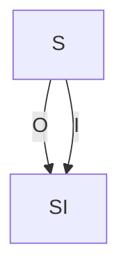
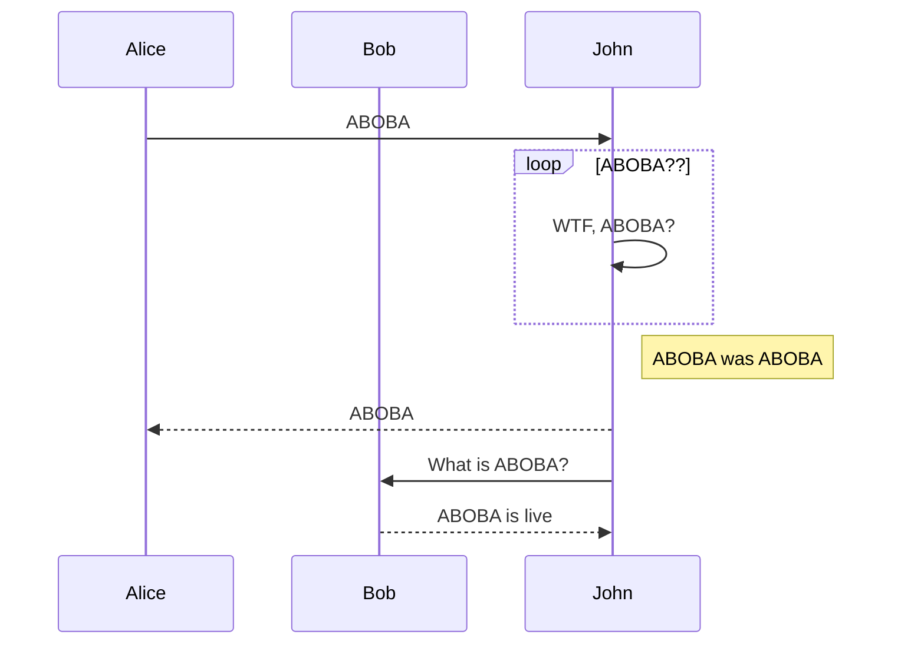
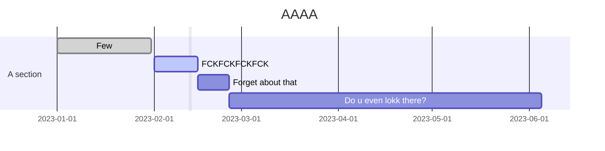
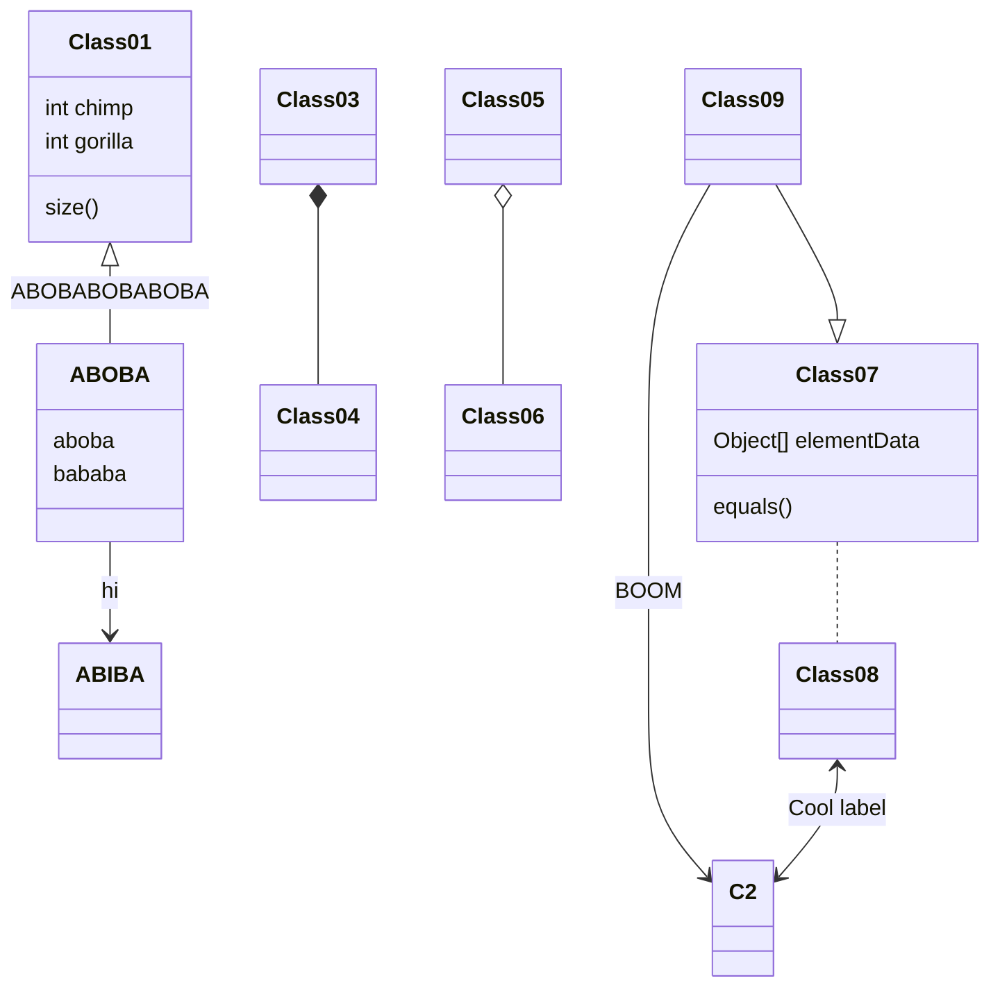
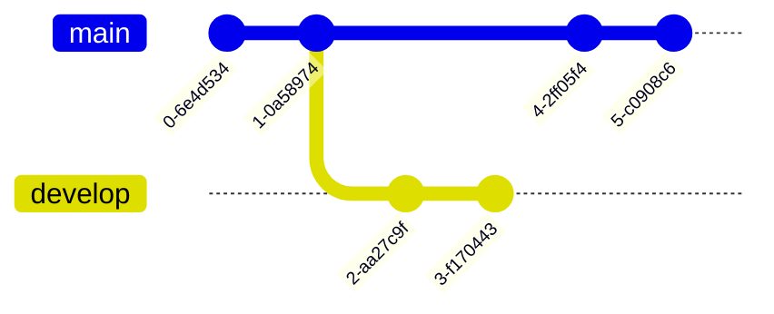
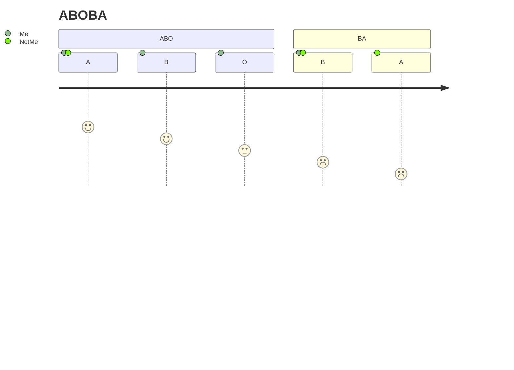

```mermaid
graph TD;
	S--O-->SI;
	S--I-->SI;
```

```mermaid
sequenceDiagram
	participant Alice
	participant Bob
	Alice->>John: ABOBA
	loop ABOBA??
		John->>John: WTF, ABOBA?
	end
	Note right of John: ABOBA was ABOBA
	John-->>Alice: ABOBA
	John->>Bob: What is ABOBA?
	Bob-->>John: ABOBA is live
```

```mermaid
gantt
dateFormat YYYY-MM-DD
title AAAA
excludes weekdays 2023-02-12

section A section
Few:done, des1, 2023-01-01,2023-01-31
FCKFCKFCKFCK:active, des2, 2023-02-01,2023-02-15
Forget about that: des3, after des2, 10d
Do u even lokk there?: des4, after des3, 100d
```

```mermaid
classDiagram
Class01 <|-- ABOBA: ABOBABOBABOBA
Class03 *-- Class04
ABOBA --> ABIBA: hi
ABOBA: aboba
ABOBA: bababa
Class05 o-- Class06
Class07 .. Class08
Class09 --> C2: BOOM
Class09 --|> Class07
Class07: equals()
Class07: Object[] elementData
Class01: size()
Class01: int chimp
Class01: int gorilla
Class08 <--> C2: Cool label
```

```mermaid
gitGraph
	commit
	commit
	branch develop
	commit
	commit
	checkout main
	commit
	commit
```

```mermaid
journey
	title ABOBA
	section ABO
		A: 5: Me, NotMe
		B: 4: Me
		O: 3: Me
	section BA
		B: 2: Me, NotMe
		A: 1: NotMe
```

