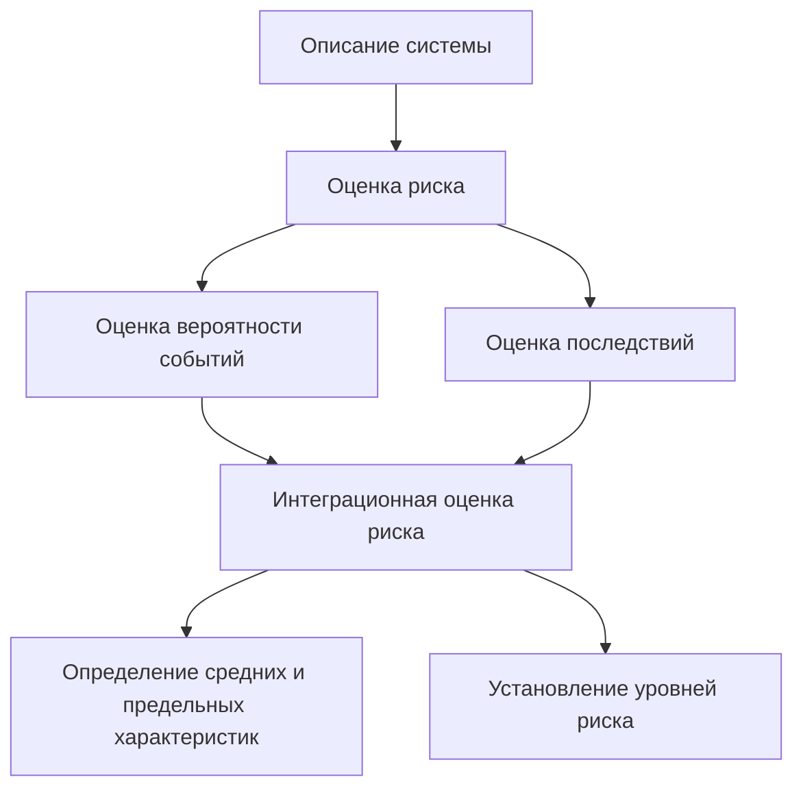

# Основные понятия, цели и задачи БЖД
**Безопасность** - такой уровень опасности, с которым на текущем этапе развития человечества можно смириться.
**Безопасность** - состояние объекта защиты, при котором воздействие на него всех потоков вещества, энергии и информации не превышает максимально допустимых значений.

**Безопасность жизнедеятельности (БЖД)** – система знаний, обеспечивающая безопасность обитания человека в производственной и непроизводственной среде.

**Жизнедеятельность** - это повседневная деятельность и отдых, способ существования человека.

В основе БЖД должны быть систематизированные и обобщенные знания об объективных закономерностях существования и развития природы, человека и общества.

**Нельзя** обеспечить абсолютную безопасность для личности, общества, государства.

В курсе рассматриваются основы теории безопасности, взаимодействие человека со средой обитания, последствия воздействия на человека опасных, вредных, поражающих факторов, прогнозирование последствий, ликвидации последствий ЧС военного и мирного времени.

**Здоровье** - естественное состояние организма, характеризующееся его уравновешенностью с окружающей средой и отсутствием каких-либо болезненных изменений.
**Здоровье** - состояние полного физического, духовного и социального благополучия и способность к воспроизводству следующих поколений.

**Деятельность** - специфическая человеческая форма активного отношения к окружающему миру, содержание которой составляет его целесообразное изменение и преобразование.

Всякая деятельность включает в себя цель, средства, результат и сам процесс деятельности.

Наиболее характерные системы взаимоотношения человека со средой обитания:
- Человек - природная среда
- Человек - машина/среда рабочей зона
- Человек - городская (бытовая) среда

Краеугольный камень - ***человек***.

Триединство функций человека
- Человек - объект защиты
- Человек - источник опасности
- Человек - специалист, обеспечивающий безопасность

Аксиома потенциальной опасности - "любая деятельность потенциально опасна".

Цель дисциплины БЖД - получение знаний о нормативно допустимых уровнях воздействия негативных факторов на человека и среду обитания, изучение, классификация и систематизация сложных событий, процессов, явлений в области обеспечения безопасности и комфортных условий деятельности человека на всех стадиях его жизненного цикла, выработка мер по упреждению, локализации и устранению существующих угроз и опасностей.

Цели БЖД:
- достижение безопасности в средах обитания;
- достижение безаварийной ситуации и готовности к стихийным бедствиям и другим проявлениям природной среды;
- предупреждение травматизма;
- сохранение здоровья;
- сохранение работоспособности;
- сохранение качества полезного труда

Задачи БЖД сводятся 
- к теоретическому анализу и разработке методов идентификации опасных и вредных факторов, генерируемых элементами среды обитания
- к комплексной оценке многофакторного влияния негативных условий среды обитания на работоспособность и здоровье человека
- к оптимизации условий деятельности и отдыха человека
- к разработке принципов и методов защиты от опасностей.
- к разработке и рациональному использованию средств защиты человека и среды обитания от негативного воздействия, техногенных источников и стихийных явлений, а также средств, обеспечивающих комфортный условия деятельности человека на всех стадиях его жизни
- к непрерывному контролю и мониторингу среды обитания
- к моделированию и прогнозированию развития ЧС
- к обучению населения основам защиты от опасностей
- к разработке мер по ликвидации последствий проявления опасностей

Задачи БЖД:
1. научные
	получение новых, нестандартных знаний в виде выявленных законов либо теоретического описания технологического процесса, математического описания явлений и т. п.
2. практические
	разработка конкретных практических мероприятий, обеспечивающих обитание человека без травм, аварий при сохранении его здоровья и работоспособности с высоким качеством трудовой деятельности

## Опасность
Опасность - это:
- свойство человека и окружающей среды, способность причинять ущерб живой и неживой материи;
- негативное свойство систем материального мира, приводящее человека к потере здоровья или к гибели;
- негативное свойство систем материального мира, приводящее природу к ее деградации и разрушению.

Стремление человека защищать свою жизнь от опасностей является его естественной жизненной потребностью.

Несмотря на предпринимаемые защитные меры всегда сохраняется некоторый остаточный риск.

Опасности реализуются в виде потоков энергии, вещества и информации, они существуют в пространстве и во времени.

Основными **признаками** опасности являются:
- возможность непосредственного отрицательного воздействия на организм человека,
- затруднения нормального функционирования человека,
- возможность возникновения опасных и вредных факторов в результате аварий, представляющих угрозу для человека.

**Причины проявления опасности** - совокупность обстоятельств, способствующих проявлению опасностей и вызывающих их нежелательные последствия. Реализация опасности есть следствие некоторой причины, которая в свою очередь является следствием другой причины и т.д.

Человек в своем стремлении обезопасить от окружающей среды себя создал для себя новые опасности, способные в определенных условиях непосредственно или косвенно наносить ущерб здоровью человека.

Материальными носителями опасности являются:
- предметы труда
- средства труда
- энергия
- флора
- фауна
- продукты питания
- природно-климатические явления
- человеческое общество

### Источники опасностей
Источники опасности могут быть:
- внешние (состояние производственной среды и ошибки персонала);
- внутренние (ложные особенности работающего).

По международной шкале опасности выделяется 8 уровней (0-7):
- уровень «О» - событие называется отклонением от нормы;
- уровни «1-3 балла» - инцидент;
- уровни «4-7 баллов» - авария (разрушение технических средств и выброс опасных веществ).

**Инцидент** - отказ или повреждение технических устройств, отключение от режима технологического процесса, нарушение положений ФЗ и иных нормативных правовых актов РФ, нормативно технических документов, установленных правил ведения работ на опасном производственном объекте (без выброса и разгерметизаций).

Закон сохранения жизни: "Жизнь может существовать только в процессе движения через живое тело потоков вещества, энергии и информации." - Ю.Н.Куражковский

##### Виды потоков
Потоки в **естественной среде**:
- солнечное излучение, излучение звезд и планет;
- космические лучи, пыль, астероиды;
- электрическое и магнитное поля Земли;
- круговороты веществ в биосфере в экосистемах, в биогеоценозах;
- потоки, связанные с атмосферными, гидросферными и литосферными явлениями, в том числе и со стихийными;
- другие.

Потоки в **техносфере**:
- потоки сырья, энергии;
- потоки продукции отраслей экономики;
- отходы экономики;
- информационные потоки;
- транспортные потоки;
- световые потоки (искусственное освещение);
- потоки при техногенных авариях;
- другие.

Потоки в **социальной среде**:
- информационные потоки (обучение, государственное управление, международное сотрудничество и т.п.);
- людские потоки (миграции, демографические процессы);
- другие.

Потоки, **потребляемые и выделяемые человеком в процессе жизнедеятельности**:
- потоки кислорода, воды, пищи и иных веществ (в том числе алкоголь, табак, наркотики и т.п.);
- потоки энергии (механической, тепловой, солнечной и др.);
- информационные потоки;
- отходы процесса жизнедеятельности;
- другие,

1. действия потоков и систем часто тесно переплетены
2. в ряде случаев потоки, необходимые для существования жизни могут превысить допустимые для воспринимающего их элемента материи уровней и тем самым вызвать в нем необратимые процессы
3. максимальные значения потоков, при которых ущерб еще не возникает, называют предельно допустимыми (ПДК, ПДУ, ПДВ)
4. возникновение опасной ситуации при наличии потоков от источника опасности определяется не только величиной потока, но и свойствами объекта защиты, его способностью воспринимать и переносить воздействующие потоки
5. опасность реализуется лишь при взаимодействии источника опасности, генерирующего поток воздействия и элемента материи (объекта защиты), воспринимающего этот поток

### Условия возникновения и реализации опасности
Таким образом, для возникновения и реализации опасности необходимо соблюдение следующих условий:
- наличие совокупности систем «источник воздействия объект защиты» и их совпадение по месту и по времени пребывания в жизненном пространстве;
- наличие источника опасности, способного создавать значимые потоки вещества, энергии или информации;
- наличие у защищаемого объекта ограничений по величине воздействия потоков
### Закон толерантности Шелфорда
**Толерантность** - способность организма переносить неблагоприятное влияние того или иного фактора среды.

Американский зоолог В. Шелфорд в начале ХХ в. сформулировал **закон толерантности**: «Лимитирующим фактором процветания популяции (организма) может быть как минимум, так и максимум экологического воздействия, а диапазон между ними определяет величину выносливости (предел толерантности) организма к заданному фактору».

**Аксиома о воздействии среды обитания на человека**: воздействие среды обитания на человека может быть позитивным или негативным, характер воздействия определяют параметры потоков веществ, энергий и информации.

Применительно к любому живому телу **аксиома о воздействии среды обитания на тело** звучит следующим образом: воздействие среды обитания на живое тело может быть позитивным или негативным, характер воздействия определяют параметры потоков и - способность живого тела воспринимать эти потоки.

Из четырех характерных видов воздействия среды обитания на человека, первые два (комфортное и допустимое) соответствуют позитивным, а два других (опасное и чрезвычайно опасное) являются недопустимыми для процессов жизнедеятельности человека.

**Аксиома об одновременном воздействии опасностей**: потоки вещества, энергии и информации, генерируемые их источниками, не обладают избирательностью по отношению к объектам защиты и одновременно воздействуют на человека, природную среду и техносферу, находящихся в зоне их влияния.

**Аксиома о совокупном воздействии опасностей**: на любой объект защиты одновременно воздействуют все потоки, поступающие извне в зону его пребывания.

### Таксономия опасностей
**Таксономия** — наука о классификации и систематизации сложных явлений, понятий, объектов.

Термин «таксономия» предложил швейцарский ботаник О. Декандоль в 1813 г.

Качественную классификацию опасностей целесообразно вести по двухуровневой схеме, сведя в первую группу (1 уровень) классификации признаки опасности (их происхождение, параметры и зоны воздействия), а именно:
- происхождение источника опасностей;
- вид потока, образующего опасность;
- интенсивность (уровень) воздействия опасности;
- длительность воздействия опасности на объект защиты;
- вид зоны воздействия опасностей;
- размеры зон воздействия опасности;
- степень завершенности процесса воздействия опасности на объект защиты.

Во вторую группу (II уровень) классификации опасностей сводятся признаки, связанные со свойствами объекта защиты, а именно:
- способность объекта защиты различать опасности;
- вид влияния негативного воздействия опасности на объект защиты;
- численность лиц, подверженных воздействию опасности.

Также, в зависимости от целей исследования, могут быть введены дополнительные классификационные признаки.

#### Качественная классификация опасностей
По природе происхождения:
- Естественные (природные)
- Антропогенные
- Техногенные
- Социальные
- Экологические
- Биологические

По видам потоков в жизненном пространстве, образующих опасность:
- Энергетические
- Вещественные (массовые)
- Информационные

По величине потоков в жизненном пространстве:
- Допустимые
- Предельно допустимые
- Опасные
- Чрезвычайно опасные

По моменту возникновения:
- Прогнозируемые
- Спонтанные

По длительности воздействия опасности:
- Постоянные
- Переменные (периодические)
- Кратковременные (импульсные)

По объектам негативных воздействий:
- Действующие на человека
- Действующие на природную среду
- Действующие на материальный ресурс
- Комплексного действия

По количеству людей, подверженных опасному воздействию:
- Личные (индивидуальные)
- Групповые (коллективные)
- Массовые

По размерам зон воздействия:
- Локальные
- Региональные
- Межрегиональные
- Глобальные

По видам зон воздействия:
- Действующие в помещении
- Действующие на территории

По способности человека идентифицировать опасности органами чувств:
- Ощущаемые
- Неощущаемые

По видам негативного воздействия на человека:
- Вредные (угнетающие)
- Травмоопасные (разрушающие)

По характеру воздействия на организм человека:
- Механические
- Физические
- Химические
- Биологические
- Психофизиологические

По времени появления отрицательных последствий:
- Импульсивные (быстроразвивающиеся)
- Кумулятивные (накапливающие или медленно развивающиеся)

По локализации опасности:
- Связанные с литосферой
- Связанные с гидросферой
- Связанные с атмосферой
- Связанные с космосом

По сфере появления опасностей:
- Бытовая
- Спортивная
- Дорожно-транспортная
- Производственная и т.д.

По структуре опасности:
- Простые
- Производные (порождаемые взаимодействием простых)

По вероятности воздействия на человека и среду обитания:
- Потенциальные
- Реальные
- Реализованные
#### Количественная классификация опасностей
**Квантификация** - это введение количественных характеристик для оценки сложных, качественно определяемых понятий.

Применяются численные, балльные и другие приемы квантификации.

Для количественной оценки (квантификации) опасностей жизненных потоков используют критерии допустимого вредного воздействия потоков (веществ, энергии, информации) и критерии допустимой травмоопасности потоков.

##### Критерии допустимого вредного воздействия потоков

• в любой точке жизненного пространства с координатами X, Y, Z массовые, энергетические и информационные потоки могут оказывать воздействие П. В общем виде это воздействие на объект (человек, природа) определяется его интенсивностью / и длительностью экспозиции :

Π (x,y,z) = f (1, τ)

Интенсивность потока определяется по формулам:

• для вещества: 1 = G / (FT), г/(M²);

• для энергии: 1₂ = Q / (F т), Дж/(м²с) или Вт/м²;

• для информации: 1 = И /т, бит/с,

где 6 - масса вещества, г; F - площадь поперечного сечения потока, м²; Q- количество энергии, в потоке, Дж; И количество информации в двоичных знаках.

Основное условие допустимости воздействия потоков в зоне пребывания человека имеет вид
П≤ПДП,
где П - реальный показатель потока; ПДП - предельно допустимое значение потока.

Потоки энергии и информации воздействуют на объект защиты непосредственно, поэтому их влияние оценивают величинами $I_э$ и $I_и$ 

Для оценки вероятности негативного воздействия используется распространенный количественный параметр - **риск**.

В. Машалл дает следующее определение: **риск - частота реализации опасностей**.
- **Количественная оценка** - это отношение числа тех или иных неблагоприятных последствий к их возможному числу за определенный период. Определяя риск, необходимо указать класс последствий, т. е. ответить на вопрос: риск чего?
- **Риск** может быть определен по формуле: R = n/N,
  где n - число тех или иных неблагоприятных последствий; N - возможное число неблагоприятных последствий за определенный период.

В соответствии с современными взглядами **риск** обычно интерпретируется как вероятностная мера возникновения техногенных или природных явлений, сопровождающихся формированием и действием вредных факторов, и нанесенного при этом социального, экономического, экологического и др. видов ущерба.

### Концепция приемлемого риска
Традиционная техника безопасности базируется на категорическом императиве: обеспечить безопасность, не допустить никаких аварий. Как показывает практика, такая концепция неадекватна законам техносферы.

Современный мир отверг концепцию абсолютной безопасности и пришел к **концепции приемлемого (допустимого) риска**, суть которой заключается в стремлении к достижению такой малой опасности, которую приемлет общество в данный период времени.

При реализации этой концепции важнейшей *задачей* является *установление верхней границы допустимого риска*.

Методические подходы к определению риска:
- инженерный, опирающийся на статистику, расчет частот, вероятностный анализ безопасности, построение деревьев опасности;
- модельный, основанный на построении моделей воздействия вредных факторов на отдельного человека, социальные, профессиональные группы и т. п.;
- экспертный, когда вероятность различных событий определяется на основе опроса опытных специалистов, т. е. экспертов;
- социологический, основанный на опросе населения.

### Реализованные опасности
**Потенциальная опасность** является универсальным свойством процесса взаимодействия человека со средой обитания на всех стадиях жизненного цикла.

Условия реализации:
- опасность существует
- человек находится в зоне действия опасности
- человек ее имеет достаточных средств защиты

**Реальная опасность** всегда связана с конкретной угрозой воздействия на человека. Она координирована в пространстве и времени.

**Реализованная опасность** - факт воздействия реальной опасности на человека и среду обитания, приведший к потере здоровья или летальному исходу, к материальным потерям.

**Происшествие** - событие, состоящее из негативного воздействия с причинением ущербам людским, природным и материальным ресурсам.

**Чрезвычайное происшествие (ЧП)** — событие, происходящее кратковременно и обладающее высоким уровнем негативного воздействия на людей, природные и материальные ресурсы. К ЧП относят крупные аварии, катастрофы, стихийные бедствия.

**Авария** - опасное техногенное происшествие, создающее на объекте, определенной территории или акватории угрозу жизни и здоровью людей и приводящее к разрушению или повреждению зданий, сооружений, оборудования и транспортных средств, нарушению производственного или транспортного процесса, нанесению ущерба окружающей среде. (ГОСТ Р 22.0.05-2020 «Безопасность в чрезвычайных ситуациях. Техногенные чрезвычайные ситуации. Термины и определения»).

**Катастрофа** - крупная авария, повлекшая за собой человеческие жертвы, ущерб здоровью людей, а также приведшая к серьезному ущербу окружающей среде.

**Стихийное бедствие** - разрушительное природное явление, в результате которого возникает угроза жизни и здоровью людей и происходит разрушение окружающей среды.

**Чрезвычайная ситуация (ЧС)** это обстановка на определенной территории, сложившаяся в результате аварии, опасного природного явления, катастрофы, стихийного или иного бедствия, которые могут повлечь или повлекли за собой человеческие жертвы, ущерб здоровью людей или окружающей природной среде, значительные материальные потери и нарушение условий жизнедеятельности людей.

Комплекс негативных факторов, действующих в пространстве в конкретный момент образует «поле опасностей».

Причинно-следственные поля опасностей, в которых находится человек можно представить в виде:
- Опасностей первого круга (непосредственно действующих на человека)
- Опасностей второго круга (воздействуют на источники опасностей первого круга)
- Опасностей третьего круга (не всегда выражены достаточно четко)
## Ноксология
**Ноксология** - это:
1) наука об опасностях материального мира Вселенной;
2) наука об опасностях для человека и окружающей среды потоков вещества, энергии и информации материального мира вселенной;
3) наука о взаимоотношениях живых организмов между собой и окружающей их средой на уровне воздействий, приносящих ущерб здоровью и жизни организмов, и (или) нарушающих целостность окружающей среды.

Задачи ноксологии:
- изучение происхождения и совокупного действия опасностей
- описание опасных зон и показателей их влияния на материальный мир
- оценивание ущерба, наносимого опасностями человеку и природе
- изучение принципов минимизации опасностей в источниках и основ защиты от них в пределах опасных зон

## Ноксосфера и гомосфера
**Ноксосфера** (от латинского «ноксо» - опасность) - пространство, в котором проявляются опасности, т.е. постоянно или периодически существует опасный или вредный фактор.

**Гомосфера** (от латинского «һоmо» - человек) - пространство, где находится человек в процессе конкретной деятельности.

Опасность реализуется на пересечении этих двух сфер.

## Техносфера
**Техносфера** - среда обитания, возникшая с помощью прямого или косвенного воздействия людей и технических средств на природную среду (биосферу) с целью наилучшего ее соответствия социально-экономическим потребностям человека.

**Среда обитания** - окружающая человека среда, обусловленная в данный момент совокупностью факторов (физических, химических, биологических, социальных), способных оказывать прямое или косвенное, немедленное или отдаленное воздействие на деятельность человека, его здоровье и потомство.

Биосфера Земли является местом возникновения человека, защитой от космических опасностей, но одновременно источником естественных биосферных опасностей.

Для защиты от неблагоприятных воздействий биосферы человек был вынужден создать техносферу.

К техносфере относится все, что создано человеком.

Период НТР (19 век - 1930) ознаменован ростом негативных техногенных воздействий на человека и природу одновременно с сохранением прежнего уровня естественных опасностей и ростом антропогенной нагрузки на природу и общество, значительным ростом показателей использования техники и технологий, сопровождается демографическим взрывом и урбанизацией населения, значительным повышение его энерговооруженности, возникновение субъективных оценок действительности, адаптации человека к новым условиям жизни и другое.

В СССР закон об охране природы принят в 1960 году.
В США национальный закон об охране среды принят в 1969 году.
ЮНЕСКО провела конференцию по защите окружающей среды в 1968 году.

Два вида негативных ситуаций в системе техносфера-человек:
- **длительное воздействие** постоянных или переменных опасностей, ограниченных в интенсивности в  локальной, региональной или глобальной зонах
- **кратковременные воздействия** импульсных опасностей высокой интенсивности в локальных, максимум - региональных зонах
## Отдельные аспекты эволюции человечества:
Начиная с XVI в., происходит процесс урбанизации населения

**Урбанизация** - переселение людей на постоянное проживание из сельской местности в города главным образом с целью их широкого привлечения к промышленному производству и с иными целями.

Черты урбанизации
- Быстрые темпы роста городского населения. Особенно в менее развитых городах.
- Концентрация населения в основном в крупных городах
- Расползание городов вширь. Города превращаются в агломерации, агломерации в мегаполисы.

Во второй половине ХХ в. каждые 12-15 лет удваивался объем **промышленного производства** ведущих стран мира, что создавало удвоение выбросов, сбросов вредных веществ и других отходов, загрязняющих биосферу.

Постоянно увеличивались и развивались **средства транспорта**.

Возрастали затраты на **военные цели**.

Развитие промышленности и технических средств сопровождалось не только **увеличением выброса загрязняющих веществ**, но и вовлечением в производство все большего числа химических элементов.

Вторая половина ХХ в. связана с **интенсификацией** сельскохозяйственного производства.

## Основные принципы БЖД (по признаку их реализации)
**Принципы ОБЖ** - правила, обеспечивающие выживание человека в окружающем мире.
1. Ориентирующие - определяют основополагающие идеи для поиска безопасных решений. Они служат методической и информационной базой БЖД (учет человеческого фактора, принцип классификации, гуманизации деятельности, системный подход);
2. Организационные - реализуют положения научной организации труда (принцип рациональной организации труда, эргономичности, зонирования территорий, подбора кадров, принцип защиты времени (ограничение пребывания людей в условиях, когда уровень вредных воздействий находится на грани допустимого), последовательности, резервирования, нормирования, компенсации, информации и т.д.);
3. Управленческие - позволяют определять взаимосвязь и отношения между отдельными стадиями, этапами процесса обеспечения БЖД (принципы контроля, адекватности, обратной связи, ответственности, плановости, стимулирования, управления, эффективности, однозначности и т.д.);
4. Технические принципы направлены на предотвращение действия опасных и вредных факторов и предполагают использование конкретных технических решений для повышения безопасности:
	- принцип защиты количеством (например, максимальное снижение вредных выбросов),
	- принцип защиты расстоянием (воздействие вредного фактора снижается вследствие увеличения расстояния),
	- принцип слабого звена (использование его в системах, работающих под давлением: разрывные мембраны, скороварки и т.д.)
	- принципы блокировки, вакуумирования, герметизации, компрессий, прочности, флегматизации, снижения потенциала земли или напряжения прикосновения, защитное заземление, изоляция, ограждения, экранирование, герметизация и т.д.

## Основные принципы БЖД (по сфере реализации)
- общественно-методологические принципы применяют во всех сферах деятельности, к ним относят принципы системности, информации, классификации, организации, планирования, контроля, анализа, управления, эффективности, обучения и т.д.;
- медико-биологические принципы: к ним относят принципы нормирования вредных веществ, санитарного зонирования, медицинского профилактического предупреждения, компенсации и т.д.
- инженерно-технические принципы (самые многочисленные): экранирования, прочности, слабого звена, недоступности, блокировки, резервирования, дублирования, вакуумирования, ограничения, несовместимости и т.д.

Все эти принципы взаимосвязаны и дополняют друг друга. В совокупности принципы образуют систему обеспечения безопасности труда. В то же время каждый принцип обладает относительной самостоятельностью.

## Защита окружающей среды
Под **ЗОС (защитой окружающей среды)** понимается комплекс научных и практических знаний, направленных на сохранение качественного состояния биосферы.

**Цель ЗОС** - защита биосферы от негативного воздействия техносферы.

**Предмет исследования в ЗОС** - негативные воздействия техносферы на природу, средства и системы защиты биосферы, а **объект защиты** - природная среда.

**Техносферная безопасность** - сфера научной и практической деятельности, направленная на создание и поддержание техносферного пространства в качественном состоянии, исключающем его негативное влияние на человека и природу.

Существуют следующие **виды** безопасности:
- Экологическая безопасность
- Национальная безопасность
- Промышленная безопасность
- Пожарная безопасность
- Информационная безопасность
- Экономическая безопасность
- Военная безопасность
- Внутренняя безопасность
- Внешняя безопасность

## Системная безопасность
**Системный анализ** - совокупность методологических средств, используемых для подготовки и обоснования решений по сложным проблемам, в данном случае - безопасности.

**Система** - совокупность взаимосвязанных компонентов, взаимодействующих между собой таким образом, что достигается определенный результат/цель.

**Компонент/элемент системы** - не только материальные объекты, но и отношения и связи.

Система, одним из элементов которой является человек, называется **эрготической**.

Цель или результат, который дает система - **системообразующий элемент**.

**Свойство эмерджентности** - система имеет качества, которых нет у системообразующих элементов.

### Системы и виды БЖД
Существуют следующие системы безопасности (по объектам защиты):
- Система личной безопасности
- Система коллективной (общественной) безопасности
- Система государственной (национальной) безопасности
- Система международной коллективной безопасности
- Система глобальной безопасности

### Реализация безопасности жизнедеятельности
БЖД на общемировом уровне достигается:
- сохранением безопасности жизнедеятельности людей на планете от воздействия космических тел (звезда Немизида);
- сохранением БЖД от загрязнения воздушного и морского бассейна;
- обеспечением БЖД путём предотвращения мировой ядерной войны.

На континентальном уровне БЖД обеспечивается:
- сохранением БЖД от стихийных катастроф (землетрясений, засухи, ураганов);
- сохранением БЖД путём предотвращения войн между государствами (локальных войн) на континенте;
- достижением экологической безопасности;
- поддержанием БЖД людей слаборазвитых стран путём экономической и продовольственной помощи.

На местном (бытовом) уровне БЖД достигается:
- сохранением БЖД от стихийных бедствий, крупных производственных аварий, катастроф;
- обеспечением БЖД от нападений, терроризма на производстве и транспорте;
- профилактической работой по уменьшению ДТП, пожаров;
- обеспечением экологической безопасности в городе (районе);
- сокращением потенциальной базы развития преступности путём проведения социально-ориентированной политики.

Обеспечение безопасности достигается тремя основными методами:
- Пространственное и (или) временное разделение гомосферы и и ноксосферы (дистанционное управление, автоматизация, роботизация). Это достигается путём механизации и автоматизации процессов, применением средств дистанционного управления, например на АЭС, использования манипуляторов и роботов.
- Нормализация ноксосферы путем исключения опасностей (средства защиты от шума, газа, пыли и др.). Метод реализуется применением средств коллективной защиты (убежищ, противорадиационных укрытий (ПРУ), созданием безопасной техники (а значит рабочей зоны).
- Адаптация человека к среде (профотбор, обучение).

В реальных условиях реализуется комбинация рассмотренных методов.

### Понятие о негативных факторах техносферы
К **вредным** относятся факторы, воздействие которых на работающего в определенных условиях приводит к заболеванию или снижению работоспособности.

**Опасными** называются производственные факторы, воздействие которых на работающего в определенных условиях приводит к травме или резкому ухудшению здоровья (в т.ч. гибели организма).

Следует отметить, что негативные факторы техносферы вовсе не являются повсеместными и неизбежными, а начинают действовать лишь в тех случаях, когда они обусловлены технологической необходимостью или вызваны нарушениями производственного цикла и условий эксплуатации технических систем. По мере разработки новых прогрессивных технологий многие факторы техносферы снижают свое негативное влияние либо вовсе прекращают воздействовать на человека.

В настоящее время научно-технический прогресс четко направлен на гуманизацию техносферы, создание для человека как можно более приемлемых условий труда, снижение риска профессиональных заболеваний и производственного травматизма, замену человеческого труда при действии негативных факторов автоматизированными роботизированными комплексами.

Всю совокупность негативных факторов техносферы можно разделить в зависимости от **энергии, которой обладают факторы** на следующие основные группы:
- физические
  Движущиеся машины и механизмы, острые и падающие предметы, изменение температуры воздуха и окружающих поверхностей, запыленность, шум, вибрация, изменение бараметрического давления, повышенный уровень ионизирующих излучений, ЭМ излучения, УФ и ИК радиации, недостаточное освещение, повышенная яркость и пульсация светового потока.
- биологические
  Патогенные микроорганизмы и продукты их жизнедеятельности, организмы растительного и животного происхождения.
- химические
  Вредные вещества, используемые в технологии, промышленные яды, аварийно химически опасные вещества (АХОВ), боевые тактические химические вещества (БТХВ).
- психофизиологические
  - физические (статические и динамические)
  - нервнопсихические (перегрузки)
    Перенапряжение, монотонность труда, эмоциональные перегрузки

В зависимости от **характера воздействия**:
- активные (сами носители энергии);
- активно-пассивные (энергетическая причина тоже имеет место, например, угол стола человек может об него удариться);
- пассивные (действуют опосредствованно, например, коррозия металлов, старение материалов).

Особую опасность представляют химические факторы, которые можно разделить на:
- промышленные яды (растворители, красители); - ядохимикаты (гербициды, пестициды), используемые в сельском хозяйстве;
- лекарственные препараты, применяемые не по назначению;
- химические вещества в быту, которые используются в качестве пищевых добавок, средств санитарии, личной гигиены;
- боевые отравляющие вещества.

# ЧС природного происхождения
**Чрезвычайная ситуация (ЧС) природного происхождения** это обстановка на определённой территории или акватории, сложившаяся в результате стихийного природного бедствия, которое может повлечь или повлекло за собой человеческие жертвы, ущерб здоровью людей и окружающей среде, значительные материальные потери и нарушение условий жизнедеятельности людей.

**Стихийное бедствие** это:
- катастрофа, вызванная природными силами или явлениями;
- разрушительное природное и (или) природно-антропогенное явление или процесс, в результате которого может возникнуть или возникла угроза жизни и здоровью людей, произойти разрушение или уничтожение материальных ценностей, необратимые изменения окружающей среды и условий жизни, деятельности населения;
- разрушительное, как правило, непредотвратимое природное явление (землетрясение, наводнение, тайфун, извержение вулкана, засуха, опустынивание, массовое размножение вредителей и т.п.).

![[IMG20240319134833.jpg]]

## Классификация ЧС природного происхождения
*Согласно Постановлению Правительства РФ от 21 мая 2007 г. № 304 «О классификации чрезвычайных ситуаций природного и техногенного характера»* (с изменениями и дополнениями), чрезвычайные ситуации природного и техногенного характера по масштабу и нанесенному ущербу подразделяются на:
- чрезвычайную ситуацию **локального характера**, в результате которой территория, на которой сложилась чрезвычайная ситуация и нарушены условия жизнедеятельности людей (далее - зона чрезвычайной ситуации), не выходит за пределы территории организации (объекта), при этом количество людей, погибших и (или) получивших ущерб здоровью, составляет не более 10 человек либо размер ущерба окружающей природной среде и материальных потерь (далее - размер материального ущерба) составляет не более 240 тыс. рублей;
- чрезвычайную ситуацию **муниципального характера**, в результате которой зона чрезвычайной ситуации не выходит за пределы территории одного муниципального образования, при этом количество людей, погибших и (или) получивших ущерб здоровью, составляет не более 50 человек либо размер материального ущерба составляет не более 12 млн. рублей, а также данная чрезвычайная ситуация не может быть отнесена к чрезвычайной ситуации локального характера;
- чрезвычайную ситуацию **межмуниципального характера**, в результате которой зона чрезвычайной ситуации затрагивает территорию двух и более муниципальных районов, муниципальных округов, городских округов, расположенных на территории одного субъекта Российской Федерации, или внутригородских территорий города федерального значения, при этом количество людей, погибших и (или) получивших ущерб здоровью, составляет не более 50 человек либо размер материального ущерба составляет не более 12 млн. рублей;
- чрезвычайную ситуацию **регионального характера**, в результате которой зона чрезвычайной ситуации не выходит за пределы территории одного субъекта Российской Федерации, при этом количество людей, погибших и (или) получивших ущерб здоровью, составляет свыше 50 человек, но не более 500 человек либо размер материального ущерба составляет свыше 12 млн. рублей, но не более 1,2 млрд. рублей;
- чрезвычайную ситуацию **межрегионального характера**, в результате которой зона чрезвычайной ситуации затрагивает территорию двух и более субъектов Российской Федерации, при этом количество людей, погибших и (или) получивших ущерб здоровью, составляет свыше 50 человек, но не более 500 человек либо размер материального ущерба составляет свыше 12 млн. рублей, но не более 1,2 млрд. рублей;
- чрезвычайную ситуацию **федерального характера**, в результате которой количество людей, погибших и (или) получивших ущерб здоровью, составляет свыше 500 человек либо размер материального ущерба составляет свыше 1,2 млрд. рублей.

Отдельно стоит отметить **трансграничные ЧС**, поражающие факторы которых выходят за пределы РФ, или ЧС произошла за рубежом и затрагивает территорию РФ.

**При этом данная классификация не распространяется на чрезвычайные ситуации в лесах, возникшие вследствие лесных пожаров.**

#### Некоторые закономерности природных явлений
- для каждого вида ЧС характерна определенная пространственная приуроченность;
- чем больше интенсивность (мощность) опасного явления, тем реже оно случается;
- каждому виду ЧС предшествуют некоторые специфические признаки (предвестники);
- при всей неожиданности появление той или иной природной ЧС может быть предсказано;
- во многих случаях могут быть предусмотрены пассивные и активные защитные мероприятия от природных опасностей.

#### Типы защитных мероприятий от природных опасностей
- Активные
  строительство инженерно-технических сооружений, вмешательство в механизм явления, мобилизация естественных ресурсов, реконструкция природных объектов и др.
- Пассивные
  использование укрытий, эвакуация

## ЧС геологического происхождения
### Оползень
**Оползень** - это скользящее смещение (сползание) масс грунтов и горных пород вниз по склонам гор и оврагов, крутых берегов морей, озёр и рек под влиянием силы тяжести.

Чаще всего оползни происходят по берегам рек, водоемов и на горных склонах.

Оползни могут происходить на всех склонах, однако на глинистых грунтах они случаются намного чаще, для этого достаточно избыточного увлажнения пород, поэтому большей частью они сходят в весенне-летний период.

**Естественной причиной** образования оползней является увеличение крутизны склонов, подмыв их оснований речными водами, избыточное увлажнение различных пород, сейсмические толчки воде и ряд других факторов.

**Искусственной причиной** разрушение склонов дорожными выемками, чрезмерным выносом грунта, вырубкой леса, неразумным ведением сельского хозяйства на склонах.

#### Классификация оползней
По наличию воды:
- сухие
- слабовлажные
- влажные
- очень влажные

По механизму оползневого процесса:
- сдвига
- выдавливания
- вязкопластичные
- внезапного разжижения

По объему:
- малые - до 10 $тыс.м^{3}.$
- средние - 10-100 $тыс.м^{3}.$
- крупные - 100-1000 $тыс.м^{3}.$
- очень крупные - более 1000 $тыс.м^{3}.$

По масштабу:
- очень мелкие - до 5 га
- мелкие - 5-50 га
- средние - 50-100 га
- крупные - 100-200 га
- очень крупные - 200-400 га
- грандиозные - более 400 га
#### Предупредительные мероприятия
Изучите информацию о возможных местах и примерных границах оползней, запомните сигналы оповещения об угрозе возникновения оползня, а также порядок действия при подаче этого сигнала.

Признаками надвигающегося оползня являются: заклинивание дверей и окон зданий, просачивание воды на оползнеопасных склонах.

При появлении признаков приближающегося оползня сообщите об этом в ближайший пост оползневой станции, ждите оттуда информации, а сами действуйте в зависимости от обстановки.

#### Как действовать при оползне
При получении сигналов об угрозе возникновения оползня отключите электроприборы, газовые приборы и водопроводную сеть, приготовьтесь к немедленной эвакуации по заранее разработанным планам.

В зависимости от выявленной оползневой станцией скорости смещения оползня действуйте, сообразуясь с угрозой.

При слабой скорости смещения (метры в месяц) поступайте в зависимости от своих возможностей (переносите строения на заранее намеченное место, вывозите мебель, вещи и т.д.).

При скорости смещения оползня более 0,5-1,0 м в сутки эвакуируйтесь в соответствии с заранее отработанным планом. При эвакуации берите с собой документы, ценности, а в зависимости от обстановки и указаний администрации теплые вещи и продукты. Срочно эвакуируйтесь в безопасное место и, при необходимости, помогите спасателям в откопке, извлечении из обвала пострадавших и оказании им помощи.

#### Действия после смещения оползня
После смещения оползня в уцелевших строениях и сооружениях проверяется состояние стен, перекрытий, выявляются повреждения линий электро-, газо-, и водоснабжения.

Если Вы не пострадали, то вместе со спасателями извлекайте из завала пострадавших и оказывайте им помощь.

### Сель
**Сель (селевый поток)** это поток с очень большой концентрацией минеральных частиц, камней и обломков горных пород (до 50-60% объёма потока), внезапно возникающий в бассейнах небольших горных рек, как правило, ливневыми осадками или бурным таянием снегов.

Сель нечто среднее между жидкой и твёрдой массой. Это явление кратковременное (обычно оно длится 1-3 ч), характерное для малых водотоков длиной до 25-30 км и с площадью водосбора до 50-100 км².

**Причиной** возникновения селя являются: интенсивные и продолжительные ливни, быстрое таяние снега или ледников, прорыв водоемов, землетрясения и извержения вулканов, а также обрушение в русло рек большого количества рыхлого грунта. Селевые потоки создают угрозу населенным пунктам, железным и автомобильным дорогам и другим сооружениям, находящимся на их пути.

В последние годы к **естественным причинам** формирования селей добавились техногенные факторы: нарушение правил и норм работы горнодобывающих предприятий; взрывы при прокладке дорог и строительстве других сооружений; неправильное ведение сельскохозяйственных работ, вырубки леса и нарушение почвенно-растительного покрова.

#### Классификация селей
**Сейсмосели**. В результате землетрясений отколовшиеся фрагменты ледников или горных пород могут преградить путь рекам, образовывая очень неустойчивые плотины. При разрушении такой плотины вода из нее сбрасывается не постепенно, а моментально, что способствует накоплению потоком большой кинетической энергии.

**Лахары** - селевые потоки вулканического происхождения. В результате выброса лавы или скода пирокластических потоков происходит быстрое таяние снежного покрова и ледников на склонах вулкана, а образовавшаяся вода смешивается с пеплом и горными породами. При извержении Везувия 79 года, под пеплом которого были похоронены Помпеи, город Геркуланум завалило трёхметровым слоем грязекаменной массы, принесённой лахаром. При раскопках обнаружено, что селевой панцирь Геркуланума значительно более плотный, чем пепловый слой Помпей.

**Связные**. К связным относят грязекаменные потоки, в которых вода практически не отделяется от твёрдой части. Они обладают большим объёмом (до 1,5-2,0 т/м³) и большой разрушительной силой.

К **несвязным** относят водокаменные потоки. Вода переносит обломочный материал и по мере уменьшения скорости откладывает его в русле или в области конуса выноса на предгорной равнине.

По механизму зарождения различают **эрозийные, прорывные и обвально-оползневые** сели.

 #### Действия населения при селях
Действия "до":
1. Знать места схода селевых потоков (они известны).
2. Наблюдать за обстановкой, поведением животных, дождями.
3. Убрать имущество, находящееся на улице, балконе, вынести из дома опасные химические вещества, бензин, растворители и т.п.
4. Укрыть документы, ценное имущество от воздействия влаги.
5. Закрыть окна, двери, вентиляционные и другие отверстия в доме или квартире.
6. Перекрыть газ, воду, отключить электричество, в частном доме - погасить огонь в печках.
7. Если есть непосредственная угроза вашему дому, то необходимо выйти из него и перейти в безопасное место.

Действия "во время":
- Услышав шум селевого потока бежать вверх на возвышенность, горному склону как можно дальше (помнить о камнях, вылетающих из потока) 

Действия "после":
1. Покинуть опасный район (возможен повторный поток)
2. Если опасность миновала - не пользоваться в доме системами электро-, водо-, газоснабжения, канализацией до их проверки и устранения неисправностей
### Обвал
**Обвал (горный обвал)** - отрыв и катастрофическое падение больших масс горных пород, их опрокидывание, дробление и скатывание на крутых и обрывистых склонах,

Обвалы природного происхождения наблюдаются в горах, на морских берегах и обрывах речных долин. Они происходят в результате ослабления связанности горных пород под воздействием процессов выветривания, подмыва, растворения и действия сил тяжести.
Образованию обвалов способствуют: геологическое строение местности, наличие на склонах трещин и зон дробления горных пород.

Чаще всего (до 80%) современные обвалы образуются при неправильном проведении работ, при строительстве и горных разработках.

#### Классификация обвалов
По масштабу
- Мелкие, площадь менее 5 га
- Малые, площадь 5-50 га
- Средние, голошадь 50-100 га
- Огромные, плошадь более 100 га

По мощности
- Малые. Характерен незначительный объем обвальных масс
- Средние. Характерно падение горных масс объемом от 100 м³ до 10 млн м³ и более
- Крупные. Характерен отрыв горных пород объемом 100 млн м³ и более

### Лавина
**Лавина (снежная лавина)** это быстрое, внезапно возникающее движение снега и (или) льда вниз по крутым склонам гор под воздействием силы тяжести и представляющее угрозу жизни и здоровью людей, наносящее ущерб объектам экономики и окружающей среде. Снежные лавины являются разновидностью оползней.

Основные факторы, влияющие на сход лавин:
- количество выпавшего снега;
- характеристики склона крутизна, длина склона и наличие растительности;
- сила ветра;
- температурные условия;
- интенсивность снегопада.

**При образовании лавин** сначала происходит соскальзывание снега со склона. Затем снежная масса быстро набирает скорость, захватывая по пути все новые и новые снежные массы, камни и другие, предметы, перерастая в мощный поток, который несется с большой скоростью вниз, сметая все на своем пути. Движение лавины продолжается до более пологих участков склона или до дна долины, где затем лавина останавливается.

Снег, выпадая в виде осадков, удерживается на склоне за счет силы трения (её величина зависит от целого ряда факторов, в том числе влажности снега, крутизны склона). Сход лавины происходит в тот момент, когда сила давления массы снега начинает превышать силу трения.

Наиболее благоприятны для я лавинообразования склоны крутизной 25-45°, однако известны сходы лавин со о склонов крутизной 15-18°. Считается, что склон 15° с глубиной снега 15 см может быть лавиноопасным при соблюдении ряда условий, например, оттепели, вследствие которой снег тает, затем мороза, вследствие которого образовывается ледяной склон, и завершает все сильный снегопад. В итоге формируется снежная масса лежащая на ледяном склоне и готовая сорваться вниз.

На склонах круче 50° снег не может накапливаться в больших количествах и скатывается небольшими дозами по мере поступления, однако полностью лавинобезопасным считается склон положе 15° или круче 60°.

Сход со склона скопившейся снежной массы обычно провоцируется климатическими причинами: резкой сменой погоды (в том числе перепадами атмосферного давления, влажности воздуха), дождями, обильными снегопадами, а также механическими воздействиями на снежную массу, включая воздействие камнепадов, землетрясений и т. п. Иногда, в силу установившегося относительного равновесия между действующей силой трения и силой давления, сход лавины может инициироваться незначительным толчком (например, звуком ружейного выстрела или давлением на снег одного человека - горнолыжника, сноубордиста). Объём снега в лавине может доходить до нескольких миллионов кубических метров. Однако опасными для жизни могут быть даже лавины объемом около 5 м³.

Рекомендуется при выходе в горы учитывать прогноз по пятибалльной шкале, кататься группой и не выходить в опасные районы без знания основ лавинной безопасности.

Крайне желательно наличие лавинного приёмопередатчика (бипера), позволяющего найти попавшего в лавину. Лавинные рюкзаки с системами надувных подушек способствуют «всплыванию» в снежной толще человека, попавшего в лавину, а также его дальнейшим поискам.

При движении по лавиноопасному склону в составе туристической группы каждому участнику следует повязать на талию лавинную ленту.

Во время перехода необходимо выставить наблюдателя на безопасное место для слежения за движением группы и предупреждения об опасности;

Первый участник, застрахованный с помощью основной веревки, должен проверить состояние снега на пути движения;

Перед началом движения необходимо ослабить плечевые ремни рюкзака и лыжные крепления;

Проходить лавиноопасный участок следует по одному, с соблюдением установленной дистанции (от 40 до 100 м), повторять след впереди идущего человека, не делать резких движений и не кричать.

**При движении по лавиноопасным склонам** следует тщательно продумать маршрут передвижения:
- направление движения следует выбирать под защитой препятствий, стоящих на пути возможного скода лавины (камней, кустов, деревьев), по обледенелым участкам, каменистым и снежным гребням;
- лавиноопасные участки пересекать выше линии основного снегосбора:
- для движения выбирать наветренный и теневой склоны.

Не рекомендуется преодолевать:
- гладкие склоны крутизной более 25-30%, не имеющие выступающих над поверхностью снега намней, деревьев и кустов, особенно покрытые сухим снегом, лежащие на твердом скользком слое;
- склоны, освещенные солнцем, с сырым снегом и многочисленными «снежными улитками»; • склоны со следами свежих лавин или оползней снега.

Опасно двигаться:
- если идет или только что прошел сильный снегопад;
- если над склоном нависают большие снежные карнизы;
- если произошло оседание снега с характерным звуком «у-ух!», это свидетельствует о наличии слоя слабого сцепления;
- в условиях плохой видимости или при ее ухудшении; • при резком изменении погодных условий.

#### Что нужно делать если вы попали в лавину?
- максимально быстро двигаться к укрытию (скале, большому камню), за которым можно спрятаться;
- закрепиться за снег с помощью ледоруба, ножа, лыжной палки;
- принять позу наименьшего сопротивления снегу;
- сбросить рюкзак и лыжи;
- закрыть лицо шарфом или воротником свитера, защитить рот и нос ладонями;
- при остановке лавины максимально расширить пространство возле лица и груди;
- постоянно разрушать образующуюся от дыхания ледяную корку;
- определить, где верх, где низ, например, выпустив изо рта слюну;
- прислушиваться к звукам на поверхности, чтобы дать сигнал товарищам / спасателям; • при отсутствии помощи откапываться самостоятельно, сразу же утрамбовывая вынутый снег и ни в коем случае не поддаваться панике.

### Землетрясение
**Землетрясение** это подземные толчки и колебания земной поверхности, возникающие в результате внезапных смещений и разрывов в земной коре или верхней части мантии Земли и передающиеся на большие расстояния в виде упругих колебаний.

Точку в земной коре, из которой расходятся сейсмические волны, называют **гипоцентром** землетрясения. Место на земной поверхности над гипоцентром землетрясения по кратчайшему расстоянию называют **эпицентром**.

Основными причинами травматизма и гибели людей при землетрясении являются:
- разрушение зданий и сооружений;
- падение обломков строительных конструкций и мебели, различных предметов и битых стекол,
- зависание и падение на проезжую часть улицы разорванных электропроводов;
- пожары, вызванные утечкой газа из поврежденных труб и замыканием электросетей;
- неконтролируемые действия людей в результате паники.

При землетрясениях характер поражения людей зависит от вида и плотности застройки населенного пункта, а также от времени возникновения землетрясения (днем или ночью).

Ночью количество пострадавших значительно выше, т.к. большинство людей находятся дома и отдыхают. Днем же число пострадавшего населения колеблется в зависимости от того, в какой день произошло землетрясение - в рабочий или в выходной.

После землетрясения следует:
- убедиться в отсутствии ранения, если есть возможность, оказать помощь пострадавшим. Тяжело раненых лучше не двигать с места, если им не угрожает крайняя опасность (пожар, обрушение строения и т.д.);
- освободить людей, попавших в завалы, которые можно легко устранить (разобрать). Особо осторожным надо быть при оказании помощи пострадавшим с «синдромом Длительного сдавливания». Если им требуется дополнительная медицинская и другая специальная помощь, то дождаться ее; • обеспечить безопасность и успокоить детей, больных и стариков;
- проверить водопровод, газ, электричество. Если имеется повреждение электролинии и водопроводных сетей, то следует отключить их (если они не были отключены ранее). Если и обнаружена утечка газа, то открыть все окна и двери, немедленно покинуть помещение и сообщить соответствующим службам;
- при наличии очагов загорания их необходимо потушить. Если это не удается, то немедленно связаться с противопожарной службой;
- спускаясь по лестнице, следует проверить ее прочность;
- первые 2-3 часа, нельзя входить в здания без крайней нужды, нельзя подходить к явно поврежденным зданиям и входить в них. Если возникает необходимость войти в здание действовать быстро и осторожно, так как предметы могут быть неустойчивы.

### Извержения вулканов
**Вулкан** - это геологическое образование, возникающее над каналами и трещинами в земной коре, по которым на земную поверхность извергаются расплавленные горные породы (лава), пепел, горячие газы, пары воды и обломки горных пород.

Основные части вулканического аппарата:
- магматический очаг (в земной коре или верхней мантии);
- жерло выводной канал, по которому магма поднимается к поверхности;
- конус возвышенность на поверхности Земли из продуктов выброса вулкана;
- кратер - углубление на поверхности конуса вулкана.

Чаще всего вулканы образуются в местах соединения тектонических плит Земли. Они могут возникать не только на суше, но и на морском дне. При этом нередко образуются острова.

#### Действия при вулканической опасности
**Подготовка к извержению вулкана**. Необходимо следить за предупреждениями о возможном извержении вулкана. При получении предупреждения о выпадении пепла нужно закрыть все окна, двери и Дымовые заслонки. Автомобиль поставить в гараж. Животных поместить в закрытые помещения. Необходимо запастись источниками освещения и тепла с автономным питанием, водой, продуктами питания на 3-5 суток. 

**Порядок действий во время извержения вулкана**. Нужно защитить тело и голову от камней и пепла. Извержение вулканов может сопровождаться бурным паводком, селевыми потоками, затоплениями, поэтому необходимо избегать берегов рек и долин вблизи вулканов, при этом лучше держаться возвышенных мест, чтобы не попасть в зону затопления или селевого потока. 

**Порядок действий после извержения вулкана**. Необходимо закрыть марлевой повязкой рот и нос, чтобы исключить вдыхание пепла. Рекомендуется надеть защитные очки и одежду, чтобы исключить ожоги. Не нужно ездить на автомобиле после выпадения пепла это приведет к выходу его из строя. В завершении требуется очистить от пепла крышу дома, чтобы исключить ее перегрузку и разрушение.

# Опасности биологического происхождения
**Биотические факторы** - это факторы, обусловленные прямым воздействием любых живых существ, сообществ, а также опосредованным их воздействием на среду и действием веществ, бывших прежде частью живого (трупы, отмершая растительность, токсины).

**Биологическая опасность** - опасность, обусловленная жизнедеятельностью живых существ и действием продуктов их жизнедеятельности и распада, т.е. опасность заражения человека и среды его обитания какой-либо инфекцией или вирусом, передаваемым животными, растениями, насекомыми и микроорганизмами.

**Биологическая чрезвычайная ситуация** - это состояние, при которой в результате воздействия источника опасности на определенной территории нарушаются нормальные условия жизни и деятельности людей, существования сельскохозяйственных животных и произрастания растений, возникает угроза жизни и здоровью людей, опасность широкого распространения инфекционных болезней, потерь сельскохозяйственных животных и растений.

Классификация биологических опасностей по механизму воздействия:
- Механические
- Энергетические
- Химические (токсические)
- Паразитические

Классификация биологических опасностей по биологической природе источника:
Биологические опасности, связанные с:
1) растениями;
2) животными;
3) грибами;
4) микроорганизмами.

Пищевые отравления и пищевые инфекции являются наиболее серьёзными и часто встречающимися опасностями, связанными с питанием. При оценке безопасности пищевых изделий, прежде всего, определяют биологические критерии.

Биологические опасности:
- Санитарно-показательные микроорганизм
- Условно-патогенные микроорганизм
- Патогенные микроорганизм
- Микроорганизмы порчи
- Вирусы
- Паразиты

ЧС Биологического характера
- эпидемия и пандемия
- эпизоотия и панзоотия
- эпифитотия и панфитотия

**Источником биологической ЧС** может служить опасная или широко распространенная инфекционная болезнь людей (эпидемия, пандемия), животных (эпизоотия, панзоотия): инфекционная болезнь растений (эпифитотия, панфитотия) или их вредитель

Опасности и ущерб, обусловленные животными:
- Нападения
- Укусы
- Паразитизм
- Аллергии
- Ущерб сельскому хозяйству

- Ущерб техносфере
- Ущерб культурным ценностям
- Ущерб материальным ценностям (пища, одежда, пр.)
- Ущерб окружающей среде
- Перенос и распространение заболеваний

Опасности и ущерб, обусловленные растениями:
Прямой физический ущерб здоровью и жизни:
- В результате механического воздействия
- В результате воздействия растительных ядов
- Аллергии
- Ущерб сельскому хозяйству

- Ущерб техносфере
- Ущерб культурным ценностям
- Ущерб материальным ценностям (пища, одежда, пр.)
- Ущерб окружающей среде
- Перенос и распространение заболеваний

Опасности и ущерб, обусловленные грибами:
Прямой физический ущерб здоровью и жизни:
- В результате воздействия ядов
- Аллергии
- Паразитизм

- Ущерб сельскому хозяйству
- Ущерб техносфере
- Ущерб культурным ценностям
- Ущерб материальным ценностям (пища, одежда, пр.)
- Ущерб окружающей среде
- Перенос и распространение заболеваний

Опасности и ущерб, обусловленные микроорганизмами:
- Прямой физический ущерб здоровью и жизни (в т.ч. в результате заболеваний)

- Ущерб сельскому хозяйству
- Ущерб техносфере
- Ущерб культурным ценностям
- Ущерб материальным ценностям (пища, одежда, пр.)
- Ущерб окружающей среде

### Эпидемиологические опасности
**Зона биологического заражения** — это территория, в пределах которой распространены (привнесены) биологические средства, опасные для людей, животных и растений.

**Очаг биологического поражения (ОБП)** — это территория, в пределах которой произошло массовое поражение людей, животных или растений. ОБП может образоваться как в зоне биологического заражения, так и за ее границами в результате распространения инфекционных заболеваний.

Примеры природно-очаговых заболеваний: чума, туляремия, клещевой и комариный энцефалит, клещевой сыпной тиф.

В зависимости от места проникновения инфекции все инфекционные заболевания подразделяются на четыре группы:
- кишечные инфекции;
- инфекции дыхательных путей (аэрозольные);
- кровяные (трансмиссивные);
- инфекции наружных покровов (контактные).

Особенности действия бактериологических средств (баксредств):
- способность вызывать массовые инфекционные заболевания при попадании в среду обитания в ничтожно малых количествах;
- способность вызывать тяжелые заболевания (часто смертельные) при попадании в организм в ничтожно малом количестве;
- многие инфекции быстро передаются от больного человека к здоровому;
- долго сохраняют поражающие свойства (некоторые формы микробов нескольких лет); до
- имеют скрытый (инкубационный) период проявления первых признаков заболевания; время от момента заражения до
- зараженный воздух проникает в негерметизированные помещения и укрытия и поражает в них незащищенных людей и животных;
- сложность и продолжительность лабораторных исследований по определению вида и природы возбудителя заболевания.

Признаки появления баксредств на территории:
- необычное для данной местности и данного времени года скопление насекомых или грызунов разносчиков возбудителей; наиболее опасных
- массовые заболевания среди людей и животных;
- массовый падеж скота.

#### Опасные и особо опасные заболевания человека
**Эпидемия** - широкое распространение инфекционной болезни, значительно превышающее обычно регистрируемый на данной территории уровень заболеваемости.

**Пандемия** возникает при распространении инфекционных болезней человека на территории ряда стран или целого континента.

**Эпидемический процесс** - это явление возникновения и распространения инфекционных заболеваний среди людей, представляющее непрерывную цепь последовательно возникающих однородных заболеваний.

**Условиями возникновения и поддержания эпидемического процесса** считают наличие источников и путей передачи инфекции, восприимчивость человека к инфекции и ряд социальных факторов.

Инфекционные болезни возникают чаще, если:
- уровень санитарной культуры низкий;
- люди живут скученно;
- нарушаются санитарные, а также технологические правила приготовления и хранения пищи (употребляются немытые овощи и фрукты, вода берется из случайных источников);
- не соблюдаются правила личной гигиены (мытье рук перед едой и после посещения туалета и др.)

Возбудителям опасных и особо опасных инфекций свойственны:
- высокая патогенность (способность вызывать заболевания);
- высокая устойчивость к воздействию внешней среды;
- способность длительно сохранять жизнеспособность вирулентность (болезнетворные свойства) в воде, продуктах питания, на предметах;
- возможность передаваться от человека к человеку различными путями;
- способность вызывать тяжелые клинические формы болезни, часто сопровождающиеся осложнениями и приводящие к летальному исходу.

### Эпидемическая цепь:
**1. источник инфекции**
Источником инфекции являются, прежде всего, люди, которые страдают тем или иным инфекционным заболеванием, а также бациллоносители.

К последним относятся здоровые люди, в организме которых находятся патогенные микробы. Самому человеку этот микроорганизм не причиняет вреда, но во внешнюю среду он способен поступать и часто может служить причиной распространения инфекции.

Обычно бациллоносительство возникает после перенесения человеком острой инфекционной болезни или же вследствие контакта здоровых людей с больными. В последнем случае люди, не заболевшие благодаря иммунитету, все-таки являются носителями возбудителя инфекции.

**2. пути передачи**
Патогенные микроорганизмы передаются через внешнюю среду следующими путями:
1) водным питье зараженной воды, мытье ею фруктов и овощей, мытье посуды, умывание и купание в бактериально загрязненных водоемах и т.д.;
2) алиментарным употребление в пищу зараженных пищевых продуктов;
3) аэрогенным вдыхание воздуха, содержащего частицы пыли или аэрозоли, которые содержат патогенные микроорганизмы;
4) трансмиссионным посредством насекомых (комары, вши, клещи и т.д.);
5) контактным посредством прямого контакта с больным или же с предметами, с которыми он соприкасался.

**3. восприимчивый к данной инфекции человеческий коллектив**
В случае возникновения в каком-либо коллективе инфекционного заболевания обычно заболевают не все люди. В силу наличия врожденного или приобретенного иммунитета некоторая часть населения не заболевает.

Указанная различная восприимчивость зависит от вида инфекции, проведения профилактических мероприятий (прививки и т.д.), а также, в большой степени, от условий жизни людей, их материального благосостояния.

*Так как любая эпидемия возникает лишь при наличии указанных трех звеньев, то при «разрыве» цепи, или отключении одного из звеньев, прекращается и сама эпидемия.*

**Карантин** - это система организационных, режимных, административно-хозяйственных, санитарно- гигиенических, противоэпидемических и лечебно- профилактических мероприятий, направленных на полную изоляцию эпидемического очага особо опасных инфекций, зоны биологического заражения и последующую полную ликвидацию последствий заражения.

**Обсервация** - система мер по медицинскому наблюдению за изолированными здоровыми людьми, имевшими контакт с больными карантинными инфекционными заболеваниями и выезжающими из зоны карантина.

В зоне обсервации проводятся следующие режимные мероприятия:
- максимально ограничивается въезд и выезд, а также вывоз имущества без предварительного обеззараживания и разрешения эпидемиологов;
- усиливается медицинский контроль за питанием и водоснабжением;
- ограничивается движение по зараженной территории, нормируется общение между отдельными группами людей и др.

Основные способы и объекты дезинфекции:
- погружение в дезраствор с последующим мытьем посуды из-под выделений (фекалий, рвотных масс, мочи, мокроты);
- кипячение столовой посуды, не загрязненного выделениями белья;
- замачивание в дезрастворе с последующей стиркой загрязненного выделениями белья;
- орошение помойных ям, мусорных ящиков;
- сжигание мусора и всего того, что нельзя или нецелесообразно обрабатывать;
- заливание мусора дезраствором;
- влажная уборка ветошью, смоченной дезраствором (мебель, дверные ручки, оборудование).

**Дезинсекция** - уничтожение насекомых-переносчиков инфекционных заболеваний и бытовых паразитов специальными средствами (хлорофос, гексахлоран, карбофос, диметилфталат и др.).

Для уничтожения бытовых вшей и блох вещи обрабатывают горячим воздухом в дезинфекционных камерах.
Мухи, тараканы, пачкая лапки в выделениях больных, могут переносить возбудителей брюшного тифа, дизентерии, холеры, туберкулеза, чумы. Вши передают сыпной и возвратный тифы; блохи - чуму; комары малярию.

**Дератизация** - комплекс мероприятий, направленных на борьбу с грызунами источниками или переносчиками инфекционных заболеваний.

Наиболее опасными для человека грызунами являются мыши и крысы. Дикие грызуны переносят возбудителей таких инфекций, как чума, туляремия. Для борьбы с ними применяют препараты под общим названием ратициды. Примером ратицидов является зоокумарин. Ратицидами опыляют норы, ходы, объекты, часто посещаемые грызунами.
Своевременное удаление мусора и отбросов предупреждает появление И распространение возбудителей инфекционных заболеваний и их переносчиков.

Постановлением Правительства РФ от 1 декабря 2004 г. № 715 утвержден перечень заболеваний, представляющих опасность для окружающих: чума, холера, туберкулез, сибирская язва, малярия, гепатиты В, С, дифтерия, инфекции, передающиеся преимущественно половым путем, вирусные лихорадки, болезнь, вызванная вирусом иммунодефицита человека (ВИЧ).

**Чума** - острое инфекционное заболевание человека и некоторых животных, вызываемое чумной палочкой.

Клиническая чума характеризуется общей резкой интоксикацией, тяжелым поражением сердечно- сосудистой системы и местными проявлениями, которые зависят от места внедрения возбудителя.

Формы протекания чумы: легочная (поражение легких); бубонная (поражение лимфатических узлов); кожно-бубонная (карбункулы и кожные язвы с поражением лимфатических узлов).

# ЧС техногенного происхождения
**ЧС техногенного характера** - неблагоприятная обстановка на определенной территории, сложившаяся в результате аварии, катастрофы или иного бедствия, которые могут повлечь или повлекли за собой человеческие жертвы, ущерб здоровью людей, окружающей среде, значительные материальные потери и нарушения жизнедеятельности людей.

По **масштабу** распространения и с учетом тяжести последствий ЧС техногенного характера делятся на:
- локальные (объектовые),
- местные,
- территориальные,
  региональные,
- Федеральные, глобальные.

По **характеру явлений** ЧС техногенного характера делятся на:
1. Аварии на радиационно-опасных объектах. 2. Аварии на химически опасных объектах.
3. Аварии на пожаро- и взрывоопасных объектах.
4. Аварии на транспорте.
5. Аварии на гидродинамических сооружениях.
6. Аварии на коммунально-энергетических сетях.

**Радиоактивность** - самопроизвольный распад ядер атомов нестабильных химических элементов (изотопов), сопровождающийся выделением (излучением) потока элементарных частиц и квантов электромагнитной энергии.

При взаимодействии такого потока с веществом происходит образование ионов разного (положительного и отрицательного) знака, поэтому это явление называют еще ионизирующим излучением (ИИ).

**Ионизирующие излучения** (ИИ) - потоки элементарных частиц (электронов, позитронов, протонов, нейтронов) и квантов электромагнитной энергии, прохождение которых через вещество приводит к ионизации (образованию разнополярных ионов) и возбуждению его атомов и молекул.

**Ионизация** - превращение нейтральных атомов или молекул в электрически заряженные частицы ионы.

**Альфа-излучение ($\alpha$)** - поток положительно заряженных частиц ядер гелия.

В настоящее время известно более 120 искусственных и естественных альфа-радиоактивных ядер, которые, испуская а-частицу, теряют 2 протона и 2 нейтрона.

Скорость частиц при распаде составляет 20 тыс. км/с. При этом а частицы обладают наименьшей проникающей способностью, длина их пробега (расстояние от источника до поглощения) в теле равна 0,05 мм, в воздухе 8-10 см. Они не могут пройти даже через лист бумаги.

Эти частицы обладают наибольшей ионизирующей способностью и опасны внутри организма.

**Бета-излучение ($\beta$)** - поток отрицательно заряженных частиц. В настоящее время известно около 900 бета- радиоактивных изотопов.

Масса $\beta$-частиц в несколько десятков тысяч раз меньше а-частиц, но они обладают большей проникающей способностью. Их скорость равна 200-300 тыс. км/с. Длина пробега потока от источника в воздухе составляет 1800 см, в тканях человека 2,5 см. $\beta$-частицы полностью задерживаются твердыми материалами (алюминиевой пластиной в 3,5 мм, органическим стеклом); их ионизирующая способность в 1000 раз меньше, чем у $\alpha$-частиц

*Естественными источниками ионизирующих излучений* являются высокоэнергетические космические частицы, а также рассеянные в земной коре долгоживущие радиоизотопы калий-40, уран-238, уран-235, торий- 232 и др., являющиеся источниками альфа и бета-частиц, гамма-квантов и т.д.

Распад урана и тория сопровождается образованием радиоактивного газа радона, который из горных пород постоянно поступает в атмосферу и гидросферу и присутствует в небольших концентрациях повсеместно.

*Искусственными источниками ионизирующих излучений* являются радиоактивные выпадения от ядерных взрывов, выбросы атомных электростанций, заводов по переработке ядерного топлива, выбросы тепловыми электростанциями золы, содержащей естественные радиоактивные элементы торий и радий.

### Дозиметрические величины и их единицы
Вещество считается радиоактивным, если оно содержит в своем составе радионуклиды и в нем идет процесс радиоактивного распада. Количество радиоактивного вещества обычно определяют не единицами массы (грамм, миллиграмм и т.п.), а активностью данного вещества.

Активность вещества определяется интенсивностью или скоростью распада ero пропорциональна числу ядер. Активность радиоактивных атомов содержащихся в данном веществе, т.е. возрастает с увеличением количества данного вещества.

**Активность** (А) - это мера количества радиоактивного вещества, которая выражается числом радиоактивных превращений (распадов ядер) в единицу времени. Так как скорость распада радиоактивных изотопов различна, то одинаковые по массе радионуклиды имеют различную активность.

Активность измеряется обычно в распадах в секунду. За единицу активности в Международной системе единиц (СИ) принят Бк беккерель.

16к такое количество радионуклида, в котором за одну секунду происходит один распад. Так как беккерель очень малая величина, то используют кратные величина: кБк - калобеккерель (103 Бк), МБк мегабеккерель (10° Бк), ГБК - гигабеккерель (10° Бк).

Внесистемной единицей активности является кюри (Ки). Кюри это такая активность, когда число радиоактивных распадов в секунду равно 3,7 х 1010 (37 млрд. расп./с). Кюри соответствует активности 1г радия. Так как кюри очень большая величина, то обычно употребляют производные величины:
- мки - милликюри (тясячная доля кюри) - 3,7 х 107 расп/с;
- мкКи - микрокюри (миллионная доля кюри) 3,7 х 104 pacn/c;
- нки - нанокюри (миллиардная доля кюри) - 3,7х10 расп/с.

На практике часто пользуются числом распадов в минуту.

**Экспозиционная доза** (Х) - количественная характеристика поля источника понизирующего излучения (гамма или рентгеновского), характеризующая величину ионизации сухого воздуха при атмосферном давлении.
Кулон на килограмм (Кл/кг, С/kg) Системная единица экспозиционной дозы: 1. Кл/кг равен экспозиционной дозе фотонного излучения, при которой сумма электрических зарядов всех понов одного знака, созданных электронами, освобожденными в облученном воздухе массой 1 кг, при полном использовании ионизирующей способности всех электронов, равна 1 Кл.
Рентген (Р. R) электронов, равна 1 Кл. Традиционная (внесистемная) единица экспозиционной дозы: 1 рентген равен экспозиционной дозе рентгеновского или гамма-излучения в воздухе, при которой в результате полной ионизации в 1 см3 сухого атмосферного воздуха при температуре 00 С и давления 760 мм рт. ст. (т. е. в 0,001293 г сухого атмосферного воздуха) образуются попы, несущие заряд, равный 1 единице заряда СГС каждого знака.

###### ВИДЫ ЯДЕРНЫХ ВЗРЫВОВ
Наземный
Производится на поверхности земли или на такой высоте, когда светящаяся область касается грунта. Применяется для разрушения наземных сооружений.

Подземный
Производится ниже поверхности земли. Характерен сильным заражением местности.

Воздушный
Производится на высотах от нескольких сотен метров до нескольких километров. Радиоактивное заражение местности практически отсутствует.

Высотный
Применяется на высоте от 10 до 65 км для поражения воздушных целей. Для наземных объектов опасен только воздействие на электро- и радиоприборы.

Космический
Применяется на высоте более 65 км для поражения космических целей.

Надводный
Производится на поверхности воды или на такой высоте, когда светящаяся область касается воды. Характерен ослаблением действия светового излучения и проникающей радиации.

Подводный
Производится под водой. Световое излучение и проникающая радиация практически отсутствует. Вызывает сильное радиоактивное заражение воды.

###### Классификация поражающих факторов ядерного взрыва
Воздушная ударная волна область резкого сжатия воздуха, распространяющаяся во все стороны от центра взрыва со сверхзвуковой скоростью.

Световое излучение поток лучистой энергии, включающий ультрафиолетовые, видимые и инфракрасные лучи.

Проникающая радиация совместное излучение гамма-лучей и нейтронов.

Радиоактивное заражение загрязнение местности и находящихся на ней объектов радиоактивными веществами.

Электромагнитный импульс кратковременное (менее секунды) электромагнитное поле, возникающее при взрыве ядерного боеприпаса.

###### Особенности аварий на АЭС
Авария без разрушения реактора возникает B результате оплавления тепловыделяющих элементов и выброса пара с аэрозольными радиоактивными веществами через высокую вентиляционную трубу АЭС.

Время выброса составляет примерно 20 - 30 мин. Происходит заражение не только воздуха, но и местности по пути распространения радиоактивного облака.

Катастрофическая авария с разрушением реактора происходит вследствие теплового взрыва. Продукты деления выбрасываются от реактора на высоту до 1,5 км. В связи с тем, что при работе реактора в нём происходит накопление долгоживущих радионуклидов, заражение ими местности происходит на очень длительное время.

Например, период полураспада стронция 90 составляет 26 лет, цезия 137 30 лет, а углерода 14-5700 лет.

В результате такой аварии на местности формируется радиоактивный след, причём заражение местности происходит неравномерно и носит пятнистый характер.

Фазы протекания аварии на АЭС:
- **Ранняя фаза** - это период от начала аварии до момента прекращения выброса радиоактивных веществ. При Чернобыльской аварии эта фаза составляла две недели. Доза внешнего облучения обусловлена гамма и бета- излучением. Внутреннее облучение организм от ингаляционного попадания в радиоактивных продуктов.
- **Средняя фаза** - период от момента завершения формирования радиоактивного следа до принятия мер защиты населения. Источник внешнего облучения радиоактивные вещества, осевшие из облака. Внутреннее заражение возникает от употребления загрязнённых продуктов воды.
- **Поздняя фаза** - период от момента прекращения ведения работ по защите до отмены ограничений жизнедеятельность в этом районе.

**Прогнозирование радиационной обстановки** выполняется с целью определения масштабов и степени заражения местности посредством построения возможных зон радиоактивного заражения. Рассматривается наиболее неблагоприятный случай, учитывается состояние атмосферы, скорость и направление ветра. Зоны радиоактивного заражения строятся по известным данным подобных аварий.

**Выявление радиационной обстановки** производится силами радиационной разведки после окончания формирования радиационного следа на местности и включает:
1. измерение уровней радиации на местности измерение мощности дозы;
2. перевод измеренных уровней радиации к единому временик одному часу после начала аварии;
3. нанесение уровней радиации на схему и определение зон заражения по отношению к населению.

Виды воздействия радиации на людей и животных:
- внешнее облучение при прохождении радиоактивного облака; внешнее облучение, обусловленное радиоактивным
- загрязнением поверхности земли, зданий, сооружений и т.п.;
- внутреннее облучение при вдыхании радиоактивных аэрозолей, продуктов деления (ингаляционная опасность) внутреннее облучение в результате потребления загрязненных продуктов питания воды;
- контактное облучение при попадании радиоактивных веществ на кожные покровы И одежду.

Радиационные эффекты облучения людей:
- Соматические (последствия воздействия облучения, сказывающиеся на самом облученном, а не на его потомстве): острая лучевая болезнь; хроническая лучевая болезнь; локальные лучевые повреждения (лучевой ожог, катаракта глаз, повреждение половых клеток.
- Соматико-стохастические (труднообнаруживаемые, так как они незначительны и имеют длительный скрытый период, измеряемый десятками лет после облучения): сокращение продолжительности жизни; злокачественные изменения кровеобразующих клеток; опухали различных органов клеток.
- Генетические (врожденные уродства, возникающие в результате мутаций, изменения на-следственных свойств и других нарушений в половых клеточных структурах облученных людей).

При определении допустимых доз облучения учитывают, что оно может быть одно- или многократным. Однократным считают облучение, полученное за первые четверо суток. Оно может быть импульсивным (при воздействии проникающей радиации) или равномерным (при облучении на радиоактивной местности). Облучение, полученное за время, превышающее четверо суток, считается многократным. Доза 100-200 Р, полученная в течение нескольких месяцев, не приведет к заболеванию: здоровый организм человека способен за это время вырабатывать новые клетки взамен погибших при облучении.

Основными принципами обеспечения радиационной безопасности являются:
- принцип нормирования
  не превышение допустимых пределов индивидуальных доз облучения граждан от всех источников ионизирующего излучения;
- принцип обоснования
  запрещение всех видов деятельности по использованию источников ионизирующего излучения, при которых полученная для человека и общества польза не превышает риск возможного вреда, причиненного дополнительным к естественному радиационному фону облучением;
- принцип оптимизации
  поддержание на возможно низком и достижимом уровне с учетом экономических и социальных факторов индивидуальных доз облучения и числа облучаемых лиц при использовании любого источника ионизирующего излучения.

Действия населения в зоне радиационного заражения
- Получив сигнал «Радиационная опасность» и информацию о радиационной аварии, персонал предприятий и население должны действовать в соответствии с полученными рекомендациями.
- Если в информации отсутствуют рекомендации по действиям, и сигнал тревоги застал вас на открытой местности, необходимо защитить органы дыхания подручными средствами (платок, шарф) и по возможности быстро укрыться в здании.
- Находясь в собственном доме, необходимо произвести тщательную герметизацию: закрыть окна, двери, зашторить щели в дверных проёмах плотной тканью или одеялом, отключить вентиляцию, заклеить щели в оконных рамах, занять место вдали от окон. Средства информации должны быть постоянно включены.
- Необходимо укрыть продукты питания в полиэтиленовые пакеты и поместить в холодильник. Хлебные и сыпучие продукты уложить в картонные ящики в полиэтиленовых пакетах. Запастись водой на несколько суток в герметически закрытой таре.
- При получении указаний из средств информации провести йодную профилактику: 3-5 капель йодной настойки на стакан воды для взрослых и 1-2 капли на 100 гр. жидкости для детей до трёх лет. Приём повторять через 5-7 часов.
- Помещение оставлять только при крайней необходимости и на короткое время, защищая органы дыхания всеми доступными средствами.
- Подготовиться к возможной эвакуации, собрав необходимые вещи.

## Химически-опасный объект (ХОО)
\- это предприятие народного хозяйства, при аварии или разрушении которого могут произойти массовые поражения людей, животных и растений сильнодействующими ядовитыми веществами (АХОВ). Применяются они в промышленности и других отраслях, при выбросе (выливе) могут приводить к заражению воздуха с поражающими концентрациями.

Статистика:
- В РФ функционирует множество химически опасных объектов экономики, располагающих значительными количествами АОХВ, суммарный запас на которых достигает 700
- Общая площадь территории России, на которой может возникнуть химическое заражение, составляет около 300 тыс.кв.км с населением около 59 млн человек

**Аварийно химически опасное вещество (AXOB)** - это опасное химическое вещество, применяемое в промышленности и в сельском -хозяйстве, при аварийном выбросе которого может произойти заражение окружающей среды в поражающих живой организм концентрациях.

**Зона химического заражения** - территория, зараженная сильнодействующими веществами в опасных для жизни людей пределах.

**Очаг поражения** - территория, в пределах которой в результате аварии на химически опасном объекте произошли массовые поражения людей, животных, растений.

**Токсичность** - свойство веществ вызывать отравления (интоксикацию) организма. Характеризуется дозой вещества, вызывающей ту или иную степень отравления.

**Токсодоза** -  количественная характеристика опасности АХОВ, соответствующая определенному уровню поражения при его воздействии на живой организм. Для ингаляционных и для кожно-резорбитных поражений она определяется по-разному.

**Концентрация** - количественная характеристика облака зараженного воздуха, измеряется в г/м3 или мг/л.

По опыту ликвидации аварий, к наиболее тяжелым последствиям с гибелью людей приводили выбросы следующих АХОВ:
- аммиака
- хлора
- оксида углерода
- оксида этилена
- хлористого водорода
- сернистого ангидрида
- цианистого водорода

Среди этих веществ на первом месте среди случаев гибели людей стоят хлор и аммиак. В последние годы значительно возросло производство и потребление жидкого аммиака на промышленных предприятиях.

Характерные особенности аварий на ХОО
- внезапность возникновения ЧС
- быстрое распространение поражающих факторов (особенно при ЧС с химической обстановкой первого и второго типов)
- опасность тяжелого массового поражения людей и сельскохозяйственных животных, попавших в зону заражения
- необходимость проведения аварийно- спасательных и других неотложных работ в короткие сроки.

**Классификация аварий на химически опасных объектах**
В химических отраслях аварии делят на две категории:
- аварии в результате взрывов, вызывающих разрушение технологической схемы, инженерных сооружений, вследствие чего полностью или частично прекращен выпуск продукции и для восстановления требуются специальные ассигнования от вышестоящих организаций.
- аварии, в результате которых повреждено основное или вспомогательное техническое оборудование, инженерные сооружения, вследствие чего полностью или частично прекращен выпуск продукции и для восстановления производства требуются затраты более нормативной суммы на плановый капитальный ремонт, но не требуются специальные ассигнования вышестоящих инстанций.

Заблаговременно проводятся следующие мероприятия химической защиты:
* создаются и эксплуатируются системы контроля за химической обстановкой в районах химически опасных объектов и локальные системы оповещения о химической опасности;
- разрабатываются планы действий по предупреждению и ликвидации химической аварии;
- накапливаются, хранятся и поддерживаются в готовности средства индивидуальной защиты органов дыхания и кожи, приборы химической разведки, дегазирующие вещества;
- поддерживаются в готовности к использованию убежища, обеспечивающие защиту людей от АХОВ;
- принимаются меры по защите продовольствия, пищевого сырья, фуража, источников воды от заражения АХОВ;
* проводится подготовка к действиям в условиях химических аварий аварийно-спасательных подразделений и персонала ХОО;
* обеспечивается готовность сил и средств подсистем и звеньев РСЧС, на
- территории которых находятся химически опасные объекты, к ликвидации последствий химических аварий.

Действия после химической аварии
- Исключить любые физические нагрузки, принять обильное питьё и немедленно обратиться к врачу.
- Если вы попали под непосредственное воздействие АХОВ, то при первой возможности снять зараженную одежду и выбросить, принять душ (не менее 15 минут), промыть глаза 1%-ным раствором борной кислоты, провести влажную уборку помещения и обратиться к врачу

## Пожары
ПОРАЖАЮЩИЕ ФАКТОРЫ ПОЖАРОВ
- непосредственное действие огня на горящий предмет (горение)
- дистанционное действие на предметы и объекты высоких температур за счёт излучения
- воздействие токсичных продуктов горения

ПАРАМЕТРЫ ПОЖАРОВ
- продолжительность пожара
  это время с момента его возникновения до полного прекращения горения
- площадь пожара
  это площадь проекции зоны горения на горизонтальную или вертикальную плоскость
- распространение пожара
  это процесс распространения зоны горения по поверхности материалов за счет теплопроводности, тепловой радиации и конвекции

Защита людей и имущества от воздействия опасных факторов пожара обеспечивается:
1. Применением средств, обеспечивающих ограничение распространение пожара
2. Устройством эвакуационных путей
3. Устройством систем обнаружения пожара в системы оповещения
4. Применением систем индивидуальной противопожарной защиты
5. Применением огнестойких материалов
6. Устройством аварийного слива пожароопасных жидкостей, систем противовзрывной защиты и автоматических установок пожаротушения

СРЕДСТВА ПОЖАРОТУШЕНИЯ
1. Первичные средства пожаротушения (огнетушители, пожарные краны, покрывала для изоляции очага возгорания)
2. Мобильные средства пожаротушения (пожарные автомобили, самолёты, поезда, суда и мотопомпы)
3. Установки пожаротушения (стационарные средства тушения пожара путём выпуска огнетушащего вещества)
4. Средства пожарной автоматики (пожарные извещатели и приборы оповещения и управления)

Для своевременного информирования о возникновении пожара в зданиях устанавливаются пожарные извещатели (датчики), которые подразделяются на:
- Дымовые
  снабжены оптико-электронными датчиками, срабатывающие при образовании дыма в помещении, в котором они установлены
- тепловые
  срабатывают при повышении температуры в помещении за счёт установленных в них термочувствительных элементов, которые с высокой точностью измеряют скорость повышения температуры воздуха в мин, что позволяет избежать ложной тревоги «пожар». Термочувствительные элементы срабатывают при повышенна температуры более чем на 8 С в мин и при достижении температуры в помещении 60 С
- комбинированные
  объединяют дымовой оптико-электронный и тепловой датчики, что позволяет обнаружить возгорание любого типа. Извещатель выдает сигнал «пожаря при достижении температуры 80 С в местах его установки

Несколько советов по предупреждению пожара в своей квартире:
запомните, что одновременное включение в электросеть нескольких электроприборов большой мощности ведет к её перегрузке и может стать причиной пожара;
- не применять самодельные предохранители («жучки») вместо плавких предохранителей заводского изготовления;
- включенные электроутюги, электроплитки и другие электронагревательные приборы нужно ставить на несгораемые и теплоизоляционные подставки, электрорефлекторы не оставлять около предметов, которые могут загореться;
- при пользовании газовыми приборами не забудьте открыть форточку, не оставляйте без присмотра включенные газовые приборы, не допускайте к ним детей и лиц, не знающих правил пользования этими приборами;
- не применяйте открытый огонь для проверки утечки газа это неминуемо вызовет взрыв, лучше всего для этой цели использовать мыльный раствор;
- соблюдайте правила безопасной эксплуатации газобаллонных установок сжиженных газов. Баллоны с газом должны находиться не ближе 0,5 м от газовой плиты и 1 м от радиатора отопления.

Для аварийной эвакуации людей в случае возникновения пожара из жилых домов и других высотных сооружений используются автомобильные коленчатые подъемники, такие как:
- АКП-100, позволяющие проводить спасательные работы на высоте до 100 метров (жилой дом до 25-30 этажей),
- АКП-50 на высоте до 50 метров (15-ти этажный жилой дом);
- автолестница пожарная АЛ-30, которая позволяет проводить спасательные работы на высоте до 30 метров (жилой дом в 9 этажей).

## Аварии на гидротехнических сооружениях
**Гидродинамическая авария** - это чрезвычайное событие, связанное с выводом из строя (разрушением) гидротехнического сооружения или сто части и неуправляемым перемещением больших масс воды, несущих разрушения и затопление обширных территорий.

На территории России находится и эксплуатируется 30 000 водохранилищ, сотни промышленных стоков и отходов;
Крупных водохранилищ емкостью более 1 млрд. куб.метров.

Потенциально опасные гидротехнические сооружения:
- плотины
- водозаборные и водосбросовые сооружения и шлюзы.

Последствия гидродинамических аварий
- Гидродинамические аварии могут привести к катастрофическому затоплению обширных территорий, городов и сёл, объектов экономики, к массовой гибели людей.
- Общие потери населения могут достигать ночью 90%, а днём - 60%.
* Последствия катастрофического затопления могут быть усугублены авариями на потенциально опасных объектах, попадающих в его зону.
* В зонах катастрофического затопления могут разрушаться (размываться) водоснабжения, канализации, сливных системы коммуникаций, места сбора мусора и прочих отбросов. 
* В результате нечистоты, мусор и отбросы загрязняют зоны затопления и распространяются вниз по течению. Возрастает опасность возникновения и распространения инфекционных заболеваний.

Аварии на электроэнергетических системах
Подобные аварии приводят к ЧС, обычно, из-за вторичных последствий и при условии наложения на них каких-либо чрезвычайных условий. К особенно тяжелым последствиям приводят аварии на электроэнергетических сетях в зимнее время года, а также в удаленных или труднодоступных районах.
Особенно характерны такие ЧС для сельских районов или в особо холодные зимы из-за перегрузок энергосетей в связи с резким увеличением энергии на обогрев.

Аварии делятся на следующие виды:
- аварии на электроэнергетических сетях с долговременным перерывом электроснабжения потребителей территории;
- аварии на автономных электростанциях с долговременным перерывом электроснабжения,
- выход из строя транспортных электрических контактных сетей.

Аварии на очистных сооружениях
Опасность данного типа аварий обусловлена:
- отрицательным воздействием на обслуживающий персонал и близлежащие населенные пункты
- большим залповым выбросом отравляющих веществ в окружающую среду.

Существуют две группы аварий:
- на очистных сооружениях сточных вод промышленных предприятий с выбросом более 10 тонн
- на очистных сооружениях промышленных газов с массовым выбросом загрязняющих веществ

