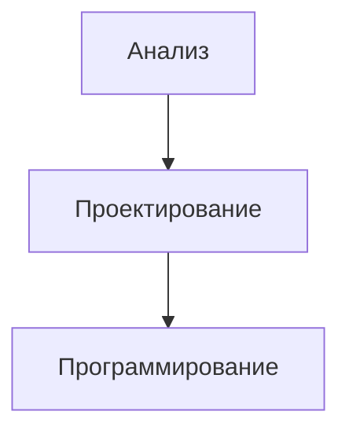
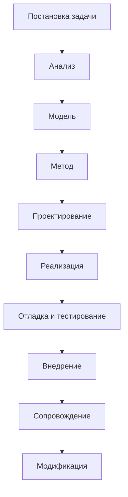
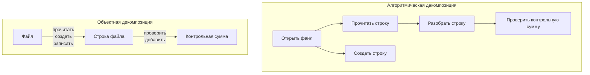

# Анализ и проектирование
Типовая схема решения задач с использованием вычислительной техники

Более развернутая версия

## Анализ предметной области. Декомпозиция
Есть два вида разбиения предметной области на составляющие:
- Алгоритмическая декомпозиция
  Основные элементы - **алгоритмы**.
  Разбиение сложного/долгого действия на простые.
- Объектная декомпозиция
  Основные элементы - виды абстракций (**классы**) и представители этих классов (**объекты**).
  Разбиение на объекты, с которыми происходит взаимодействие.

## Повторное использование
**Повторное использование** - применение уже существующих наработок в разрабатываемом ПО.

Повторное использование - важный элемент проектирования.
- Необходимо проектировать новые элементы системы с тем, чтобы их в последствии можно было использовать.
- Необходимо при проектировании системы рассматривать возможность использования того, что уже есть и работает.

**Девиз**: "Не надо изобретать велосипед, если он уже изобретен".

Достоинства повторного использования (по Соммервилю):
- Повышение надежности
- Уменьшение проектных рисков
- Эффективное использование специалистов
- Соблюдение стандартов
- Ускорение разработки

Виды повторного использования:
- Компонентная разработка
  Часть компонентов уже разработаны ранее, имеют четко описанный интерфейс. Они используются в качестве "кирпичиков" в новой системе.
- Использование паттернов (шаблонов) проектирования
  Применяются известные подходы к решению некоторых встречавшихся ранее проблем.
- Использование стандартных прикладных и системных библиотек

# Визуальное моделирование
**Модель** - упрощенное представление объектов и явлений реального мира.
Модель строят для того, чтобы лучше понять исследуемую систему.

Задачи моделирования:
- визуализация системы в ее некотором состоянии
- определение структуры и поведения системы
- получение шаблона для создания системы
- документирование принятых решений

*Выбор модели* оказывает определяющее влияние на подход к решению проблемы и на то, как будет выглядеть это решение.
Каждая модель может быть воплощена с разной *степенью абстракции*.
Лучшие модели - те, что *ближе к реальности*.
Наилучший подход при разработке сложной системы - использовать *несколько* почти *независимых моделей*.

**Объектный подход** - один из ключевых подходов к моделированию.
В результате OOA & OOD мы получаем "хороший" проект программной системы, прозрачный, удовлетворяющий требованиям, удобный для тестирования и отладки, коллективной разработки, развиваемый, допускающий повторное использование компонентов.

> [!NOTE] Идея визуального программирования
> **Проблема:** В больших системах проект слишком велик для восприятия одним человеком.
> Решение предлагает визуальное программирование.
> 
> - Визуализация упрощает понимание проекта в целом.
> - Визуализация помогает согласовать терминологию и убедиться, что все одинаково понимают термины.
> - Визуализация делает обсуждение конструктивным и понятным.

# UML
Для визуального моделирования нужна специальная нотация или язык.

>UML - **язык** для 
> - визуализации
> - специфицирования
> - конструирования
> - документирования
>
>элементов программных систем.

UML - язык общего назначения, предназначенный для объектного моделирования.

UML позволяет описывать систему следующими моделями:
- **Модель функционирования**
  Функциональность систем с точки зрения пользователя
- **Объектная модель**
  Проект системы с точки зрения объектного подхода
- **Динамическая модель**
  Как взаимодействуют друг с другом компоненты системы в динамике. Какие процесс происходят в системе.
  
**Диаграммы** UML предназначены для визуального отображения моделей и их компонентов.

В UML 2.0 13 типов диаграмм. 6 структурных, 3 поведения, 4 взаимодействия.

Структурные диаграммы:
- Диаграмма классов
  Классы, их атрибуты и связи между классами
- Диаграмма компонентов
  Компоненты и связи между ними
- Структурная диаграмма
  Внутренняя структура классов и связи с внешним миром
- Диаграмма развертывания
  Размещение ПО на аппаратуре
- Диаграмма объектов
  Структура системы в конкретный момент времени, объекты, их атрибуты
- Диаграмма пакетов
  Разложение системы на крупные составные части и связи между ними

Диаграммы поведения:
- Диаграмма действия
  Потоки информации в системе
- Диаграмма состояния
  Конечный автомат, показывающий функционирование системы
- Диаграмма вариантов использования (прецедентов)
  Работа системы с точки зрения пользователей

Диаграммы взаимодействия:
- Диаграмма кооперации
  Структурная организация участвующих во взаимодействии объектов
- Диаграмма взаимодействия (новация UML 2.0)
- Диаграмма последовательности
  Временная упорядоченность событий
- Временная диаграмма
  Временные рамки

