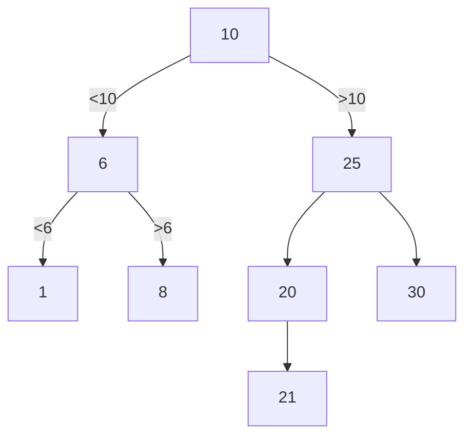

##### Stack (Last In First Out - LIFO)
```c++
#include <iostream>
using namespace std;

struct Node
{
	int d;
	Node* next;
};
Node *first(int d);
void push(Node **top, int d);
int pop(Node **top);

int main()
{
	Node *top = first(1);
	for(int i=2; i<6; i++)
	{
		push(&top, i);
	}
	while(top)
	{
		cout << pop(&top);
	}
	return 0;
}

Node *first(int d)
{
	Node *pv = new Node;
	pv->d = d;
	pv->next = 0;
	return pv;
}
void push(Node **top, int d)
{
	Node *pv = new Node;
	pv->d = d;
	pv->next = *top;
	*top = pv;
}
int pop(Node **top)
{
	int temp = (*top)->d;
	Node *pv = *top;
	*top = (*pv)->next;
	delete pv;
	return temp;
}
```
##### Очередь (First In First Out - FIFO)
```c++
#include <iostream>
using namespace std;

struct Node
{
	int d;
	Node *next;
	Node *prev;
};

Node *first(int d);
void add(Node **pend, int d);
int del(Node **pbeg);

int main()
{
	Node *queue = first(1);
	Node *end = queue;
	for(int i=2; i<6; i++)
	{
		add(&queue, i);
	}
	while(end)
	{
		cout << del(&end);
	}
	return 0;
}

Node *first(int d);
{
	Node *pv = new Node;
	pv->d = d;
	pv->next = 0;
	pv->prev = 0;
	return pv;
}
void add(Node **pend, int d)
{
	Node *pv = new Node;
	pv->d = d;
	pv->next = 0;
	pv->prev = *pend;
	(*pend)->next = pv;
	*pend = pv;
}
int del(Node **pbeg)
{
	int temp = (*pbeg)->d;
	Node *pv = *pbeg;
	*pbeg = (*pv)->next;
	delete pv;
	return temp;
}
```
##### Элементарные деревья (двоичные деревья / деревья двоичного поиска)
10,25,20,6,21,8,1,30, 10-корень

