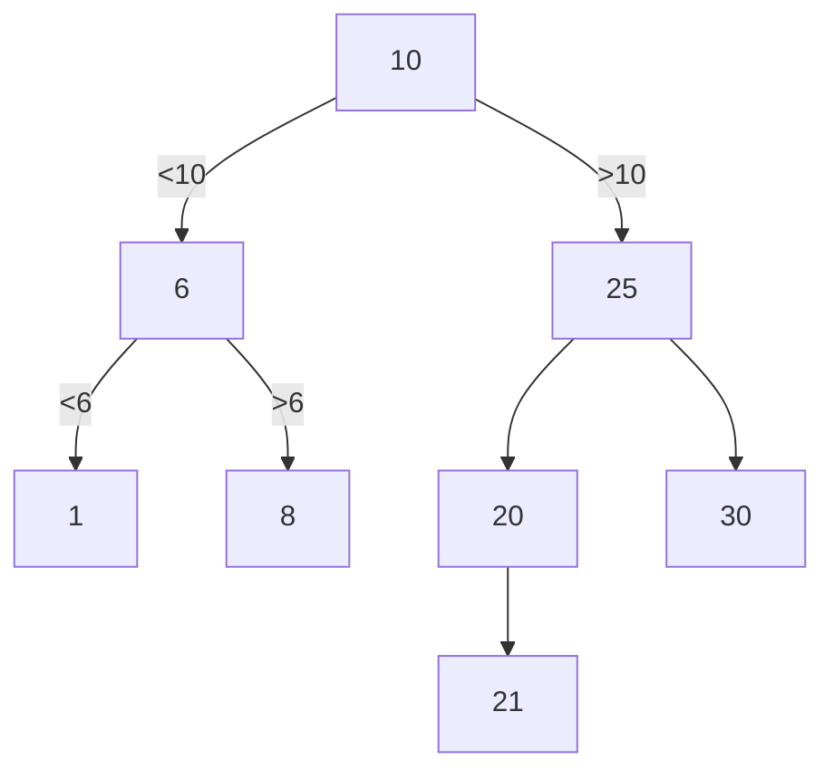

##### Stack (Last In First Out - LIFO)
```c++
#include <iostream>
using namespace std;

struct Node
{
	int d;
	Node* next;
};
Node *first(int d);
void push(Node **top, int d);
int pop(Node **top);

int main()
{
	Node *top = first(1);
	for(int i=2; i<6; i++)
	{
		push(&top, i);
	}
	while(top)
	{
		cout << pop(&top);
	}
	return 0;
}

Node *first(int d)
{
	Node *pv = new Node;
	pv->d = d;
	pv->next = 0;
	return pv;
}
void push(Node **top, int d)
{
	Node *pv = new Node;
	pv->d = d;
	pv->next = *top;
	*top = pv;
}
int pop(Node **top)
{
	int temp = (*top)->d;
	Node *pv = *top;
	*top = (*pv)->next;
	delete pv;
	return temp;
}
```
##### Очередь (First In First Out - FIFO)
```c++
#include <iostream>
using namespace std;

struct Node
{
	int d;
	Node *next;
	Node *prev;
};

Node *first(int d);
void add(Node **pend, int d);
int del(Node **pbeg);

int main()
{
	Node *queue = first(1);
	Node *end = queue;
	for(int i=2; i<6; i++)
	{
		add(&queue, i);
	}
	while(end)
	{
		cout << del(&end);
	}
	return 0;
}

Node *first(int d);
{
	Node *pv = new Node;
	pv->d = d;
	pv->next = 0;
	pv->prev = 0;
	return pv;
}
void add(Node **pend, int d)
{
	Node *pv = new Node;
	pv->d = d;
	pv->next = 0;
	pv->prev = *pend;
	(*pend)->next = pv;
	*pend = pv;
}
int del(Node **pbeg)
{
	int temp = (*pbeg)->d;
	Node *pv = *pbeg;
	*pbeg = (*pv)->next;
	delete pv;
	return temp;
}
```
##### Элементарные деревья (двоичные деревья / деревья двоичного поиска)
10,25,20,6,21,8,1,30, 10-корень


%%23.03.31(Л)%%
```CPP TI:"main.cpp"
#include <iostream>

using namespace std;

struct Node
{
	int d;
	Node *left;
	Node *right;
};

Node *first(int d);
void print_tree(Node *root, int l);
Node *search_insert(Node *root, int d);

int main()
{
	int b[] = {10,25,20,6,21,8,1,30};
	Node *root = first(b[0]);
	for(int i=1; i<8; i++) search_insert(root,b[i]);
	print_tree(root,0);
	return 0;
}

Node *first(int d)
{
	Node *pv = new Node;
	pv->d = d;
	pv->left = 0;
	pv->right = 0;
	return pv;
}
void print_tree(Node *root, int l)
{
	if(root)
	{
		print_tree(root->left, ++level);
		for(int i=0;i<level;i++) cout << "x";
		cout << root->d << endl;
		print_tree(root->right, ++level);
	}	
}
Node *search_insert(Node *root, int d)
{
	Node *pv = root, *prev;
	bool found = false;
	while(pv&&found)
	{
		prev = pv;
		if(d==pv->d) found = true;
		else if(d<pv->d) pv = pv->left;
		else pv = pv->right;
	}
	if(found) return pv;
	Node *pnew = new Node;
	pnew->d = d;
	pnew->left = 0;
	pnew->right = 0;
	if(d<prev->d) prev->left = pnew;
	else prev->right = pnew;
	return pnew;
}
```

	Ошибка на Node *pnew = new Node;

---
#theory #informatics_and_programming 