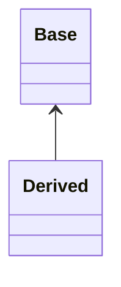
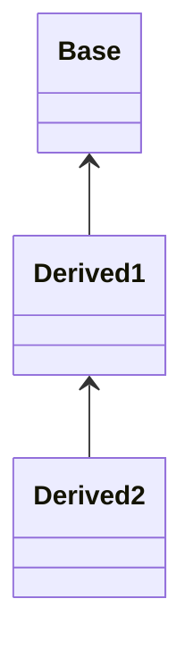
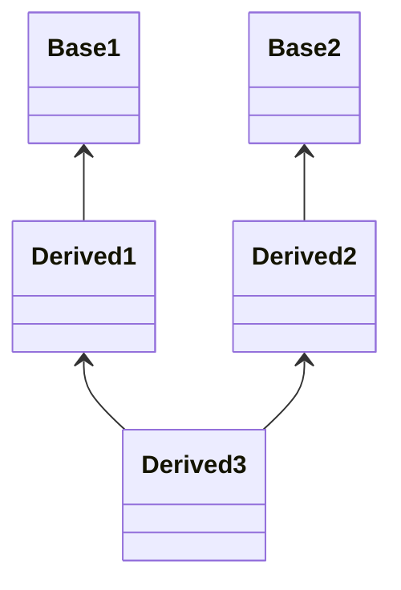
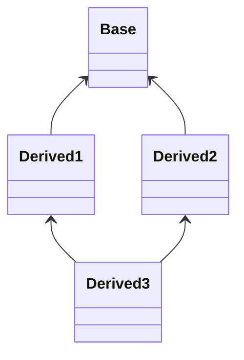

[[Информатика и программирование/23.05.05(Л)#Наследование]]


Сначала вызывается конструктор базового класса, затем производного.
Деструкторы вызываются в обратном порядке.

```cpp
#include <iostream>
using namespace std;

class Base
{
	int x;
public:
	Base(int x): x(x) {cout << "Base constructor" << endl;}
	~Base() {cout << "Base destructor" << endl;}
	void show() {cout << "x = " << x << endl;}
};

class Derived : public Base
{
	int y;
public:
	Derived(int n, int m) : Base(n)
		{y = m; cout << "Derived constructor" << endl;}//y = 0; y = n;
	~Derived() {cout << "Derived constructor" << endl;}
	void show()
	{
		cout << "y = " << y << endl;
		Base::show();	
	}
};

int main()
{
	Derived ob(10, 20); //x=10, y=20
	ob.show();
	ob.Base::show();
	return 0;
}
```





`Base`, `Base 1`, `Base 2` - косвенные предки


`Derived3` дважды наследует класс `Base`. Хранит две копии `Base`.
Возникает проблема - с какой копией работать?

Для предотвращения данной ситуации используется ключевое слово `virtual`.

```cpp
#include <iostream>
using namespace std;

class Base
{
	int x;
public:
	Base(int y) : x(y) {}
	void show() {cout << "x = " << x << endl;}
};

class Derived1 : public Base
{
	int y;
public:
	Derived1(int m, int n) : Base(n), y(m) {}
	void show() {cout << "y = " << y << endl;}
};

class Derived2 : public Base
{
	int y;
public:
	Derived2(int m, int n) : Base(n), y(m) {}
	void show() {cout << "y = " << y << endl;}
};

class Derived3 : public Derived1, public Derived2
{
	int z;
public:
	Derived3(int x1, int y1, int x2, int y2, int z) : 
		Derived1(x1, y1),
		Derived2(x2, y2),
		z(z)
		{}
	void showZ() {cout << "z = " << z << endl;}
};

int main()
{
	Derived3 ob(1,2,3,4,5);
	ob.show(); // ошибка
	return 0;
}
```

```cpp
};

class Derived1 : virtual public Base
{
	int y;
```

```cpp
};

class Derived2 : virtual public Base
{
	int y;
```

---
#theory #informatics_and_programming 