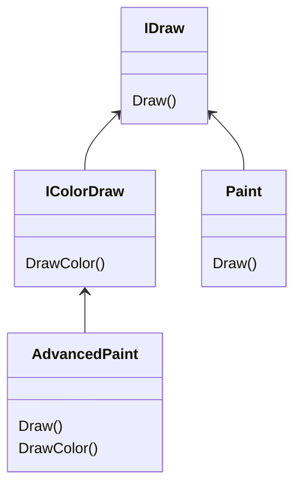
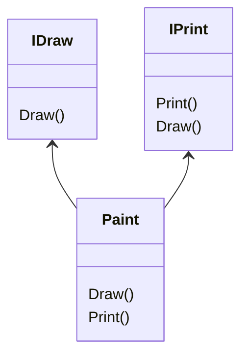

- Инкапсуляция
  Только класс может манипулировать своими данными.
- Наследование
  Классы могут наследовать от других методы и поля.
- Полиморфизм
  Способность языка трактовать связанные объект в схожей манере.

Модификаторы доступа C#

| Модификатор доступа  | К чему может быть применен     | Практический смысл                                                                                                                                                                                                                     |
| -------------------- | ------------------------------ | -------------------------------------------------------------------------------------------------------------------------------------------------------------------------------------------------------------------------------------- |
| `public`             | Типы или члены типов           | Открытые элементы не имеют ограничений доступа. Открытый член может быть доступен из объекта, а также из любого производного класса. Открытый тип может быть доступен из других внешних сборок                                         |
| `private`            | Члены типов или вложенные типы | Закрытые элементы могут быть доступны только классу (или структуре), где они определены                                                                                                                                                |
| `protected`          | Члены типов или вложенные типы | Защищенные элементы могут пользоваться классом, который их определяет, и любым дочерним классом. Защищенные элементы не доступны за пределами цепочки наследования                                                                     |
| `internal`           | Типы или члены типов           | Внутренние элементы доступны только внутри текущей сборки. Другим сборкам можно явно предоставить разрешение выдать внутренние элементы                                                                                                |
| `protected internal` | Члены типов или вложенные типы | Когда в объявлении элемента указана комбинация `protected` и `internal`, то такой элемент будет доступен внутри определяющей его сборки, внутри определяющего класса и производным классам внутри или за пределами определяющей скобки |
| `private protected`  | Члены типов или вложенные типы | Когда в объявлении элемента указана комбинация ключевых слов `private` и `protected`, то такой элемент будет доступен внутри определяющего его класса                                                                                                                                                                                                                                       |

# Наследование
```cs
sealed class MiniVan : Car
{
}
```
`MiniVan` - наследник `Car`.

Конструкторы не наследуются!

Множественное наследование запрещено (структура иерархии классов может быть только древовидной).

Ключевое слово `sealed` запрещает наследование от этого класса (тупиковый класс).

Обычно поля объявляются приватными (`private`), а функции их изменения (если необходимо) - защищенными (`protected`).

Включаемый класс/делегат
```cs
class BenefitPackage
{
	public double ComputePayDeduction()
	{
		return 125.0;
	}
}

partial class Employee
{
	protected BenefitPackage EmpBenefits = new BenefitPackage();
	//...
}
```

# Интерфейсы
Виртуальные классы без полей и реализации методов.
Классы могут иметь несколько интерфейсов.
Каждый класс должен реализовать функции интерфейса.

# Полиморфизм
- Подтиповой
  наследование метода от класса/интерфейса
- AD-HOC
  функция переопределена с другими параметрами
  ```cs
  Draw(int a);
  Draw(int a, int b);
	```
- Параметрический
  функция принимает любые параметры (generic)
  ```cs
  Draw([a]);
	```

# Иерархия интерфейсов




C# зачтет реализацию одного `Draw()` для обоих интерфейсов.

Для разделения `Draw()` из `IPrint` и `IDraw`,  при реализации можно указывать, к какому интерфейсу относится метод.
```cs
interface IDraw {
int Draw();
}
interface IPrint {
int Draw();
}
class Paint : IPrint, IDraw {
int IPrint.Draw() {...}
int IDraw.Draw() {...}
}
Paint p = new Paint();
p.Draw(); // ошибка
```

# Системные интерфесы/классы
## IEnumerable, IEnumerator
```cs
public class Garage
{
	// ...
	private Car[] carArray[4];
	public Garage() {
		carArray[0] = new Car("Rusty", 30);
		carArray[1] = new Car("Chunker", 55);
		carArray[2] = new Car("Zippy", 30);
		carArray[3] = new Car("Lada", 1000);
	}
}
foreach (car in garage) // Error
{/*...*/}
```

```cs
public class Garage : IEnumerable
// ...

```

```cs
interface IEnumerable {
	IEnumerator GetEnumerator();
}

interface IEnumerator {
	bool MoveNext(); // перейти к следующему
	object Argument {get}; // получить текущий
	void Reset(); // вернуться к первому
}
```
методы интерфейса также необходимо реализовать в классе
```cs
public class Garage {
	//...
	public IEnumerator GetEnumerator() => carArray.GetEnumerator();
}
```


