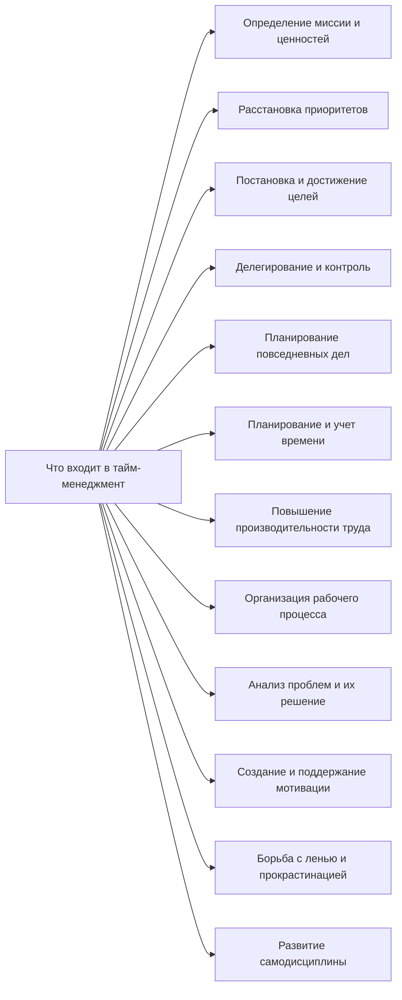

Фактору времени как оценке системы управления и потенциальному конкурентному преимуществу в теории менеджмента стали уделять большое внимание только в последние 30 лет.

Нормирование труда, разработанное основоположниками научной школы менеджмента в начале ХХ в., нельзя отнести к данной категории, поскольку они использовали время как единицу измерения при выполнении работы.

Первым серьезным достижением в этом направлении стало развитие в теории менеджмента методик стратегического планирования и понятия «конкурентное преимущество». Все это произошло благодаря развитию мировой торговли и интенсивной экспансии национальных корпораций на рынки соседних стран и континентов.

**Объектом** тайм-менеджмента является **человек** (руководитель, менеджер, сотрудник) и его личностные и профессиональные качества, влияющие на временные затраты при выполнении им тех или иных дел.
Главной целью тайм-менеджмента является расстановка приоритетов среди стоящих перед человеком задач и выполнение в первую очередь наиболее важных из них.

Планирование своего времени и управление им - **личное дело каждого**. Однако способность сотрудника укладываться в сроки, расставлять приоритеты и грамотно распределять рабочую нагрузку - это залог не только личной успешности, но и эффективной деятельности предприятия.

**Тайм-менеджмент** - это новое направление в управленческой сфере, способ сделать организацию конкурентоспособной, создав при этом сотрудникам более комфортные условия труда, что, в свою очередь, повышает их мотивацию.

**Управление временем** - это действие или процесс тренировки сознательного контроля над количеством времени, потраченного на конкретные виды деятельности, при котором специально увеличиваются эффективность и продуктивность. Управление временем может помочь рядом навыков, инструментов и методов, используемых при выполнении конкретных задач, проектов и целей.
Этот набор включает в себя широкий спектр деятельности, а именно: планирование, распределение, постановку целей, делегирование, анализ временных затрат, мониторинг, организация, составление списков и расстановка приоритетов.

**Дефицит рабочего времени** - нехватка временного ресурса, вызванная неправильной организацией работником своей деятельности, либо неграмотной организацией деятельности руководством, что приводит к спешке, затягиванию выполнения работ, заданий, некачественной работе, потерям в производстве, браку и т.д. что в конечном итоге существенно влияет на эффективность работы всего предприятия.

**Причины дефицита времени** заключаются в следующем:
1. Постоянная спешка.
2. Отсутствие четкого распределения работ по степени их важности.
3. Постоянные доработки дома.
4. Большой поток рутинных дел, работа над которыми занимает много времени.
5. "Воры времени" - непредвиденные и обусловленные недостаточным планированием дела.
6. Суетливость.
7. Слабая мотивация труда.

Существуют различные подходы к типологии тайм- менеджмента, среди которых В.В. Ананишев выделяет следующие:
1. Ролевой тайм-менеджмент способствует эффективному исполнению работы человека в процессе исполнения им какой-то «конкретной социальной роли в ролевом тайм менеджменте чаще всего не обойтись без помощи профессионального консультанта
2. Профессиональный тайм-менеджмент состоит из психологии трудовой деятельности и методов повышения эффективности труда заимствованных из НОТ (научной организации труда)
3. Социальный тайм-менеджмент это совокупность межличностных отношений и совместного управления временем нескольких людей. Примером является корпоративный тайм- менеджмент, основной задачей которого является оптимизация процессов взаимодействия людей.
4. Личный (персональный) тайм менеджмент применяется для организации сотрудником своей работы с помощью различных методов, инструментов, приемов.
5. Командный тайм-менеджмент это правила взаимодействия по горизонтали между не подчиненными друг другу специалистами. Это наиболее значимая область для корпоративного стандарта, поскольку взаимоотношения сотрудников, согласование индивидуальных целей, планов и приоритетных направлений в условиях неизбежных функциональных и личностных конфликтов требуют корпоративного централизованного регулирования.
6. Корпоративный тайм-менеджмент регулируются отношения по вертикали, причем как от начальника к подчиненному, так и в обратную сторону

Большинство специалистов по тайм менеджменту считают, что лучшие методы управления временем это удобные методы.

В практикуме по управлению временем С.И. Калининым предложены следующие критерии «удобства» методов тайм-менеджмента:
1. Легкость и простота применения.
2. Экономичность.
3. Эффективность.
   Методы управления временем - не игра, не развлечение, не отдых; это несколько другой способ структурирования времени.
4. Естественность.
   Методы управления временем должны легко интегрироваться в нашу повседневную жизнь, не слишком нарушая ее течение, и уж точно не разрушая ее.
5. Положительные эмоции.
   На начальных этапах применения многие методы управления временем могут доставлять и негативные эмоции.

### Специфика восприятия времени в различных типах культур
В странах **монохронной** культуры (США, Англии, Германии и в странах Скандинавии) время жестко регулирует поведение людей и вместе с тем отношения между ними.

Американец, например, сосредоточивает все свое внимание на сложной задаче, решает ее и переходит к следующей. Для него выполнение задачи более важно, чем отношения с людьми, которые оказывают ему содействие. Он серьезно относится к намеченным сроком, ценит расторопность и не придает большого значения кратковременным отношениям с человеком, с которым заключил одноразовую сделку, сыграл партию в теннис и, возможно, больше никогда не встретится.

В других культурах (российской, во многих средиземноморских, арабских, латиноамериканских и некоторых азиатских) время зачастую воспринимается **полихронно**, то есть внимание людей обращено одновременно на несколько событий: человек умеет гибко себя вести, делая сразу три-четыре запланированных дела. Когда в таких странах что-то планируется, во главу угла ставятся Дружеские отношения, а не намеченные сроки, и личностные отношения могут одерживать верх над интересами дела.

Китайцы, как и большинство жителей Востока, "не спешат бросаться в воду", избегают поспешных решений, но обладают острым чувством ценности времени. Это особенно заметно в их отношении ко времени, отнятому у других людей, за что они часто извиняются. В Китае принято при завершении встречи благодарить участников за то, что они затратили свое драгоценное время. Пунктуальность в прибытии также считается важной больше, чем во многих других азиатских странах.

Несмотря на схожесть культур и народов Китая и Японии, их взгляды на время, однако, различаются. Характерная для японцев обостренная способность к последовательному развертыванию событий хорошо описана Джой Хендри в ее книге "Обволакивающая культура".

Те, кто знаком с японцами, хорошо знают о контрасте между головокружительной скоростью, с которой работает фабричный рабочий, с одной стороны, и неторопливым созерцанием японских садов или мучительно медленным темпом драм «Но» - с другой (Драма «Но» - традиционный японский театральный жанр, характеризующийся медленным развитием действия).

### Общие проблемы планирования времени
Различные взгляды на время:
- физический
-  философский
- психологический
- ресурсный

А. Эйнштейн считал, что временная длительность физического события определяется показаниями покоящихся часов, которые находятся в месте события. Другими словами, время это показание часов, и свойства физического времени совпадают со свойствами физических часов.

### Время и философия
С точки зрения философии можно построить теорию, исходя из того, что время вторично по отношению особому свойству мира - **изменчивости**.

Человеку дано чувство изменения окружающего мира. А время тогда вводится как мера происшедших изменений. При таком подходе для каждого человека время свое. Общая для многих людей мера времени возникает, если договориться о едином явлении, изменчивость которого будет принята за эталон хода времени.
Так возникли часы.
Это классическая **реляционная** концепция времени.

Имеется концепция первичности человеческого восприятия в феномене времени. Время трактуется как упорядоченность в сознании воспринимаемых человеком событий. Общезначимое время возникает как феномен коллективного сознания.

Некоторые философские системы считают время иллюзией. Неуловимость момента времени трактуется как аналог призрачности самого явления. В древности именно этот взгляд на время привел к сознательному изгнанию понятия времени из математических теорий.

Имеется взгляд на время как на субстанцию, активирующую изменчивость в мире. Некоторые из таких учений носят религиозный характер (изменчивость как проявление энергии божества). Такую роль играет, например, Шива в индуизме. Но эта концепция совместима и с научными представлениями.

Возможны различные взгляды на понятие момента времени. Момент можно трактовать как наименьшую доступную наблюдению длительность.

Такое понятие момента абсолютно на каждом этапе развития метрологии. Альтернативной концепцией является понятие момента как совокупности начавшихся и пока незавершенных процессов, относящихся к интересующей наблюдателя группе явлений.

Тогда момент обладает длительностью, зависящей от типа рассматриваемых процессов. Это позволяет говорить о десятках тысяч лет в одном моменте геологической истории, или о наносекундах в такте электронных схем.

### Психологические аспекты времени
Психологи часто стремятся физические единицы времени считать не только физическими, но и психологическими характеристиками.

Весьма показательно в этом отношении понятие психологического возраста.

Он определяется личностью исходя из своей самооценки, т.е. является ее интраиндивидуальной оценкой.

Об идентичности личности судят в первую очередь по тому, насколько и в какую сторону отличается ее психологический возраст от хронологического. В отличие от хронологического психологический возраст может не только возрастать, но и уменьшаться (т.е. происходит отказ от необратимости времени).