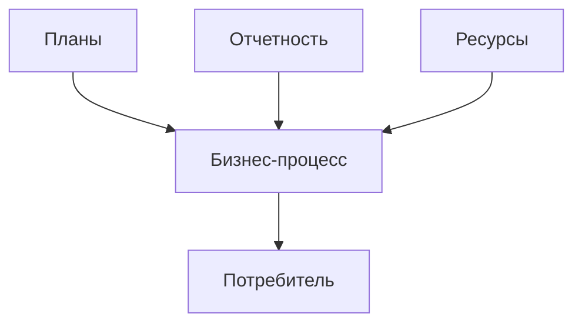

**Бизнес-процесс** - это набор операций, которые, взятые вместе, создают результат, имеющий цену для потребителя.

Бизнес-процессы могут быть разделены на три группы:
- Основные
  Создание основных продуктов
- Вспомогательные
  Обеспечение деятельности основных процессов
- Процессы управления
  Управление деятельностью всей организации

### Методологии моделирования
Описание бизнес-процессов, как правило, начинается с определения стандарта (методологии), в котором будет осуществляться моделирование.

На сегодняшний день существуют и используется несколько стандартов:
- IDEF0
  Описание бизнеса на верхнем уровне
- IDEF3
  Построение бизнес-процессов по принципу послеовательно выполняемых по времени работ
- DFD
  Описание потоков данных
- UML
  Основана на объектно-ориентированном подходе, построение диаграмм прецедентов, классов и т.д.
- ARIS
  Описание организации строится из моделей 4-х групп: организационной структуры, функций, данных, бизнес-процессов. В основе лежит IDEF3.

#### Методология IDEF0 (SADT)
Методология структурного моделирования IDEF0 предполагает построение модели, которая должна использоваться при построении ИС предприятия.

Предназначена для представления функций системы и анализа требований к системам.

Реализованы идеи системного анализа:
- общий обзор системы
- детализация в виде иерархической структуры.

В результате система разбивается на функциональные части, дается их описание, исследуются информационные потоки, формализуется структура данных.

Нотация IDEF0 позволяет наглядно представить бизнес-процессы и выявить недостатки: неэффективное управление, ненужные, избыточные или дублирующие работы и др.

##### Основы
Методология IDEF0 базируется на четырех ключевых понятиях:
1. **Функциональный блок (Activity Bох)** графически изображается в виде прямоугольника и олицетворяет собой некоторую конкретную функцию в рамках рассматриваемой системы
2. **Интерфейсная дуга (Arrow)** отображает элемент системы, который обрабатывается функциональным блоком или оказывает иное влияние на функцию, отображенную данным функциональным блоком
3. **Декомпозиция (Decomposition)** - позволяет разбить сложные процессы на составляющие его операции. При этом уровень детализации процесса определяется непосредственно разработчиком модели
4. **Глоссарий (Glossary)** - набор соответствующих определений, ключевых слов, повествовательных изложений и т.д., которые характеризуют объект, отображенный данным элементом

##### Функциональный блок
Каждая из четырех сторон функционального блока имеет свое определенное зночение (роль):
- Верхняя часть - Управление
- Левая часть - Вход
- Правая часть - Выход
- Нижняя часть - Механизм

**Входы** - информация, которая используется или преобразуется функциональным блоком для достижения результата.
**Управление** - правила, стратегии, процедуры, стандарты регулирующие поведение исполнителей каждого функционального блока.
**Механизмы** - ресурсы, выполняющие работу в функциональном блоке.
**Выходы** - данные, которые получаются в результате выполнения функции, т. е. результат работы.

##### Дуги
Графическим отображением интерфейсной дуги является однонаправленная стрелка. Каждая интерфейсная дуга должна имеет свое уникальное наименование (Arrow Label).

В зависимости от того, к какой из сторон подходит данная интерфейсная дуга, она является "входом", "выходом", "механизмом" (ресурсом) или "управлением".

##### Декомпозиция
Декомпозиция позволяет постепенно и структурированно представлять модель системы в виде иерархической структуры отдельных диаграмм.
Это делает ее менее перегруженной и легко читаемой.

##### Иерархия диаграмм
Каждый блок на диаграмме имеет свой номер.

Блок любой диаграммы может быть далее описан диаграммой нижнего уровня, которая, в свою очередь, может быть далее детализирована с помощью необходимого числа диаграмм. Таким образом, формируется иерархия диаграмм.

Для того, чтобы указать положение любой диаграммы или блока в иерархии, используются составные номера диаграмм.

##### Синтаксис диаграмм
Функциональные блоки изображаются прямоугольниками, в названии используются глаголы или глагольные обороты.

Блоки располагаются по степени важности сверху вниз и слева на право. Блоки нумеруются, номера блоков - однозначные идентифиткаторы системных функций.

Дуги изображаются одинарными линиями со стрелками на концах. Дуги изображают объекты (или данные), поэтому они описываются существительными или существительными с определениями (набор инструментов, чертеж и т.д.)

Используются пять типов взаимосвязей между блоками для описания их отношений: управление, вход, обратная связь по управлению, обратная связь по входу, выход-механизм.

**Отношение входа (механизма, управления)** возникает тогда, когда выход одного блока становится входом (механизмом, управлением) для блока с меньшим доминированием.

**Обратная связь по управлению и обратная связь по входу** представляют собой итерацию или рекурсию: выходы одной функции влияют на будущее выполнение других функций, которые в последущем влияют на исходную функцию.

**Обратная связь по управлению** возникает тогда, когда выход некоторого блока влияет на блок с большим доминированием.

**Связь по входной обратной связи** имеет место тогда, когда выход одного блока становится входом другого блока с большим доминированием.

**Связи выход-механизм** отражают ситуацию, когда выход одной функции становится средством достижения цели другой функции. Характерны при распределении ресурсов (требуемые инструменты, обученный персонал, физическое пространство, оборудование, финансирование и та