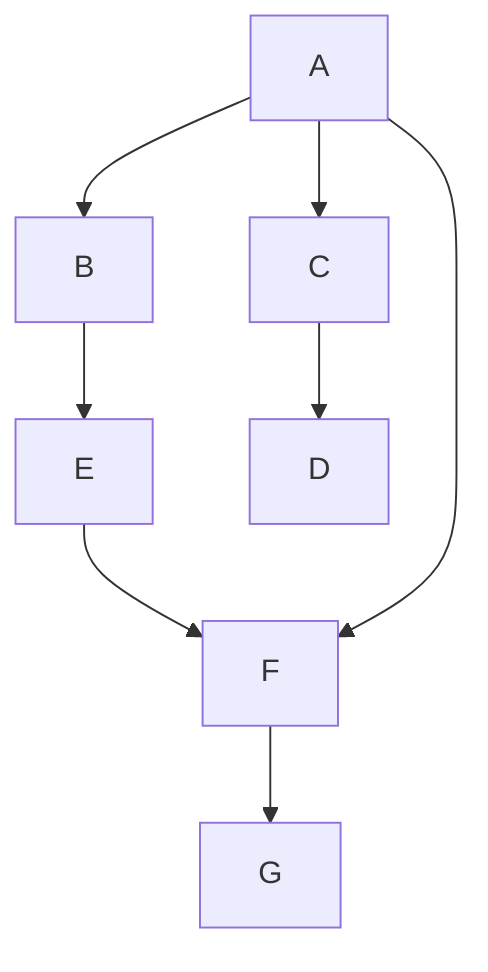
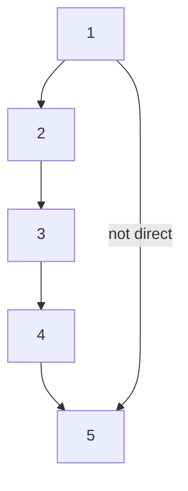

# Архитектура, стандартизация и классификация сетей
**Декомпозиция** - разбиение одной сложной задачи на несколько более простых задач-модулей.

### Концепция многоуровневого взаимодействия
Межуровневый интерфейс, называемый также интерфейсом услуг, определяет набор функций, которые нижележащий уровень предоставляет вышележащему.
![[IMG20230320121341.jpg|600]]

### Взаимодействие произвольной пары узлов

Организация взаимодействия узлов A и B может быть сведена к поочередному взаимодействию пар промежуточных смежных узлов.

### Протокол и стек протоколов
![[IMG20230320122113.jpg|600]]
Интерфейс со средствами взаимодействия другой стороны, расположенными на том же уровне иерархии, называют **протоколом**.

Иерархически организованный набор протоколов, достаточный для организации взаимодействия узлов сети, называется стеком протоколов.

### Модель OSI
В начале 80-х годов ряд международных организаций по стандартизации и, в частности, International Orgainzation for Standatization(ISO), часто называемая International Standards Organization, а также International Telecommunication Union(ITU) и некоторые другие, разработали стандартную модель **взаимодействия открытых систем** (Open System Interconnection, OSI). Эта модель сыграла значительную роль в развитии компьютерных сетей.

Модель OSI описывает только системные средства взаимодействия, реализуемые операционной системой, системными утилитами, системными аппаратными средствами. Модель не включает средства взаимодействия приложений конечных пользователей. Важно различать уровень взаимодействия приложений и прикладной уровень семиуровневой модели.

Приложения могут реализовывать собственные протоколы взаимодействия, используя для этих целей многоуровневую совокупность системных средств. Именно для этого в распоряжение программистов предоставляется **прикладной программный интерфейс** (Application Program Interface, API).

![[IMG20230320123222.jpg|600]]

### Вложенность сообщений различных уровней
![[IMG20230320124028.jpg|600]]
В стандартах ISO для обозначения единиц обмена данными, с которыми имеют дело протоколы разных уровней, используется общее название **протокольная единица данных** (Protocol Data Unit, PDU). Для обозначения единиц обмена данными конкретных уровней часто используются специальные названия, в частности: **сообщение, кадр, пакет, дейтаграмма, сегмент**.

### Уровни модели OSI
***Физический уровень*** имеет дело с передачей битов информации по физическим каналам связи. Физический уровень не вникает в смысл информации, которую он передает. Для него это однородный поток битов, которые нужно доставить без искажений и в соответствии с заданной тактовой частотой.
Единица информации: **дейтаграмма**.

***Канальный уровень*** обеспечивает прозрачность соединения для сетевого уровня.
Услуги:
1. установление логического соединения
2. согласование скоростей передатчика и приемника информации
3. обеспечение надежной передачи, обнаружение и коррекция ошибок

Единица информации: **кадр/ячейка**.

***Сетевой уровень*** служит для образования единой транспортной системы, объединяющей несколько сетей и называемой **составной частью**, или **интернетом**.
Единица информации: **пакет**.

***Транспортный уровень*** обеспечивает приложениям и верхним уровням стека передачу данных с той степеью надежности, которая им требуется. Модель OSI определяет пять классов транспортного сервиса: от 0 до 4.
Все протоколы, начиная с транспортного уровня и выше, реализуются программными средствами конечных узлов сети. Протоколы нижних четырех уровней обобщенно называют сетевым транспортом, или транспортной подсистемой.
*Примеры транспортных протоколов*: TCP, UDP, SPX.

***Сеансовый уровень*** управляет взаимодействием сторон: фиксирует, какая из сторон является активной в настоящий момент, и предоставляет средства синхронизации сеанса.

***Уровень представления*** обеспечивает представление передаваемой по сети информации, не меняя при этом ее содержания.

***Прикладной уровень*** - набор разнообразных протоколов, с помощью которых пользователи сети получают доступ к общим ресурсам, а также организует совместную работу.
Единица информации: **сообщение**.
*Примеры транспортных протоколов*: NFS, FTP, SMB, NCP, SMTP, IMAP, POP3, HTTP, HTTPS.

### Стек протоколов OSI
![[IMG20230320125827.jpg|600]]

### Стек протоколов NetBIOS/SMB
![[IMG20230320130137.jpg|300]]

### Соответствие популярных стеков протоколов модели OSI
![[IMG20230320130241.jpg]]

### Распределение протоколов по элементам сети
![[IMG20230320130610.jpg]]

### Вспомогательные протоколы транспортной системы
**Пользовательский слой** основные протоколы, переносящие пользовательский трафик.
**Слой управления** вспомогательные протоколы, необходимые для работы основных протоколов сети.
**Слой менеджмента** протоколы управления сетью администратором.

### Классификация компьютерных сетей
Телекоммуникационные сети:
- радиосети
- телефонные сети
- телевизионные сети
- компьютерные сети

По территории покрытия:
- локальные
- глобальные
- городские

По среде передачи:
- проводные
- беспроводные

По способу коммутации:
- с коммутацией пакетов
- с коммутацией каналов

По способу продвижения пакетов:
- дейтаграммные
- с логическим соединением
- на виртуальных каналов

По типу пользователей:
- операторов связи
- корпоративные
- персональные

По функциональной роли:
- сети доступа
- магистральные
- сети агрегирования трафика
 
- Первичные сети (оптические)
- Наложенные сети

### Интернет
- Публичная сеть
- Сет операторов связи, предоставляющая публичные услуги, как информационные, так и транспортные.
- Сеть с коммутацией пакетов
- Сеть состоящая из магистральных сетей, сетей агрегирования трафика и сетей доступа.