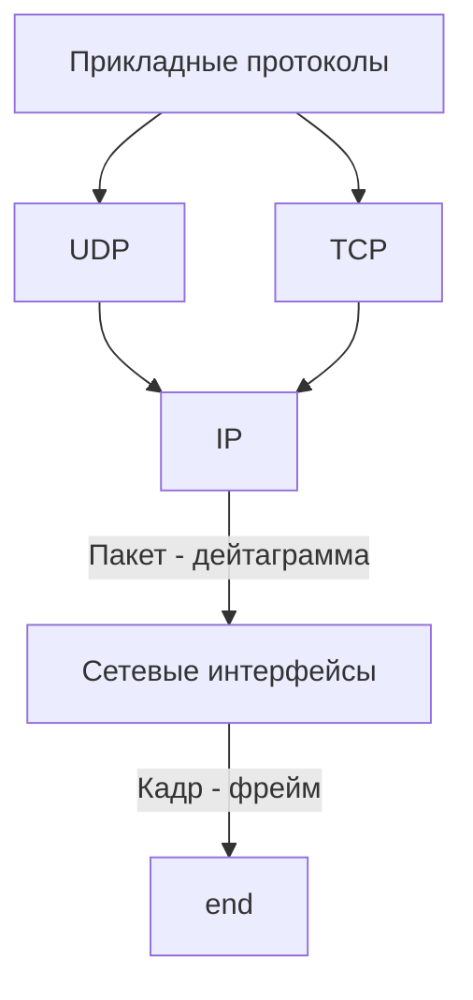

# Адресация в стеке протоколов TCP/IP
Уровень | Протоколы
--- | ---
Прикладной | FTP, Telnet, HTTP, SMTP, SNMP, TFTP
Транспортный | TCP, UDP
Сетевой | IP, ICMP, RIP, OSPF
Уровень сетевых интерфейсов | Не регламентируется

## Типы адресов стека TCP/IP
Для идентификации сетевых интерфейсов используется три типа адресов:
- локальные (аппаратные) адреса
- сетевые адреса (IP)
- символьные (доменные) имена
![[IMG20230327123016~2.jpg|400]]

## Формат IP-адреса
Наиболее распространенной формой представления IP-адреса является запись в виде четырех чисел, представляющих значения каждого байта в десятичной форме и разделенных точками, например:
	128.10.2.30
Этот же адрес может быть представлен в двоичном и шестнадцатеричном формате.

## Классы IP-адресов
Признаком, на основании которого IP-адрес относят к тому или иному классу, являются значения нескольких первых битов адреса.
![[IMG20230327124632~2.jpg|600]]

Класс | Первые биты | Наименьший номер сети | Наибольший номер сети | Максимальное число узлов сети
---|---|---|---|---
A | 0 | 1.0.0.0 (0 - не используют) | 126.0.0.0 (127 - зарезервирован) | $2^{24}$, поле 3 байта
B | 10 | 128.0.0.0 | 191.255.0.0 | $2^{16}$, поле 2 байта
C | 110 | 192.0.0.0 | 223.255.255.0 | $2^{8}$, поле 1 байт
D | 1110 | 224.0.0.0 | 239.255.255.255 | Групповые адреса
E | 11110 | 240.0.0.0 | 247.255.255.255 | Зарезервировано

## Особые IP-адреса
- Если IP-адрес состоит только из двоичных нулей, то он называется **неопределенным** адресом и обозначает адрес того узла, который сгенерировал этот пакет. Адрес такого вида в особых случаях помещается в заголовок IP-пакета в поле адреса отправителя.
- Если в поле номера сети стоят только нули, то по умолчанию считается, что узел назначения принадлежит той же самой сети, что и узел, который отправил пакет. Такой адрес также может быть использован только в качестве адреса отправителя.
- Если все двоичные разряды IP-адреса равны 1, то пакет с таким адресом назначения должен рассылаться всем узлам, находящимся в той же сети, что и источник этого пакета. Такой адрес называется **ограниченным широковещательным**. Ограниченность в данном случае означает, что пакет не выйдет за границы данной подсети ни при каких условиях.
- Если в поле адреса назначения в разрядах, соответствующих номеру узла, стоят только единицы, то пакет, имеющий такой адрес, рассылается всем узлам сети, номер которой указан в адресе назначения. Например, пакет с адресом 192.190.21.255 будет направлен всем узлам сети 192.190.21.0. Такой тип адреса называется **широковещательным**.

Класс адресов  | Десятичная форма | Двоичная форма | Шестнадцатеричная форма | Префикс
--|--|--|--|--
A|255.0.0.0|11111111.000000000.000000000.000000000|FF.00.00.00|/8
B|255.255.0.0|11111111.11111111.000000000.000000000|FF.FF.00.00|/16
C|255.255.255.0|11111111.11111111.11111111.000000000|FF.FF.FF.00|/24

## Автономные сети
- в классе A - сеть 10.0.0.0
- в классе B - диапазон из 16 номеров сетей (172.16.0.0 - 172.31.0.0)
- в классе C - диапазон из 255 сетей (192.168.0.0 - 192.168.255.0)