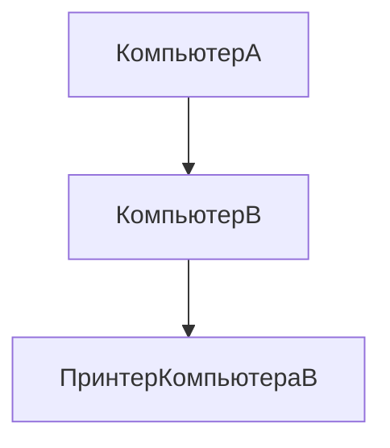
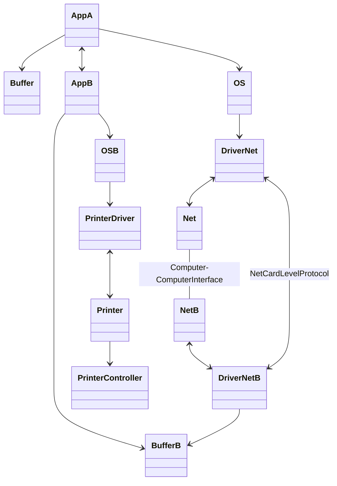
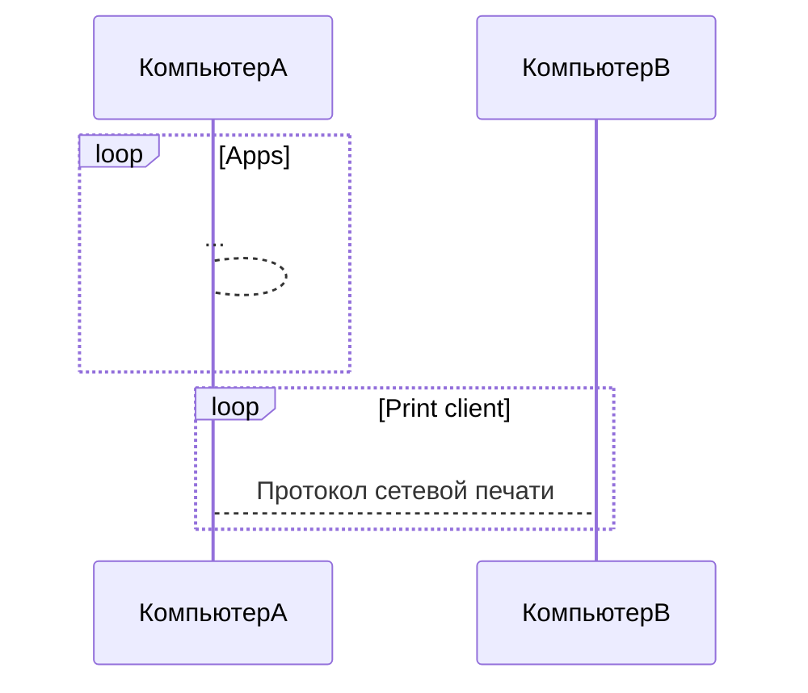
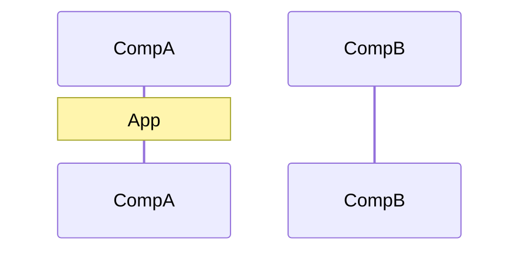
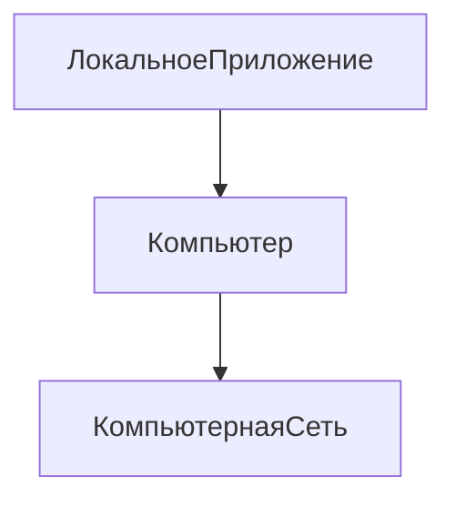
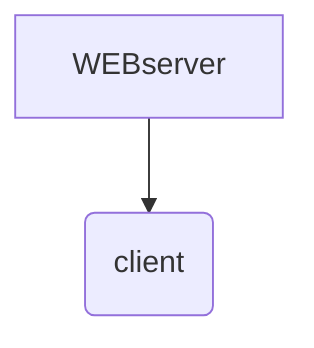

%%23.02.20(Л)%%
## Простейшая сеть
Исторически главной целью объединения компьютеров в сеть было разделение ресурсов
- переферийные устройства
- данные, хранящиеся в оперативной памяти или на внешних запоминающих устройствах
- вычислительная мощность

**Интерфейс** - в широком смысле - формально определенная логическая и/или физическая граница между взаимодействующими независимыми объектами.

**Физический интерфейс (порт)** определяется набором электрических связей и характеристика сигналов. Обычно он представляет собой разъем с набором контактов, каждый из которых иметт определенное назначение.

**Логически интерфейс (протокол)** - набор информационных сообщений конкретного формата, которыми обмениваются два устройства или две программы, а также набор правил, определяющих логику обмена этими сообщениями.

*Приложение А* формирует сообщение, содержащее как информацию, так и управляющие команды. Сообщение формируется в соответствии с протоколом уровня приложений. Для передачи сообщения *приложение А* обращается к *операционной системе*. *Операционная система* вызывает *драйвер сетевой интерфейсной карты* и дает драйверу задание, связанное с передачей сообщения. Далее *драйвер* осуществляет управление *сетевой интерфейсной картой*, в результате чего *сетевая интерфейсная карта* переводит сообщение из двоичного кода в набор физических импульсов (сигналов), которые передаются по *интерфейсу компьютер-компьютер* (физический канал связи). *Сетевая интерфесная карта компьютера Б* принимает физические импульсы и переводит их в двоичный код под руководством (управлением) *драйвера сетевой интерфейсной карты*. Далее информация записывается в *буфер оперативной памяти*. *Приложение Б* по мере готовности считывает сообщение из *буфера оперативной памяти*, интерпретирует его и выполняет действия в соответствии с алгоритмом. Если в сообщении была команда о выводе на печать на принтер, подключенный к компьютеру Б, то *приложение Б* обращается к *операционной системе*, та вызывает *драйвер принтера* и дает ему задание. *Драйвер принтера* управляет *интерфейсной картой принтера*, в результате чего формируется физический сигнал, который передается на *интерфейс компьютер-принтер*. На другом конце *контроллер принтера* интерпретирует полученные сигналы и выполняет команды.

**Клиент** - это модуль, предназначенный для формирования и передачи сообщений - запросов к ресурсам удаленного компьютера от разных приложений с последующим приемом результатов из сети и передачей их соответсвтвующим приложениям.

**Сервер** - это модуль, который постоянно ожидает прихода из сети запросов от клиентов и, приняв запрос, пытается его обслужить, как правило, с участием локальной ОС, один сервер может обслуживать запросы сразу нескольких клиентов (поочередно или одновременно).

Пара клиент-сервер - сервер, предоставляющий доступ к конкретному типу ресурса компьютера через сеть, образует **сетевую службу**.

Услуги, предоставляемые службой, называются **сервисом**.

Сетевой операционной системой называют операционную систему компьютера, которая помимо управления локальными ресурсами предоставляет пользователям и приложениям возможность эффективного и удобного доступа к информационным и аппаратным ресурсам других компьютеров сети.
>Сетевая ОС
>> Средства управления локальными ресурсами
>> Сетевые средства
>>> Сетевые службы
>>>> Клиент
>>>> Сервер
>>>
>>> Транспортные средства

Обращение к локальным ресурсам

%%23.02.27(Л)%%
## Физическая передача данных по линиям связи
Представление данных в виде электрических и оптических сигналов называется **кодированием**.
Примеры представления дискретной информации:
- Каналы высокого качества
	- Потенциальное кодирование
	- Импульсное кодирование
- Каналы низкого качества
	- Модуляция

**Предложенная нагрузка** - это поток данных, поступивший от пользователя на вход сети (скорость поступления данных в сеть), **бит/с**.
**Скорость передачи данных (information rate или throughput)** - это фактическая скорость потока данных, прошедших через сеть.
**Емкость канала связи (capacity),** назывемая также **пропускной способностью**, представляет собой максимально возможную скорость передачи информации по каналу.
**Полоса пропускания (bandwidth)**:
\- ширина полосы частот, которую линия передает  без существенных искажений, **Гц**,
или
\- синоним термина *емкость канала связи*, **бит/с**.

**Симплексный канал** - позволяет передавать информацию только в одном направлении.
**Дуплексный канал** - обеспечивает одновременную передачу информации в обоих направлениях.
**Полудуплексный канал** - обеспечивает передачу информации в обоих направлениях, но не одновременно, а по очереди.

Под топологией сети понимается конфигурация гафа, вершинам которого соответсвуют конечные узлы сети (например, компьютеры) и коммникационное оборудование (например, маршрутизаторы), а ребрами - физические или информационные связи между вершинами.

### Полносвязная топология
Для связи N узлов требуется N(N-1)2 физических дуплексных линий связи.

Преимущество - скорость передачи данных (нет промежуточных узлов).

Недостатки - большая стоимость, сложность в масштабировании.

### Ячеистая топология
Получается из полносвязной топологии путем удаления некоторых связей.

Наследует преимущества и недостатки от полносвязной.

### Кольцевая топология
Главным достоинством кольца является то, что оно по своей природе обеспечивает резервирование связей.
Желательно, чтобы все устройства были +- одинаковы по производительности.
Легко масштабируема.
Не нужен сервер. 
Скорость ограничивается самыми слабыми устройствами.

### Звездообразная топология
Каждый компьютер подключается непосредственно к общему центральному устройству, называемому концентратором.

Преимущества:
- низкие требования к не-центральным узлам.
- высокая скорость (1 узел - посредник)

Недостатки:
- высокая стоимость
- ограничение по наращиванию количества узлов.

### Иерархическая звезда (дерево)
Дерево является самой распространенной топологией связей, как в локальных, так и в глобальных сетях.

### Общая шина
Частный случай звезды.
В качестве центрального элемента выступает пассивный кабель (такую же топологию имеют многие беспроводные сети).

Преимущества:
- дешевизна
- простота присоединения новых узлов к сети

Недостатки:
- низкая надежность
- невысокая производительность

### Базовые топологии
- кольцо
- звезда
- общая шина

Все топологии могут быть получены линейной комбинацией базовых.

### Адресация узлов сети
По количеству использумых интерфейсов адреса можно классифицировать следующим образом:
- уникальный адрес (unicast) используется для идентификации отдельных интерфейсов.
- групповой адрес (multicast) идентифицирует сразу несколько интерфейсов, поэтому данные, помеченные групповым адресом, доставляются каждому из узлов, входящих в группу.
- данные, направленные по широковещательному адресу (broadcast), должны быть доставлены всем узлам сети.
- адрес произвольной рассылки (anycast), определенный в новой версии протокола IPv6, так же как и групповой адрес, задает группу адресов, однако данные, посланные по данному адресу, доставляются не всем узлам данной группы, а только одному из них. Выбор этого узла осуществляется в соответствии с неотороми правилами предпочтения.

Адреса могут быть числовыми и символьными.
Множество всех  адресов, которые являются допустимыми в рамках некоторой схемы адресации, называется адресным пространством. Адресное пространство может иметь плоскую (линейную) или иерархическую организацию.

---
#theory #nets_and_telecommunications 