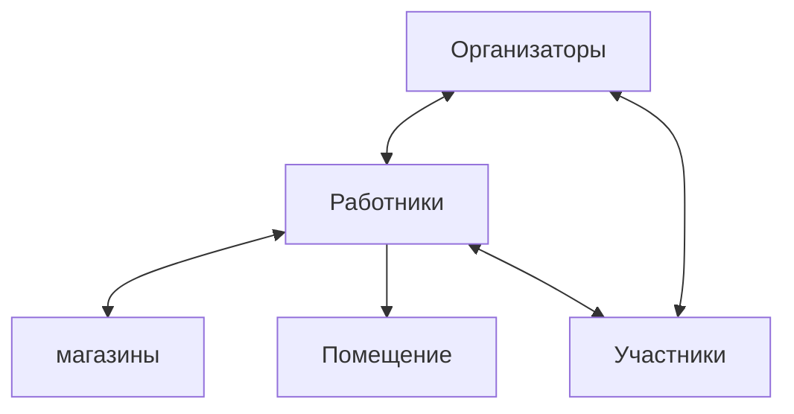

# ПОНЯТИЕ МОДЕЛИ СИСТЕМЫ
Широкое применение в современной жизни получил термин «модель. Его обобщенное понятие вышло за рамки естественных наук и стало общеупотребимым в быту. Пример:
- модель автомобиля,
- модель платья,
- модель декорации.

В системном анализе под моделью будем понимать некоторое представление о системе (объекте), отражающее наиболее существенные закономерности ее структуры и процесса функционирования и зафиксированное на некотором языке или в другой форме.

Анализируемая система может быть описана разными моделями, каждая из которых обладает характерными свойствами и пригодна для решения определенного круга задач, относящихся к структуре и функционированию системы.

# МОДЕЛЬНЫЕ ОТОБРАЖЕНИЯ И МОДЕЛИ
Некоторые свойства объекта могут проявляться во взаимодействии
-объект <-> объект,
некоторые выявляться лишь во взаимодействии
-субъект <-> объект.

К свойствам -субъект <-> объект относятся сложность, красота, надежность и все те, которые субъект соотносит с объектом только при мысленном восприятии.

Все те свойства, которые субъект соотносит с объектом при мысленном его восприятии, по существу соотносятся не с самим объектом в целом, а с его мысленным образом, который неизбежно по набору свойств беднее реального объекта

# ПРИМЕР
Если размышляют о слитке золота как об объекте продажи, то имеют в виду его вес и ценность и не думают об электропроводности золота или о его пластичности.

Мастер, собирающийся из золотого слитка сформировать драгоценное украшения, в первую очередь, имеет в виду его пластичность и внешнюю привлекательность.

Для конструктора электронных схем главными свойствами золота являются его электропроводность и не подверженность коррозии, благодаря которым контакты, покрытые золотом, обеспечивают безотказную работу электронных систем.

Тот образ, с которым соотносится объект при его мысленном восприятии, является модельным отображением объекта.

Модель объекта есть любой иной объект (материальный, мысленный, математический), обладающий ограниченным набором существенных свойств, присущих оригиналу.

- одному и тому же объекту может быть сопоставлено множество совершенно различных моделей, каждая из которых будет отображать определенный набор существенных свойств объекта.
- Любая модель будет обладать лишь ограниченным набором этих свойств.
- Если удастся воспроизвести модель, обладающую полным набором свойств, присущих оригиналу, то это будет воспроизведена не модель, а сам объект - оригинал.

# Адекватность модели
В большинстве случаев, вполне адекватная модель чрезвычайно сложного объекта (например, человека) может быть реализована с Использованием весьма примитивных средств.

Пример: При испытании лифта или новой модели парашюта и др. моделью человека может являться мешок с песком соответствующего веса.

При моделировании объекта такое его свойство как сложность не имеет объективной меры и основы. В природе не существует a-priori сложных или простых объектов.
Нельзя указать ни одного объекта, в отношении которого можно дать априорное определение, является ли он (объект) элементарным объектом или системой все определяется принятым масштабом и целью рассмотрения.

Объект познается как система тогда и только тогда, когда относительно него решается задача определенного (системного) типа. Любой объект оказывается системой, но не в любом отношении.

Система есть модель объекта, в которой объект представлен как составное целое, состоящее из частей, обладающих определенными свойствами и находящихся в таких отношениях, которые порождают новые свойства, присущие только системе в целом и не присущие ее составным частям, взятым по отдельности или в любых совокупностях, но в иных отношениях.

Элемент системы (составная часть) есть модель объекта, в которой он представлен как неделимое целое, не имеющее внутренней структуры и являющейся частью некоторой системы.

**Простая система** - модель объекта из конечного числа элементов. обладающих такими свойствами и находящимися в таких отношениях, которые позволяют однозначным образом определить свойства системы как следствие свойств ее элементов и отношений между ними.

**Сложная система** - модель объекта, в которой связь существенных его свойств со свойствами его частей и отношений между ними представлена многомерным деревом причинно-следственных связей, причем в цепочках этих связей есть какие-то разрывы, не поддающиеся представлению через функции отклика.

Моделирование является одним из основных элементов совокупности формализованных приемов, составляющих инструментарий системного подхода.

В общем случае модель есть отображение объекта в математическом виде, или на уровне вербальных определений ограниченной полнотой отношений между основными элементами системы и вытекающими из этих отношений свойствами.

По существу, процесс построения модели есть процесс познания реально существующей системы.

# Уровни моделирования
- Различают уровни модельного представления системы по нарастающей полноте отображения.

- Простейшим уровнем является описание состава системы или представление системы списком ее элементов.

- Пример: состав компьютера задан списком его элементов - Тип процессора и его быстродействие (частота), емкость, тип монитора, емкость HD. Этого списка достаточно, чтобы иметь представление о функциональных возможностях данного компьютера.

В структурной модели система определяется как совокупность элементов с заданными отношениями между ними. При этом все элементы задаются на уровне моделей черного ящика.

В исследуемую систему включаются и в модели отображаются только те элементы и отношения, которые существенны с точки зрения построения модели, совпадающей в частном случае с целью системы.

В большинстве случаев конечной целью моделирования является получение математической модели, то есть совокупности математических формул и уравнений, представляющих соотношение в замкнутом виде, позволяющем числено определять величину изменений выходных переменных в зависимости от задаваемых изменений входных переменных.

# СОГЛАСОВАННОСТЬ МОДЕЛИ С КУЛЬТУРОЙ СРЕДОЙ
Данные - (что?)- описание результатов измерений, наблюдений; протоколы экспериментов; исходные, «сырые» данные.
Информация- (состав?) - результат первичной обработки данных, их упорядочение, классификация, структуризация.
Знание (структура?) - результат вторичной обработки данных; выявление связей и закономерностей между группами, классами данных.
Понимание (почему?) объяснение выявленных закономерностей, построение теорий, дающих такое объяснение.
Мудрость (зачем?) сведения о том, зачем все это надо, хорошо ли это, надо ли это продолжать или прекращать те подход с точки зрения эстетики и этики

# задание
1. Модель - некоторое представление о системе (объекте), отражающее наиболее существенные закономерности ее структуры и процесса функционирования и зафиксированное на некотором языке или в другой форме.
2. Виды моделей:
3. Моделирование - процесс познания реально существующей системы.

модели
- студенческой группы
	относительно университета студенческая группа - группа людей, объединенных по уровню знаний и умений, изучающих одни и те же дисциплины, взаимодействующих в социальном и образовательном плане.
- процесса подготовки к празднику (новый год)

