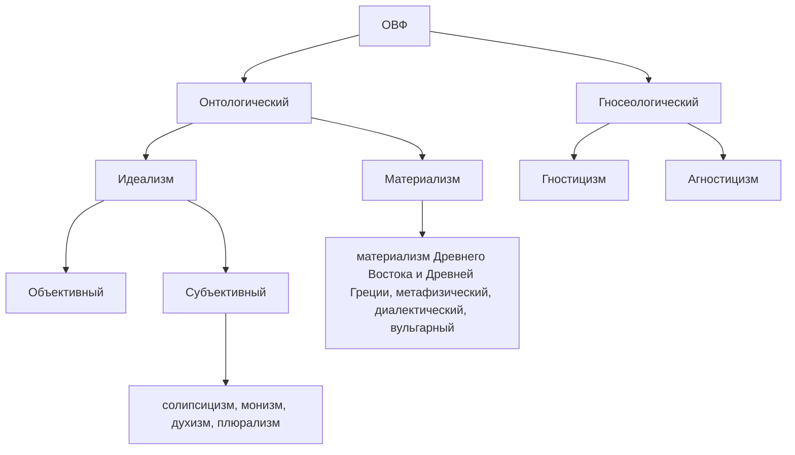

## Доклады
Философия - любовь к мудрости. Пифагор первым использовал "философ".
Поиск гармонии.
Мировоззрение - отношение человека к миру, влияющее на его поведение.
Начало - в мифах.
Миф содержит два элемента: дехронический, синхронический.
Религия объясняет строение мира. Передает знания.
Философия наследует от религии и мифологии мировоззренческий характер. Имеет более рациональный характер. Позволяет структурировать мировоззрение.
Физическое мировоззрение отличается от редигиозного: логично, четкие понятия и категории.
Мировоззрение делят на 4 компонента: эмоциональный(опирается на научные знания), познавательный, ценностно-нормативный(идеалы, ценности, нормы), эмоционально-волевой, практический.
Уровни представления: жизненно-практический(обыденный), теоретический(решает проблемы обыденного с глубиной теории).
Типы мировоззрения: мифологическое, религиозное, научное, философское.

**Проблема происхождения философии. Специфика философского знания.**
Фундамент философии - мифология. Мифы несут одни идеи - происхождение и уничтожение мира, происхождение человека. Очеловечивание окружающего мира. Сокращение дистанции между божественным и людским.
Мотивы в истоках философии: удивление, сомнение, обращение к вещам(объективность). Они работают только при взаимодействии между людьми. В основе философии - способность человека к абстрактному мышлению.

Философское знание отличается от научного: не претендует на общее знание.
Философия - не только форма знания, но и форма жизнедеятельности. Помогает человеку выработать опыт.

Требования:
- ссылаться на автора

