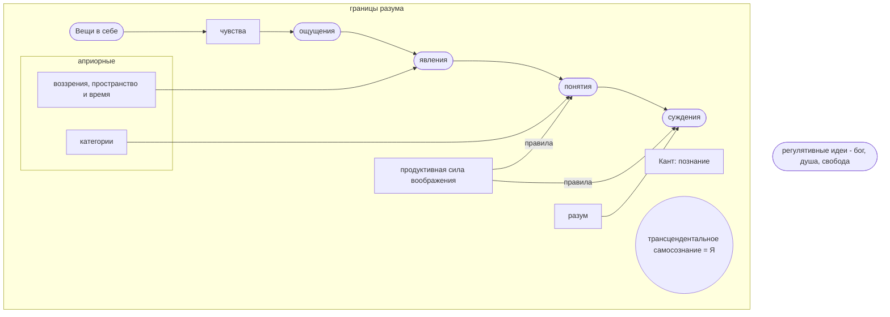

[[Философия/23.03.17(Л)]]
##### Позитивное значение скептицизма
- Значительно усиливает идею активности познающего субъекта, подчеркивает конструктивный характер человеческого разума.
- Проводит последовательную критику естественнонаучного и философского мышления, обнаруживая их слабые стороны.

##### Отношение к религии
- Юм делает решающий шаг в направлении атеизма
- Критикует доказательства существования Бога, выводимые из несовершенства человеческой природы и целесообразного устройства мира
- Признает значение религии в обществе в качестве важнейшего регулятора общественных отношений

##### Понимание человека
- Всю душевную жизнь человека сводил к впечатлениям и ассоциациям между ними.
- Отрицал понятие личности в качестве духовной субстанции. Личность - это "связка или пучок различных восприятий, следующих друг за другом" -> Сторонник безличностного подхода к трактовке человека.
- Сторонник крайнего психологизма в понимании человека и истории. Изучение истории сводил к анализу психологических мотивов деятельности великих людей.

### Теории общественного договора
Томас Гоббс (1588-1679) - "Левиафан"
Джон Локк (1632-1704) - "Два трактата о правлении", "Письма о веротерпимости"
Жан-Жак Руссо (1712-1778) - "Об общественном договоре"
Шарль Луи Мотескье (1689-1755) - "О духе законов"

Гоббс - "человек по природе зол" -> тоталитарный контроль государства
Локк - сторонник разделения властей, "человек от природы не зол"

## Немецкая классическая философия
1. Общая характеристика немецкой класиической философии
2. "Критическая философия" И.Канта
3. Объективный идеализм Г.В.Ф.Гегеля
4. Антропологический материализм Л.Фейербаха

### Специфика немецкой классической философии
- Отдает предпочтение вопросам о характере познания
- Стремится обосновать философию как систему научного знания
- Стремится утвердить философию в качестве основания для науки
- Формирует общий категориальный аппарат и формулирует принципы познания мира и человека

#### Главный принцип классической философии - абсолютизация разума
Разум рассматривается:
- Как активная конструктивная сила (Кант)
- Как первооснова мира и абсолютная сущность природы, человека и всемирной истории (Гегель)

#### Основные идеи немецкой классической философии:
- Идея активности разумного познающего субъекта (из нее вытекает понимание знания не как "слепка" с реальности, а как конструируемого самим субъектом)
- Идея разумности мира (из нее вытекает пантеизм)
	"Все действительное разумно, все разумное действительно" -> снятие проблемы объективного и субъективного

#### Пантеизм
\- философская позиция, согласно которой Бог или Разум не внеположен миру, а как бы растворен в нем.

Представители:
Николай Кузанский
Бенедикт Спиноза

### "Критическая философия" Иммануила Канта (1724-1804)
Исходные установки философии Канта:
- "Если существует наука, действительно необходимая человеку, то это та... из которой можно научиться тому, каким надо быть, чтобы быть человеком".
- Наука нуждается в гуманизации, в "человечности оценок" и должна быть дополнена "самопознанием человеческого разума"

#### "Докритический" период (до 70-х гг.)
Главная проблема периода:
разработка и обоснование философии как умозрительной теоретической науки

Проблематика:
вопросы онтологии, философии природы, философии, религии, этики, логики.

#### "Критический" период (с начала 70-х гг.)
- Осуществляет систематическую критику предшествующей философии
- Дает "критику познания" и формулирует основные положения своего агностицизма - учения о непознаваемости "вещей в себе".

Основные проблемы периода:
- "Критика чистого разума" (1781) - посвящена проблеме определения границ, условий и возможностей познания
- "Критика практического разума" (1788) - посвящена проблемам этики
- "Критика способности суждения" (1790) - излагаются эстетические взгляды, а также учение о целесообразности

#### Проблема познающего субъекта
- Утверждает активность субъекта познания
- Различает в субъекте два уровня:
	эмпирический (определяется индивидуально-психологическими особенностями)
	трансцендентальный (надындивидуальное начало в человеке)

#### Иммануил Кант (1724-1804) - основатель трасцендентального метода
Трансцендентальная философия - коперниканский поворот

"...Раньше люди были склонны думать, что Представления сообразуются с предметами, тогда как есть основания предполагать обратное предметы сообразуются с нашими представлениями... И центр познавательной Вселенной находится не в объекте, а находится внутри субъекта"

"...Я определяю **трансцендентальным** всякое познание, занимающееся не столько предметами, сколько видами нашего познания предметов, поскольку это познание должно быть возможным **а priopi**"

#### Теория познания
- Вводит различие между "вещью самой по себе" и тем, как она дана в опыте субъекта (явлением)
- Утверждает, что опыт искажает сущность вещей самих по себе, поскольку придает им пространственно-временную форму.

**Вывод**: "Вещи в себе" недоступны человеческому опыту и рассудку (трансцендентны) и непознаваемы.

Такая позиция носит название **агностицизма**.

#### Учение о познавательных способностях
Выделяет 3 познавательные способности:
- Чувственность - способность к ощущениям
- Рассудок - способность оперировать понятиями и суждениями
- Разум - способность к умозаключениям, приводящим к появлению идей.

##### Чувственность
- Исходный материал - данные **ощущений**.
- Эмпирический материал оформляется при помощи **пространства и времени**.
- Пространство и время - **априорные (доопытные) формы чувственности**. Они носят субъективный характер и не являются формами вещей.

##### Рассудок
- Главная задача рассудка - оформление опыта при помощи понятий и формирование суждений.
- Понятия (категории) сами не зависят от опыта и являются априорными формами рассудка.

**Вывод**: Знание - **синтез** ощущений и понятий. Оно всегда дано в форме **суждения**.

##### Разум
- Разум - способность к умозаключениям, приводящая к появлению **идей**.
- **Идеи** - понятия о **безусловном**, из которых вытекает вся совокупность явлений данного класса **психических или физических**.

Разум образует три идеи:
- Идея **души** как безусловного источника внутренних чувств.
- Идея **мира** как безусловного источника физических явлений.
- Идея **бога** как безусловной причины *всех* обусловленных явлений.

###### Антиномии разума
\- неустранимые противоречия, в которые впадает разум при попытке мыслить о безусловном.

###### Вывод Канта:
Разум ограничен и должен с необходимостью дополняться верой.

![[IMG20230324131132.jpg]]

#### Этика Канта
- Основное понятие - категория **долга**.
- Моральное поведение - только то, которое совершается из **уважения к закону** и из **чувства долга**.
- Как нравственное существо человек **свободен**.
- Человек всегда есть **цель** и никогда не может быть средством.

#### Категорический императив
Нравственный закон у Канта - это безусловное предписание: Поступай так, чтобы максима твоей воли могла стать основой всеобщего законодательства.

### Объективный идеализм Гегеля (1770-1831)
Основные работы:
- "Наука логики"
- "Энциклопедия философских наук"
- "Философия права"

#### Общая характеристика философии Гегеля
Философия Гегеля - последовательный **объективный идеализм**: Разум возводится в абсолют, отождествляется с Богом и рассматривается как первопричина всего сущего.

Мир творится "мировым духом", и схема этого творения заложена в логике развертывания "абсолютной идеи".

Разум имманентно присущ миру и является абсолютной сущностью природы, человека и всемирной истории (**пантеизм**).