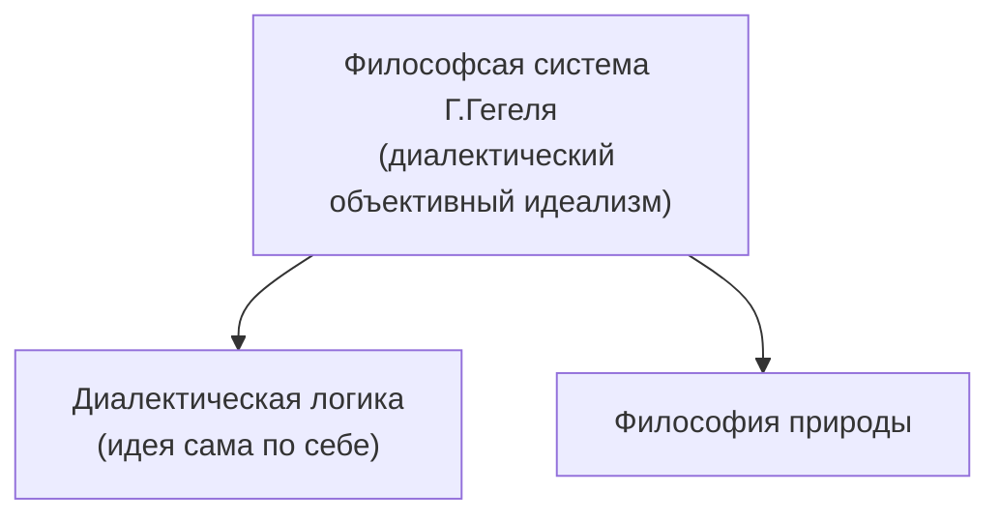
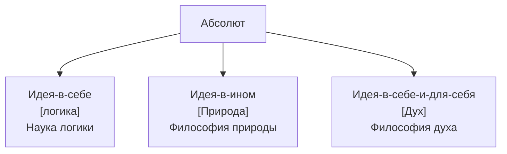
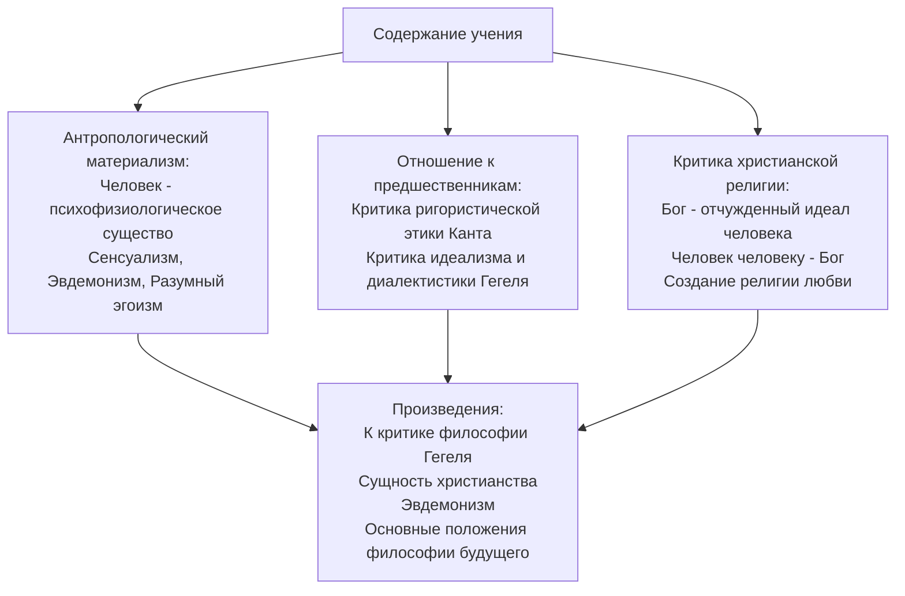

[[Философия/23.03.24(Л)#Объективный идеализм Гегеля (1770-1831)|Гегель]]
#### Онтологическая схема Гегеля
- Первоначало - **абсолютная идея** (абсолютный дух), стремящийся к самосознанию (изучается **логикой**)
- В процессе отчуждения себя абсолютная идея переходит в **инобытие** и порождает **природу** (изучается **философией природы**)
- В дальнейшем развитии абсолютная идея приводит к появлению **субъекта** (человека) и разворачивается во **всемирной истории** (изучается **философией духа**)

#### Структура философии Гегеля
- Логика - является не только наукой о законах человеческого мышления, но и учением о сущности всего сущего.
- Философия природы - изучает формы природного бытия
- Философия духа - учение о развитии индивидуального и общественного сознания

#### Диалектика - учение о развитии
- Разработана как **теоретическая система** (выделены категории, законы и принципы диалектики)
- Ядро диалектики - **учение о противоречии** как движущей силе развития

##### Законы диалектики
- Закон единства и борьбы противоположностей (указывает на источник развития)
	Противоположность $\neq$ противоречие
	Противоречие - отрицание того же, что утверждаем.
	
		белое - черное - противоположность
		белое - не белое - противоречие
- Закон взаимного перехода количественных и качественных изменений (раскрывает механизм развития)
	Накапливание количественных качеств неизбежно ведет к качественному изменению
- Закон отрицания отрицания (указывает направленность развития)

### Антропологический материализм Людвига Фейербаха (1804-1872)
Основные сочинения:
- "О критике философии Гегеля" (1839)
- "Сущность христианства" (1841)
- "Основные положения философии будущего" (1843)
- "Предварительные тезисы к реформе философии" (1824)

#### Общая характеристика философии Фейербаха
- Философия Фейербаха - материалистический сенсуализм (утверждает опыт в качестве источника знаний)
- Основу философии Фейербаха составляет антропологический принцип (философия фактически превращается в антропологию)

#### Основные идеи философии Фейербаха
- Идея реформы философии (обусловлена упадком христианской религии)
- Критика традиционной религии и требование наполнить религиозные представления "земным" содержанием
- Новая философия должна стать религией, основанной на вере в человека ("Человек Человеку Бог")
- Проблема человека - центральная проблема философии.

#### Этика Фейербаха
- Движущая сила человеческой воли - **стремление к счастью**
- Условием достижения индивидуального счастья является добровольное **ограничивание эгоизма**, приводящее к **созданию нравственного долга**
- Проблема общественных отношений сводится к **межиндивидуальному общению**
- Основа человеческого существования - **любовь** человека к человеку во всех ее проявлениях

# Современная западная философия
1. Исторические предпосылки возникновения неклассической философии и ее характеристика.
2. Основные течения гуманитарно-антропологического направления современной западной философии.
3. Сциентистское направление западной философии: позитивизм и философия науки.
4. Основные идеи феноменологии и герменевтики.

## Исторические предпосылки возникновения неклассической философии и ее характеристика
**Причины кризиса классической философии**
- Социально-политические: обусловлены стабилизацией западного общества к середине 19 века и проявлением в нем острых социально-классовых противоречий.
- Интеллектуальные: связаны с кризисом классического естествознания и лежащей в его основе механистической картиной мира.

### Различия классической и неклассической философии
0|Классическая философия|Неклассическая философия
--|--|--
Понимание предмета философии|видела свою задачу в познании наиболее общих законов природы и общества|стремится рассматривать не законы объективного мира, а "факты", "жизнь", феномены сознания субъекта
Особенности понятийно-концептуального аппарата|оперирует предельно общими, абстрактными понятиями, приспособленными для выражения метафизического содержания|противопоставляет абстрактным общим категориям метафизики понятие единичного, непосредственно данного, очевидного
Характер знания|характерно доминирование рационализма|характерно тяготение к иррациональному. Главными методами постижения реальности признает интуицию и переживание
Понимание морали|исходит из требования подчинения частных интересов общему благу|на первое место ставит свободу, права и достоинство индивида
