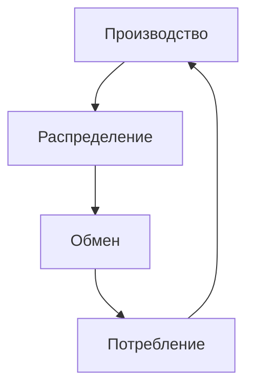

[[Философия/23.05.12(Л)#Формационный и цивилизационный подходы к исследованию общества]]
### Основные подходы к трактовке общества
- "Методологический реализм"
  Общество - объективная реальность, "не исчерпывающая совокупность входящих в нее индивидов" (С.Франк). Это новое социальное качество, представленное в том числе надындивидуальными объектами (классами, этносами, социальными институтами и т.п.).
- "Методологический номинализм"
  Общество - абстрактное понятие, обобщенное название для совокупности и взаимодействия множества отдельных людей, суммативная система, состоящая из множества отдельных людей, вступающих между собою в сознательные отношения в процессе совместной жизни.

### Структурные компоненты общества
- Социальные статусы и социальные роли, составляющие основу социальных взаимодействий.
- Социальные институты - исторически сложившиеся устойчивые формы организации совместной деятельности людей, выполняющих общественно-значимые фунции.
- Культура - специфический способ организации и развития человеческой жизнедеятельности людей.
- Властные отношения, обеспечивающие функциональную целостность общества (наиболее полно проявляются в деятельности государства)

### Формационный подход к анализу общества
Общественно-экономическая формация - общество на определенном этапе его развития с характерными для него способом производстве, социальной структурой, политической системой и духовной жизнью.

Выделяются такие общественно-экономические формации, как первобытно-общинная. рабовладельческая, феодальная, капиталистическая и коммунистическая.

### Структура общественно-экономической формации
- **Экономический базис** производственные отношения, главными, определяющими в которых являются отношения собственности.
- **Политическая надстройка**, которая должна полностью соответствовать экономическому базису, главным ее элементом, по мысли К.Маркса, является государство.

### Цивилизационный подход к анализу общества
В конце 19 - начале 20 века возник новый подход к пониманию общества и его истории. Он был разработан в трудах Н.Я. Данилевского, О. Шпенглера, позднее А. Тойнби. Они выдвинули идею о цивилизационной структуре общественной жизни. По их представлениям, основу общественной жизни составляют более или менее изолированные друг от друга «культурно-исторические типы» (Данилевский) или "цивилизации" (Шпенглер, Тойнби). проходящие в своем развитии ряд последовательных стадий: зарождение, расцвет, старение, упадок/

#### Особенности:
- отказ от европоцентристской, однолинейной схемы прогресса общества
- вывод о существовании множества культур и цивилизаций, для которых характерны локальность и разнокачественность
- утверждение об одинаковом значении всех культур в историческом процессе

#### Цивилизация:
- синоним культуры, в марксистской философии употребляется также для обозначения материальной культуры
- уровень, ступень общественного развития, материальной и духовной культуры
- ступень общественного развития, следующая за варварством (Л.Морган, Ф.Энгельс).
- цивилизация определенная ступень в развитии культуры народов и регионов (А. Тойнби, П.А.Сорокин);
- ценность всех культур, носящая общий характер для всех народов (К. Ясперс);
- конечный момент в развитии культуры того или иного народа или региона его "закат" (О.Шпенглер);
- высокий уровень материальной деятельности человека, орудий труда, технологии, экономических и политических отношений и учреждений (Н.Бердяев, С. Булгаков).

**Но!** В современной социальной философии под цивилизацией чаще понимают крупномасштабную социокультурную общность людей и народов.

**Достоинства:**
- помогает раскрыть механизмы исторического развития, выявить его пути и особенности.
- особое внимание уделяется непрерывности, эволюционности общественного процесса.
- помогает увидеть в истории поливариативность, не отбрасывая некие варианты, как не отвечающие критериям какой-то одной культуры.
- с его помощью можно выделить ряд социально-культурных различий современных цивилизаций

**Недостатки:**
- не учитывается связь между различными цивилизациями,
- не объясняется феномен повторяемости

# Основные сферы общества
1. Экономическая
   - технико-технологический способ производства
   - экономический способ производства
1. Социальная
   - этническая
   - демографическая
   - классовая (стратификационная)
   - поселенческая
   - профессионально-образовательная
1. Политическая

**Общество** - сверхсложная и в структурном, и в функциональном отношении система общественных отношений.

### Характеристики социальной системы
Представляет собой целостный социальный организм, состоящий из элементов, объединенных специфическими связями и выполняющих характерные для них функции. Социальная система - регулярно повторяющиеся явления и взаимоотношения между индивидами и коллективами, воспроизводимые во времени и в пространстве.

## Основные подсистемы (сферы) общества
- Экономическая
- Политическая
- Духовная
- Социальная

**Системообразующий компонент общества** - сфера материально-практической деятельности людей и складывающихся в ходе этой деятельности общественные отношения.

Именно **экономическая сфера** в качестве базиса интегрирует все остальные подсистемы общества в целостность.

### Экономическая сфера как сфера общественного бытия
Основа - материальные (производственные) общественные отношения, возникающие между людьми по поводу производства, распределения, обмена и потребления материальных благ.

### Материальное производство
Ключевым при изучении экономической жизни общества является анализ **материального производства**, так как общество не может существовать без производства необходимых для жизни людей материальных благ.

#### Структура материального производства
В структуре материального производства различают две взаимоопосредованные подсистемы:
1. **Технологический способ производства** - способ взаимодействия людей с предметами и средствами своего труда, а также между собой в связи с технико-технологическими особенностями производства.
2. **Экономический способ производства** - общественный способ взаимодействия производительных сил и производственных отношений.

Эти системы отношений не просто связаны, они взаимопроникают друг в друга. Таким "проникающим" элементом наряду с человеком является **техника**, занимающая достойное место и в экономическом, и в технологическом способах производства.

**Техника** - древнейший социальный феномен. «Вся история человечества при тщательном рассмотрении сводится в конечном счете к истории изобретения все лучших орудий труда» (Эрнст Капп). В первоначальном, древнегреческом варианте под техникой (от "тэхнэ") подразумевались искусство, мастерство, умение.

### История развития отношения к технике
**Эпоха зарождения техники**, ее первых великих успехов (мифы о Прометее, о Дедале и его сыне Икаре, в ветхозаветном сюжете, связанном со строительством Вавилонской башни) - оптимистическое отношение к технике.
**Средневековье** отношение к технике - принципиально меняется. Технотворчество - дело богохульное, т.к. все, что возвышает человека, уничижает Бога (среди жертв инквизиции так много изобретателей, обвиняемых в союзе с «нечистой силой»).
**Эпоха Просвещения** - оптимистическая вера в технику.

Технический прогресс представляется непрерывно действующим и главным фактором совершенствования общества, его коренного преобразования. Начиная с «Новой Атлантиды» Фрэнсиса Бэкона (1624) техника непременно присутствует во всех социальных утопиях в качестве материальной основы желаемого общества.

С 70-х 20 века годов все сменяется технологическим пессимизмом. Техника объявляется тем "злым демоном", который неподвластен человеку и неизбежно погубит его.

#### Определение техники
**Техника** - совокупность средств человеческой деятельности, направленной на изменение объектов в соответствии с человеческими потребностями.

#### Основные проявления феномена техники
- в виде машин, орудий и технических сооружений
- в виде технической среды техносферы
- в виде системы технических знаний

### Основные типы технологического производства
- присваивающий
- аграрно-ремесленный
- индустриальный
- информационно-компьютерный

Каждый из них представляет собой единство определенной материально-технической основы и соответствующих ей технологических отношений.

#### Особенности
1. Каждый технологический способ производства характеризуется специфическими, ему одному присущими орудиями труда.
2. Специфические для данного технологического способа производства орудия труда предопределяют характер труда, предлагаемый данным способом производства человеку и обществу.
3. Каждый технологический способ производства характеризуется также системой организации труда.

#### Технологические отношения
**Технологические отношения** - складывающиеся на определенной технической основе отношения производителя материальных благ к предмету и средствам своего труда, а также к людям, с которыми он взаимодействует в ходе технологического процесса.

#### Экономический способ производства
**Способ производства** - это та общественная форма, в которой человек осуществляет целеполагающий и опосредованный труд.
Способ производства представляет собой единство **производительных сил** и **производственных отношений**.

#### Структура способа производства
**Производительные силы** - система субъективных (связанных с человеком, уровнем его знаний и умений) и вещественных (представленных техникой и технологиями) факторов, обеспечивающих процесс производства материальных благ.

**Производственные отношения** - совокупность материальных (не зависящих от субъекта) экономических отношений между людьми в процессе производства, распределения, обмена и потребления материальных благ.

#### Производительные силы общества
Производительные силы включают:
- **средства труда** - вещь или комплекс вещей, которые человек помещает между собой и природой для воздействия на нее.
- **орудия труда** - костная и мускульная система производства (К.Маркс), важнейший показатель отношения общества к природе.
- **предметы труда** - все то, на что направлена преобразующая деятельность (труд) человека.
- **человека** с его знаниями, умениями, опытом и навыками.

#### Производственные отношения
Типы производственных отношений:
- Отношения собственности
- Отношения обмена результатами деятельности
- Отношения распределения продуктов деятельности
- Отношения общественного разделения труда

#### Основной закон материального производства
Характер производственных отношений определяется уровнем развития производительных сил.