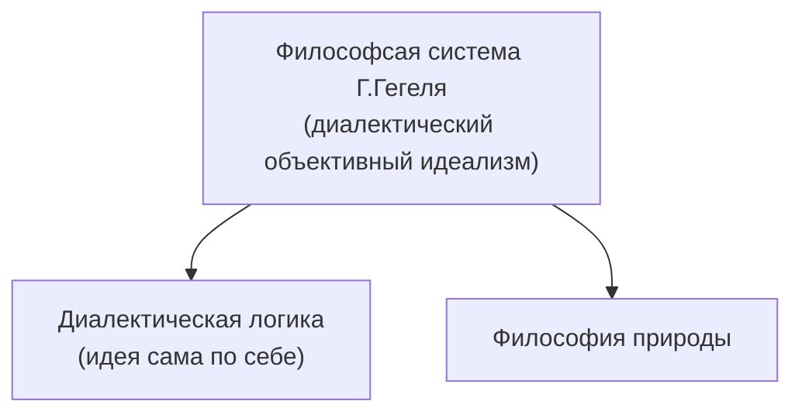

%%23.03.17(Л)%%
## Западноевропейская философия 17-18 вв.
1. Общая характеристика философии Нового времени.
2. Проблема метода в философии Нового времени:
	a) эмпиризм Ф.Бэкона
	b) рационализм Р.Декарта
3.  Материализм Дж.Локка
4. Субъективный идеализм Дж.Беркли и Д.Юма
5. Теории общественного договора

### Особенности философии Нового времени
1. Союз философии и науки
2. Центральное место занимают проблемы теории познания
3. Утверждение идеи прогресса
4. Главная проблема - вопрос об источнике истинного знания -> Основные направления в гносеологии - эмпиризм и рационализм

#### Основные направления в гносеологии

\\ | Эмпиризм | Рационализм
-- | -- | --
Представители | Ф.Бэкон, Т.Гоббс, Дж.Локк, Дж.Беркли, Д.Юм | Р.Декарт, Б.Спиноза, Г.В.Лейбниц
Основные отличия | связан с номинализмом, критикует "теорию врожденных идей", критикует категорию "субстанции", как абстрактное понятие, значительное место уделяет проблемам индуктивного метода | связан с реализмом, признает "врожденные идеи", как основу истинного познания, категория "субстанции" - одна из основных, исследует рациональные средства познания, развивает теорию дедукции

#### Философское учение Ф.Бэкона
	"знание - сила"

Материализм у Ф.Бэкона имеет форму эмпиризма.

**Эмпиризм** - направление в теории познания, признающее источником знания чувственный опыт, к которому, в конечном счете, сводится все содержание знания. Деятельность разума состоит лишь в обработке материала опыта систематизации, классификации - и не дает нового знания.

##### Понимание опыта
**Опыт и эксперимент - основа науки**
Истинный метод получения знания - эмпирический ("путь пчелы").

**Виды опыта:**
1) "Плодоносные опыты" - приносящие непосредственную пользу человеку.
2) "Светоносные опыты" - приводящие к познанию законов природы и объективных свойств вещей.

##### Понимание науки
**Наука** - средство познания причинных связей природы, позволяющих использовать ее на благо людей.

**Условия реформирования науки:**
1) Усовершенствование методов научного исследования, главным из которых является **индукция**.
2) "Очищение" разума от заблуждений как условие получения достоверного, истинного знания.

##### Индуктивный путь познания
- Поскольку источником знания является опыт, в науке необходимо двигаться индуктивным путем - от изучения единичных фактов к общим положениям.
- Поскольку на практике полная индукция не осуществима, наука должна прибегать к неполной индукции (когда на основе конечного числа фактов делается общий вывод относительно всего класса данных явлений).
- Неполная индукция предполагает вероятностный характер выводов.

##### Пути усовершенствования индукции
Для подтверждения теории важно искать не только факты, подтверждающие выводы (метод верификации), и факты, опровергающие его (метод фальсификации).

Пренебрежение опровержениями - главная причина заблуждений и ошибок.

##### Виды заблуждений (препятствий на пути получения истинного знания)
1. "Идолы рода" - препятствия, обусловленные несовершенством человеческих чувств и разума.
2. "Идолы пещеры" - ошибки, присущие отдельным группам людей в силу их субъективных предпочтений.
3. "Идолы площади" - препятствия, возникающие вследствие многозначности и неверного употребления слов.
4. "Идолы театра" - ошибки, порождаемые некритически усвоенными ложными мнениями.

#### Рационализм Рене Декарта (1596-1650)
**Основные работы**:
- "рассуждение о методе"
- "правила для руководства ума"
- "первоначала философии"

**Рационализм** - философское направление, признающее разум основой познания и поведения людей.

##### Основные идеи гносеологии
В познании необходимо руководствоваться принципом очевидности:
"Никогда не принимать за истинное то, что не познано с очевидностью; включать в свои суждения только то, в чем уже нельзя сомневаться"

Основанием истинного познания является разум и его центральная часть - самосознание: "Мыслю - следовательно, существую".

**Декарт - сторонник теории врожденных идей.**

##### Проблема метода
Главный метод познания - дедукция

3 правила научных истин:
1) Признавать за истину только то, что познается с совершенной отчетливостью и ясностью и не оставляют сомнений.
2) Делить исследуемый вопрос на максимально простые элементы.
3) Всегда начинать с предметов самых простых, наиболее легких и двигаться к познанию сложных.

##### Метафизика Декарта
Центральное понятие - **субстанция**.

**Дуализм**. Признает существование двух субстанций:
1) Духовной (сознание, включающее в себя врожденные идеи)
2) Материальной (отождествляет с природой)

**Механицизм**: мир мыслится по аналогии с огромной машиной (механизмом), все части которого подчиняются законам механики.

#### Материализм Джона Локка
Основные произведения:
- "Опыт о человеческом разумении"
- "Опыт о законе природы"
- "Опыт о веротерпимости"

##### Критика теории врожденных идей
Локк - представитель материалистического сенсуализма. Выступает против идеи врожденного знания и признания источником знания чувственный опыт (ощущения).

Теория tabula rasa (Локк)
Душа и разум человека до соприкосновения с материальным, чувственным миром представляют собой "белую бумагу без всяких знаков и идей".

##### Двойственность опыта
Опыт как источник знания двойственен:
- с одной стороны, он включает внешний опыт (направленный на ощущение предметов)
- с другой - внутренний опыт (рефлексию, направленную на действия нашего ума). Следовательно, можно выделить два измерения опыта.
- чувственное (связано с ощущениями)
- рациональное (связано с познавательной деятельностью)

##### Теория первичных и вторичных качеств
Локк делит качества на объективные (первичные) и субъективные (вторичные)

Первичные качества - отражают механикоматематические свойства тел (плотность, протяженность, форма, движение ил покой, число). Существуют объективно и схожи с порождаемыми ими чувственными образами.

##### Отношение Локка к религии
Изложено в работах:
- "Разумность христианства"
- "Два трактата о правлении"
- "О веротерпимости"

Тяготеет к деизму. Суть позиции: Бог рассматривается как безличная первопричина мира, не вмешивающаяся в закономерное течение его событий

##### Следствия деизма Локка
- Критика концепции божественного происхождения королевской власти
- Отрицание догмата о первородном грехе
- Сомнение в догмате о троичности Бога

#### Субъективный идеализм Джоржа Беркли
Исходный пункт рассуждения - теория первичных и вторичных качеств Дж.Локка.

Субстанция - это "носитель свойств". Все свойства (качества) являются вторичными, поскольку их существование обусловлено нашим восприятием.
Объективно "вещей" не существует.

Вывод: предметы, вещи являются совокупностью наших ощущений (формула "существовать - значит быть воспринимаемым").

##### Тенденция Беркли к объективному идеализму
Позиция Беркли не согласуется со "здравым смыслом" и влечет обвинения в солипсизме.
Чтобы объяснить "непрерывное" существование вещей, аппелирует к существованию божественного сознания.

##### Отношение Беркли к естественнонаучноу мышлению
- Отвергает концепцию механистической причинности. Считает, что действующей причиной может быть только дух (мысль).
- Дает субъективистскую трактовку пространства и времени как способов упорядочения чувственных восприятий (рядоположенности и последовательности).

#### Агностицизм Д.Юма
- Философия Д.Юма является органическим продолжением линии, исходящей из сенсуализма Дж.Локка.
- Важнейший труд - "Исследование о человеческом разуме", посвященный проблемам теории познания.

##### Решение вопроса об источнике ощущений
Наш разум оперирует лишь с содержанием наших ощущений, а не с тем, что их вызывает. То, что существует за пределами наших восприятий, нашего внутреннего мира нам недоступно.

Мы не можем ни утверждать существование внешнего мира, ни отрицать его. Единственно возможная позиция - скептицизм, из которого следует агностицизм.

##### Субъективистская трактовка опыта
- Опыт ничего не говорит нам об отношениях во внешнем мире, он относится только к освоению восприятий в нашем сознании
- Причинно-следственные связи не являются объективными и являются следствием **привычки**: часто встречаясь с последовательностью фактов, мы начинаем видеть между ними несуществующую **связь**.
- На самом деле эта связь ассоциативная, ее продуцирует наше сознание.

##### Теория познания Юма
- Основа нашего познания - впечатления ("душевные восприятия")
- Чувственные впечатления первичны и являются наиболее сильными.
- Рефлексия - восприятия внутренних душевных состояний.
- Идеи - представления о содержании наших впечатлений.

##### Выводы
- Все человеческое познание представляет собой **ассоциацию впечатлений и идей**.
- Разум сам по себе ничего не может добавить к восприятиям, он может лишь разделять, соединять и т.д.

%%23.03.24(Л)%%
##### Позитивное значение скептицизма
- Значительно усиливает идею активности познающего субъекта, подчеркивает конструктивный характер человеческого разума.
- Проводит последовательную критику естественнонаучного и философского мышления, обнаруживая их слабые стороны.

##### Отношение к религии
- Юм делает решающий шаг в направлении атеизма
- Критикует доказательства существования Бога, выводимые из несовершенства человеческой природы и целесообразного устройства мира
- Признает значение религии в обществе в качестве важнейшего регулятора общественных отношений

##### Понимание человека
- Всю душевную жизнь человека сводил к впечатлениям и ассоциациям между ними.
- Отрицал понятие личности в качестве духовной субстанции. Личность - это "связка или пучок различных восприятий, следующих друг за другом" -> Сторонник безличностного подхода к трактовке человека.
- Сторонник крайнего психологизма в понимании человека и истории. Изучение истории сводил к анализу психологических мотивов деятельности великих людей.

### Теории общественного договора
Томас Гоббс (1588-1679) - "Левиафан"
Джон Локк (1632-1704) - "Два трактата о правлении", "Письма о веротерпимости"
Жан-Жак Руссо (1712-1778) - "Об общественном договоре"
Шарль Луи Мотескье (1689-1755) - "О духе законов"

Гоббс - "человек по природе зол" -> тоталитарный контроль государства
Локк - сторонник разделения властей, "человек от природы не зол"

## Немецкая классическая философия
1. Общая характеристика немецкой класиической философии
2. "Критическая философия" И.Канта
3. Объективный идеализм Г.В.Ф.Гегеля
4. Антропологический материализм Л.Фейербаха

### Специфика немецкой классической философии
- Отдает предпочтение вопросам о характере познания
- Стремится обосновать философию как систему научного знания
- Стремится утвердить философию в качестве основания для науки
- Формирует общий категориальный аппарат и формулирует принципы познания мира и человека

#### Главный принцип классической философии - абсолютизация разума
Разум рассматривается:
- Как активная конструктивная сила (Кант)
- Как первооснова мира и абсолютная сущность природы, человека и всемирной истории (Гегель)

#### Основные идеи немецкой классической философии:
- Идея активности разумного познающего субъекта (из нее вытекает понимание знания не как "слепка" с реальности, а как конструируемого самим субъектом)
- Идея разумности мира (из нее вытекает пантеизм)
	"Все действительное разумно, все разумное действительно" -> снятие проблемы объективного и субъективного

#### Пантеизм
\- философская позиция, согласно которой Бог или Разум не внеположен миру, а как бы растворен в нем.

Представители:
Николай Кузанский
Бенедикт Спиноза

### "Критическая философия" Иммануила Канта (1724-1804)
Исходные установки философии Канта:
- "Если существует наука, действительно необходимая человеку, то это та... из которой можно научиться тому, каким надо быть, чтобы быть человеком".
- Наука нуждается в гуманизации, в "человечности оценок" и должна быть дополнена "самопознанием человеческого разума"

#### "Докритический" период (до 70-х гг.)
Главная проблема периода:
разработка и обоснование философии как умозрительной теоретической науки

Проблематика:
вопросы онтологии, философии природы, философии, религии, этики, логики.

#### "Критический" период (с начала 70-х гг.)
- Осуществляет систематическую критику предшествующей философии
- Дает "критику познания" и формулирует основные положения своего агностицизма - учения о непознаваемости "вещей в себе".

Основные проблемы периода:
- "Критика чистого разума" (1781) - посвящена проблеме определения границ, условий и возможностей познания
- "Критика практического разума" (1788) - посвящена проблемам этики
- "Критика способности суждения" (1790) - излагаются эстетические взгляды, а также учение о целесообразности

#### Проблема познающего субъекта
- Утверждает активность субъекта познания
- Различает в субъекте два уровня:
	эмпирический (определяется индивидуально-психологическими особенностями)
	трансцендентальный (надындивидуальное начало в человеке)

#### Иммануил Кант (1724-1804) - основатель трасцендентального метода
Трансцендентальная философия - коперниканский поворот

"...Раньше люди были склонны думать, что Представления сообразуются с предметами, тогда как есть основания предполагать обратное предметы сообразуются с нашими представлениями... И центр познавательной Вселенной находится не в объекте, а находится внутри субъекта"

"...Я определяю **трансцендентальным** всякое познание, занимающееся не столько предметами, сколько видами нашего познания предметов, поскольку это познание должно быть возможным **а priopi**"

#### Теория познания
- Вводит различие между "вещью самой по себе" и тем, как она дана в опыте субъекта (явлением)
- Утверждает, что опыт искажает сущность вещей самих по себе, поскольку придает им пространственно-временную форму.

**Вывод**: "Вещи в себе" недоступны человеческому опыту и рассудку (трансцендентны) и непознаваемы.

Такая позиция носит название **агностицизма**.

#### Учение о познавательных способностях
Выделяет 3 познавательные способности:
- Чувственность - способность к ощущениям
- Рассудок - способность оперировать понятиями и суждениями
- Разум - способность к умозаключениям, приводящим к появлению идей.

##### Чувственность
- Исходный материал - данные **ощущений**.
- Эмпирический материал оформляется при помощи **пространства и времени**.
- Пространство и время - **априорные (доопытные) формы чувственности**. Они носят субъективный характер и не являются формами вещей.

##### Рассудок
- Главная задача рассудка - оформление опыта при помощи понятий и формирование суждений.
- Понятия (категории) сами не зависят от опыта и являются априорными формами рассудка.

**Вывод**: Знание - **синтез** ощущений и понятий. Оно всегда дано в форме **суждения**.

##### Разум
- Разум - способность к умозаключениям, приводящая к появлению **идей**.
- **Идеи** - понятия о **безусловном**, из которых вытекает вся совокупность явлений данного класса **психических или физических**.

Разум образует три идеи:
- Идея **души** как безусловного источника внутренних чувств.
- Идея **мира** как безусловного источника физических явлений.
- Идея **бога** как безусловной причины *всех* обусловленных явлений.

###### Антиномии разума
\- неустранимые противоречия, в которые впадает разум при попытке мыслить о безусловном.

###### Вывод Канта:
Разум ограничен и должен с необходимостью дополняться верой.

![[IMG20230324131132.jpg]]

#### Этика Канта
- Основное понятие - категория **долга**.
- Моральное поведение - только то, которое совершается из **уважения к закону** и из **чувства долга**.
- Как нравственное существо человек **свободен**.
- Человек всегда есть **цель** и никогда не может быть средством.

#### Категорический императив
Нравственный закон у Канта - это безусловное предписание: Поступай так, чтобы максима твоей воли могла стать основой всеобщего законодательства.

### Объективный идеализм Гегеля (1770-1831)
Основные работы:
- "Наука логики"
- "Энциклопедия философских наук"
- "Философия права"

#### Общая характеристика философии Гегеля
Философия Гегеля - последовательный **объективный идеализм**: Разум возводится в абсолют, отождествляется с Богом и рассматривается как первопричина всего сущего.

Мир творится "мировым духом", и схема этого творения заложена в логике развертывания "абсолютной идеи".

Разум имманентно присущ миру и является абсолютной сущностью природы, человека и всемирной истории (**пантеизм**).

%%23.03.31(Л)%%
#### Онтологическая схема Гегеля
- Первоначало - **абсолютная идея** (абсолютный дух), стремящийся к самосознанию (изучается **логикой**)
- В процессе отчуждения себя абсолютная идея переходит в **инобытие** и порождает **природу** (изучается **философией природы**)
- В дальнейшем развитии абсолютная идея приводит к появлению **субъекта** (человека) и разворачивается во **всемирной истории** (изучается **философией духа**)

#### Структура философии Гегеля
- Логика - является не только наукой о законах человеческого мышления, но и учением о сущности всего сущего.
- Философия природы - изучает формы природного бытия
- Философия духа - учение о развитии индивидуального и общественного сознания

#### Диалектика - учение о развитии
- Разработана как **теоретическая система** (выделены категории, законы и принципы диалектики)
- Ядро диалектики - **учение о противоречии** как движущей силе развития

##### Законы диалектики
- Закон единства и борьбы противоположностей (указывает на источник развития)
	Противоположность $\neq$ противоречие
	Противоречие - отрицание того же, что утверждаем.
	
		белое - черное - противоположность
		белое - не белое - противоречие
- Закон взаимного перехода количественных и качественных изменений (раскрывает механизм развития)
	Накапливание количественных качеств неизбежно ведет к качественному изменению
- Закон отрицания отрицания (указывает направленность развития)

### Антропологический материализм Людвига Фейербаха (1804-1872)
Основные сочинения:
- "О критике философии Гегеля" (1839)
- "Сущность христианства" (1841)
- "Основные положения философии будущего" (1843)
- "Предварительные тезисы к реформе философии" (1824)

#### Общая характеристика философии Фейербаха
- Философия Фейербаха - материалистический сенсуализм (утверждает опыт в качестве источника знаний)
- Основу философии Фейербаха составляет антропологический принцип (философия фактически превращается в антропологию)

#### Основные идеи философии Фейербаха
- Идея реформы философии (обусловлена упадком христианской религии)
- Критика традиционной религии и требование наполнить религиозные представления "земным" содержанием
- Новая философия должна стать религией, основанной на вере в человека ("Человек Человеку Бог")
- Проблема человека - центральная проблема философии.

#### Этика Фейербаха
- Движущая сила человеческой воли - **стремление к счастью**
- Условием достижения индивидуального счастья является добровольное **ограничивание эгоизма**, приводящее к **созданию нравственного долга**
- Проблема общественных отношений сводится к **межиндивидуальному общению**
- Основа человеческого существования - **любовь** человека к человеку во всех ее проявлениях

---
#theory #philosophy 