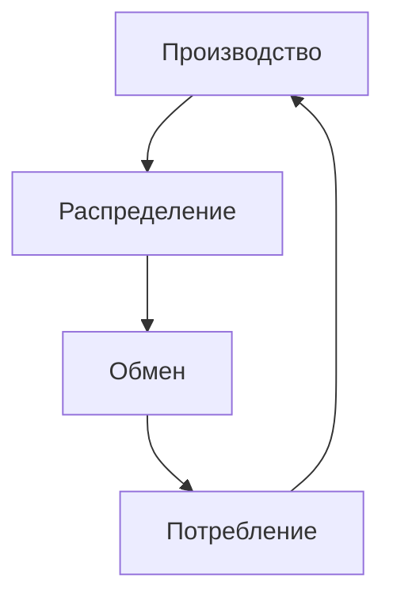

%%23.05.19(Л)%%
1. Экономическая
   - технико-технологический способ производства
   - экономический способ производства
1. Социальная
   - этническая
   - демографическая
   - классовая (стратификационная)
   - поселенческая
   - профессионально-образовательная
1. Политическая

**Общество** - сверхсложная и в структурном, и в функциональном отношении система общественных отношений.

### Характеристики социальной системы
Представляет собой целостный социальный организм, состоящий из элементов, объединенных специфическими связями и выполняющих характерные для них функции. Социальная система - регулярно повторяющиеся явления и взаимоотношения между индивидами и коллективами, воспроизводимые во времени и в пространстве.

## Основные подсистемы (сферы) общества
- Экономическая
- Политическая
- Духовная
- Социальная

**Системообразующий компонент общества** - сфера материально-практической деятельности людей и складывающихся в ходе этой деятельности общественные отношения.

Именно **экономическая сфера** в качестве базиса интегрирует все остальные подсистемы общества в целостность.

### Экономическая сфера как сфера общественного бытия
Основа - материальные (производственные) общественные отношения, возникающие между людьми по поводу производства, распределения, обмена и потребления материальных благ.

### Материальное производство
Ключевым при изучении экономической жизни общества является анализ **материального производства**, так как общество не может существовать без производства необходимых для жизни людей материальных благ.

#### Структура материального производства
В структуре материального производства различают две взаимоопосредованные подсистемы:
1. **Технологический способ производства** - способ взаимодействия людей с предметами и средствами своего труда, а также между собой в связи с технико-технологическими особенностями производства.
2. **Экономический способ производства** - общественный способ взаимодействия производительных сил и производственных отношений.

Эти системы отношений не просто связаны, они взаимопроникают друг в друга. Таким "проникающим" элементом наряду с человеком является **техника**, занимающая достойное место и в экономическом, и в технологическом способах производства.

**Техника** - древнейший социальный феномен. «Вся история человечества при тщательном рассмотрении сводится в конечном счете к истории изобретения все лучших орудий труда» (Эрнст Капп). В первоначальном, древнегреческом варианте под техникой (от "тэхнэ") подразумевались искусство, мастерство, умение.

### История развития отношения к технике
**Эпоха зарождения техники**, ее первых великих успехов (мифы о Прометее, о Дедале и его сыне Икаре, в ветхозаветном сюжете, связанном со строительством Вавилонской башни) - оптимистическое отношение к технике.
**Средневековье** отношение к технике - принципиально меняется. Технотворчество - дело богохульное, т.к. все, что возвышает человека, уничижает Бога (среди жертв инквизиции так много изобретателей, обвиняемых в союзе с «нечистой силой»).
**Эпоха Просвещения** - оптимистическая вера в технику.

Технический прогресс представляется непрерывно действующим и главным фактором совершенствования общества, его коренного преобразования. Начиная с «Новой Атлантиды» Фрэнсиса Бэкона (1624) техника непременно присутствует во всех социальных утопиях в качестве материальной основы желаемого общества.

С 70-х 20 века годов все сменяется технологическим пессимизмом. Техника объявляется тем "злым демоном", который неподвластен человеку и неизбежно погубит его.

#### Определение техники
**Техника** - совокупность средств человеческой деятельности, направленной на изменение объектов в соответствии с человеческими потребностями.

#### Основные проявления феномена техники
- в виде машин, орудий и технических сооружений
- в виде технической среды техносферы
- в виде системы технических знаний

### Основные типы технологического производства
- присваивающий
- аграрно-ремесленный
- индустриальный
- информационно-компьютерный

Каждый из них представляет собой единство определенной материально-технической основы и соответствующих ей технологических отношений.

#### Особенности
1. Каждый технологический способ производства характеризуется специфическими, ему одному присущими орудиями труда.
2. Специфические для данного технологического способа производства орудия труда предопределяют характер труда, предлагаемый данным способом производства человеку и обществу.
3. Каждый технологический способ производства характеризуется также системой организации труда.

#### Технологические отношения
**Технологические отношения** - складывающиеся на определенной технической основе отношения производителя материальных благ к предмету и средствам своего труда, а также к людям, с которыми он взаимодействует в ходе технологического процесса.

#### Экономический способ производства
**Способ производства** - это та общественная форма, в которой человек осуществляет целеполагающий и опосредованный труд.
Способ производства представляет собой единство **производительных сил** и **производственных отношений**.

#### Структура способа производства
**Производительные силы** - система субъективных (связанных с человеком, уровнем его знаний и умений) и вещественных (представленных техникой и технологиями) факторов, обеспечивающих процесс производства материальных благ.

**Производственные отношения** - совокупность материальных (не зависящих от субъекта) экономических отношений между людьми в процессе производства, распределения, обмена и потребления материальных благ.

#### Производительные силы общества
Производительные силы включают:
- **средства труда** - вещь или комплекс вещей, которые человек помещает между собой и природой для воздействия на нее.
- **орудия труда** - костная и мускульная система производства (К.Маркс), важнейший показатель отношения общества к природе.
- **предметы труда** - все то, на что направлена преобразующая деятельность (труд) человека.
- **человека** с его знаниями, умениями, опытом и навыками.

#### Производственные отношения
Типы производственных отношений:
- Отношения собственности
- Отношения обмена результатами деятельности
- Отношения распределения продуктов деятельности
- Отношения общественного разделения труда

#### Основной закон материального производства
Характер производственных отношений определяется уровнем развития производительных сил.

%%23.05.29(Л)%%
#### Общественно-экономическая формация
Исторически определенный тип общества и одновременно ступень общественного развития.
Определяется лежащим в ее основе способом производства.
В структуру общественно-экономических формаций входят базис и надстройка.

**Базис** - экономический строй общества, представляющий собой совокупность производственных отношений.

**Надстройка** - совокупность идеологических отношений, а также закрепляющие их общественные организации и учреждения.

### Социальная сфера общества
**Социальные отношения** - это многообразные связи и зависимости, которые возникают между социальными субъектами различной степени общности (индивидами, социальными группами, классами, нациями, этносами и т.д.) в процессе их экономической, социальной, политической, культурной духовной жизни и деятельности.

Социальная структура общества
- Этническая структура
- Демографическая структура
- Классовая структура
- Поселенческая структура
- Профессионально-образовательная структура

#### Этническая структура общества

Форма этнической общности | Основная характеристика | Основной период существования
---|---|---
Род|
Племя|
Народность|
Нация|

**Род** - 

**Племя** - 

**Народность** - 

**Национальность** - 

**Раса** - 

#### Классы
**Классами** называются большие группы людей, различающиеся по их месту в исторически определенной системе общественного производства, по их отношению (большей частью закрепленному и оформленному в законах) к средствам производства, по их роли в общественной организации труда, а следовательно, по способам получения и размерам той доли богатства, которой они располагают.

#### Маргинальные социальные группы
**Маргиналы, или люмпен маргинальный слой** (от латинского *marginalis* - находящийся на краю) - совокупность людей, в силу ряда причин не сумевших адаптироваться к существующим социальным общностям.

### Политическая система общества
Совокупность различных политических институтов, социально-политических общностей и взаимоотношений между ними, в которых реализуется политическая власть.

Элементы политической подсистемы:
- Институциональная подсистема
- Нормативная подсистема
- Функциональная подсистема
- Коммуникативная подсистема

Функции:
- Определение целей, задач и путей развития общества и организация деятельности по достижению этих целей
- распределение материальных и духовных ресурсов
- согласование разнообразных интересов субъектов политического процесса
- политическая социализация личности, приобщение людей
- 
- контроль за выполнением политических норм поведения, пресечение попыток их нарушения

### Духовная сфера общества
Основные подходы к анализу духовной жизни общества:
- как духовное производство
- как общественное сознание
- как система духовных или культурных ценностей

#### Духовное производство
- Духовные потребности
- Духовная деятельность
- Духовное потребление

#### Общественное сознание
**В широком смысле** - совокупность идей, взглядов, представлений, чувств, переживаний общества.

**В узком смысле** - отражение общественного бытия, его осознание.

#### Структура общественного сознания
Уровни:
- общественная идеология
- общественная психология

Формы:
- мораль
- политическое сознание
- правосознание
- философия
- религия
- искусство
- наука

#### Мораль
Один из основных способов нормативной регуляции поведения и сознания человека во всех сферах общественной жизни.

Нормы морали имеют социально-всеобщее значение формируется в практике массово поведения, закрепляются в традиции и прививаются индивиду путем воспитания убеждений.

Основные механизмы моральной регуляции:
- Моральный авторитет
- Нравственные санкции

#### Политическое сознание
**Политика** - сфера деятельности, связанная с отношениями между классами, нациями и другими большими социальными группами. Ядро политики - проблема завоевания, удержания и использования государственной власти.

**Власть** - установление отношений господства и подчинения, отношений зависимости между людьми, предполагающая принуждение субъекта к деятельности вопреки его воле.

Социальные источники власти:
- Авторитет
- Традиция
- Насилие

Необходимым условием власти является добровольная или вынужденная готовность к повиновению.

#### Правосознание
Право - система социальных норм и отношений, утвержденных и охраняемых системой государства и являющихся обязательными для исполнения.

Правосознание - совокупность взглядов и идей, выражающих отношения индивидов, социальных групп и классов к праву, законности, правосудию.

#### Специфика искусства
- Отражает мир в художественных образах
- Имеет своим идеалом прекрасное
- Связано со сферой художественного творчества

Теория искусства - **эстетика**

#### Специфика эстетического суждения
- Это суждение вкуса, а потому оно субъективно
- Не дает знания о предмете
- Оценивает предмет с точки зрения удовольствия или неудовольствия

#### Религия
Основа религии - вера в сверхъестественное.

Функции религии:
- компенсаторная
- интегрирующая
- регулятивная
- экзистенциальная
- политическая

---
#theory #philosophy 