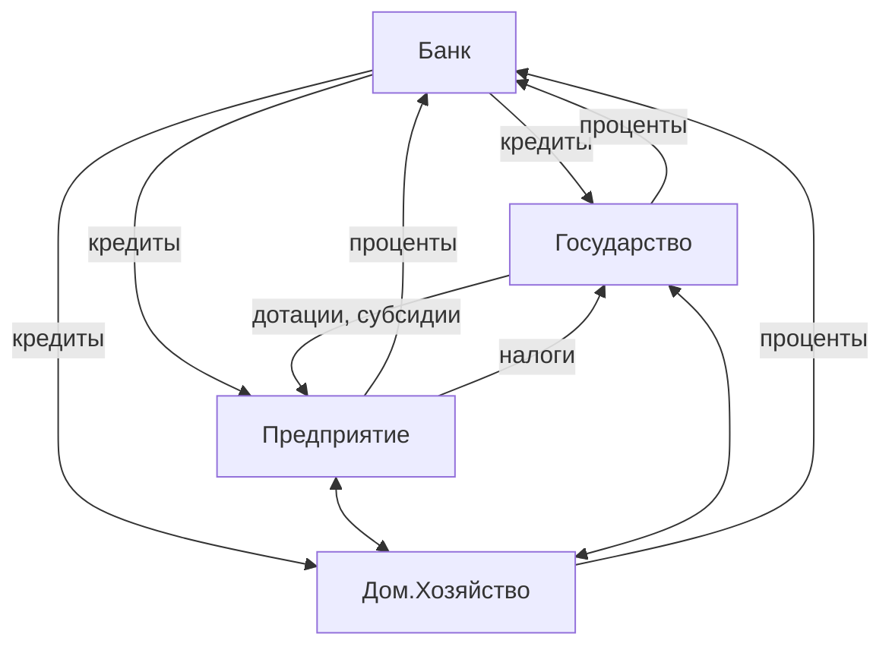

Допущения для построения КПВ:
- в экономике производится только два товара - производственный (инвестиционный) и потребительский
- экономика является эффективной, если задействованы все экономические ресурсы
- количество экономических ресурсов является постоянным
- технология производства является неизменной

Возможности (альтернативы) | Хлеб | Станки
--- | --- | ---
a | 0 | 15
b | 1 | 14
c | 2 | 12
d | 3 | 9
e | 4 | 5
f | 5 | 0
```chartsview
#-----------------#
#- chart type    -#
#-----------------#
type: Line

#-----------------#
#- chart data    -#
#-----------------#
data:
  - хлеб: "0"
    станки: 15
    serie: возможности
  - хлеб: "1"
    станки: 14
    serie: возможности
  - хлеб: "2"
    станки: 12
    serie: возможности
  - хлеб: "3"
    станки: 9
    serie: возможности
  - хлеб: "4"
    станки: 5
    serie: возможности
  - хлеб: "5"
    станки: "0"
    serie: возможности

#-----------------#
#- chart options -#
#-----------------#
options:
  seriesField: serie
  xField: хлеб
  yField: станки
```


# Рыночное хозяйство: сущность и основные черты
План:
1. Рыночное хозяйство и его субъектная структура
2. Взаимодействие субъектов рыночного хозяйства. Модель "потока доходов и расходов"
3. Роль государства в рыночной экономике
4. Структура и инфраструктура рынка

Рыночное хозяйство - форма организации экономики, основанная на товарном производстве, обеспечивающая взаимодействие между производством и потреблением посредством рынка.

Рынок - система экономических отношений, возникающих между продавцами и покупателями.

Типы рынка:
- классический
- регулируемый

Черты классического рынка:
- множество независимых производителей
- множество независимых потребителей
- цены устанавливаются свободно, стихийно
- свободный "перелив капитала"
- однородность одноименных товаров
- отсутствие монополии и государственного регулирования

Недостатки:
- циклический характер развития экономики
- игнорируются потенциально негативные последствия от принимаемых решений и не сохраняются не воспроизводимые природные ресурсы
- нет стимулов для производства общественных благ
- не обеспечивается мотивация к проведению фундаментальных научных исследований
- дифференциация в уровне жизни населения
- не гарантируется полная занятость и стабильный уровень цен

Преимущества свободного рынка:
- обеспечивает высокую гибкость и адаптивность
- эффективное разделение ресурсов
- свобода выбора и действий производителей и потребителей
- максимальное использование достижений НТР
- удовлетворение разнообразных потребностей, повышение качества ТиУ

## Субъектная структура рыночного хозяйства
- домашние хозяйства
- предприятия
- банки
- государство

Домашнее хозяйство - это экономическая единица, состоящая из одного или нескольких лиц, которая
1) обеспечивает производство и воспроизводство человеческого капитала
2) самостоятельно принимает решения
3) является собственником и поставщиком какого-либо фактора производства
4) стремится к максимальному удовлетворению своих потребностей

Предприятие - это экономическая единица, которая характеризуется следующими чертами:
1) использует факторы производства для изготовления продукции с целью ее продажи
2) самостоятельно принимает решения
3) стремится к максимальной прибыли

Банк - финансово-кредитное учреждение, которое регулирует движение денежной массы, необходимой для нормального функционирования экономики.

Государство - это различные правительственные учреждения, в руках которых находится власть, используемая ими для контроля над рынком и его субъектами в общественных целях.

Модель взаимодействия субъектов рыночного хозяйства


Субсидия (от лат. subsidium - помощь, поддержка) - выплаты, предоставляемые за счет государственного или местного бюджета.
Основные свойства субсидии:
- безвозмездная передача средств
- целевой характер

Дотации - денежные суммы, выделяемые из государственного бюджета для преодоления отраслевых кризисов (предоставляются предприятиям, чья продукция имеет важное социальное и народнохозяйственное значение, но чрезмерные затраты)