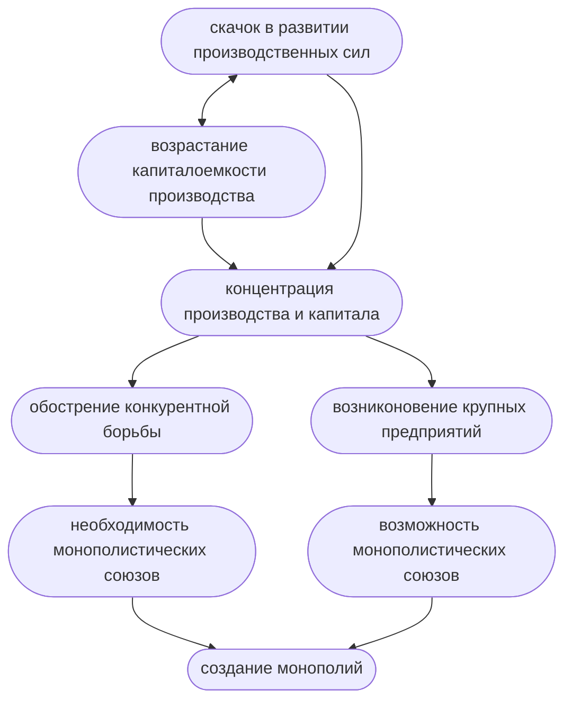

#### Эластичность спроса по доходу
**Эластичность спроса по доходу** - это показатель процентного изменения величины спроса на какой-либо товар или услугу в результате изменения доходов потребителей.
$$E_{d}=\frac{\Delta Q}{Q}:\frac{\Delta R}{R}$$
$R$ - средняя величина дохода
$\Delta R$ - изменение дохода
$\Delta Q$ - изменение количества спрашиваемого товара
$Q$ - среднее значение количества спрашиваемого товара

$E_{d}<0$ | Низкокачественный товар | При росте дохода спрос падает
---|---|---
$E_{d}=0$ | Нейтральный товар | Нет прямой связи между изменением дохода и изменением спроса
$E_{d}>0$ | Нормальный товар | При росте дохода спрос также растет

#### Перекрестная эластичность
Перекрестная эластичность характеризует степень изменения спроса на товар а при изменении цены товара $b\:(E_{ab})$.
$$E_{ab}=\frac{\Delta Q_{a}}{Q_{a}}:\frac{\Delta P_{b}}{P_{b}}$$
где $\frac{\Delta Q_{a}}{Q_{a}}$ - изменение спроса на товар $a$;
$\frac{\Delta P_{b}}{P_{b}}$ - изменение цены на товар $b$.
Если:
- $E_{ab}>0$, то товары $a$ и $b$ - взаимозаменяемые
- $E_{ab}<0$, то товары $a$ и $b$ - взаимодополняющие
- $E_{ab}=0$, то товары $a$ и $b$ - независимые друг от друга

# Конкуренция и монополия в системе рыночного механизма
План:
- Сущность конкуренции
- Совершенная и несовершенная конкуренция. Типы рыночных структур
- Природа, специфика и типы монополистических предприятий
- Антимонопольная политика государства

## Сущность конкуренции
Конкуренция ((лат.) concura - сталкиваться) - это соперничество между отдельными субъектами (агентами) рыночного хозяйства за наиболее выгодные условия производства и реализации товаров.

- Обеспечивает нацеленность производителей на всестороннее удовлетворение запросов потребителей
- Стимулирует увеличение эффективности производства
- Способствует распределению ресурсов между отраслями в соответствии со спросом  и нормой прибыли
- Стимулирует снижение цен и повышение качества товаров
- Приводит к дифференциации производителей

Методы конкуренции:
- ценовые
	Цена = Издержки+Прибыль
- неценовые

**Ценовая конкуренция** - это борьба между товаропроизводителями путем снижения издержек производства товаров/услуг и, соответственно, снижения цен на них без изменения ассортимента и качества товаров/услуг.

**Неценовая конкуренция** проводится посредством совершенствования качества продукции (**конкуренция по продукту**) и условий ее продажи (**конкуренция по условиям продаж**).

## Совершенная и несовершенная конкуренция. Типы рыночных структур
Виды конкуренции
- внутриотраслевая и межотраслевая
- совершенная и несовершенная

**Совершенная конкуренция** - это такое состояние экономической системы, когда влияние каждого участника экономического процесса на общую ситуацию настолько мало, что им можно пренебречь.

- На рынке действует очень большое количество независимых продавцов
- Фирмы производят однородную продукцию
- Каждая фирма производит настолько небольшую часть от общего объема производства, что она не в состоянии оказывать влияния на цену данного товара
- Существует свободный вход и выход из данной отрасли производства
- Участники рынка имеют равный доступ к информации

Под **несовершенной конкуренцией** понимают рынок, на котором не выполняется хотя бы одно из условий совершенной конкуренции.

Модели несовершенной конкуренции:
- Чистая монополия
- Олигополия
- Монополистическая конкуренция

Чистая монополия:
- единственный продавец
- уникальный товар
- фирма-монополист полностью контролирует объем предложения, а следовательно и цену, что позволяет ей получать максимальную прибыль
- существуют барьеры на вход в отрасль (собственность на сырье, патенты, лицензии, размер капитала)

Ситуация, обратная монополии, называется монопсония (единственный покупатель).

Олигополия:
- на рынке доминирует несколько крупных фирм
- продукция может быть как однородной, так и дифференцированной
- существуют барьеры на вход в отрасль

Монополистическая конкуренция
- достаточно много предприятий
- только дифференцированная продукция
- вход в отрасль возможен

Трактовки понятия "монополия":
- монополия - это модель рынка несовершенной конкуренции
- монополия - это крупнейшее предприятие или объединение предприятий, которые доминируют в определенной сфере народного хозяйства.

Типы монополистических предприятий:
- картель
- синдикат
- трест

**Картель** - это объединение предприятий одной отрасли, при котором сохраняется их производственная и коммерческая самостоятельность.
Предприятия договариваются о ценах, делят рынки сбыта, определяют квоты.
