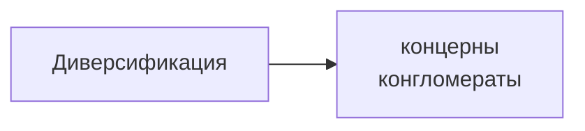
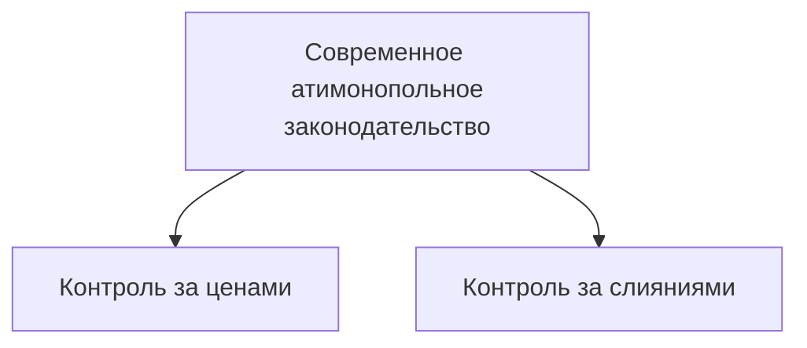
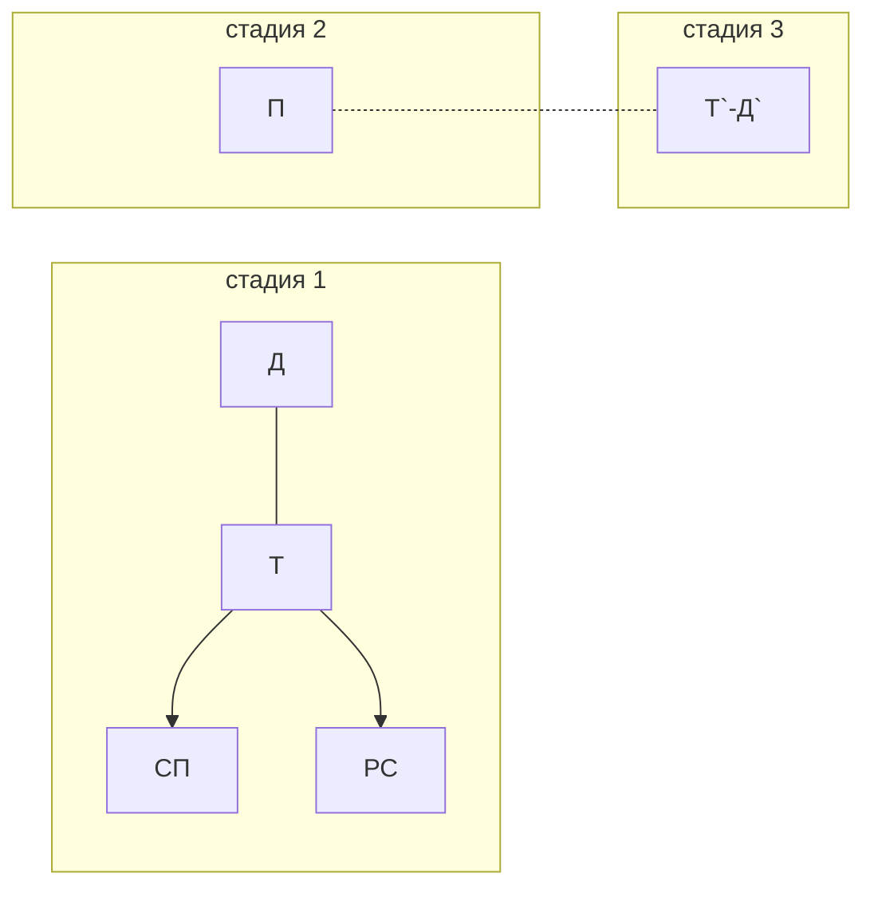

[[Экономика/23.03.24(Л)#Совершенная и несовершенная конкуренция. Типы рыночных структур|Типы рыночных структур]]
**Синдикат** - это объединение предприятий одной отрасли, при котором сохраняется их производственная, но утрачивается коммерческая самостоятельность.

**Трест** - это объединение предприятий одной отрасли, при котором входящие в него предприятия утрачивают как коммерческую, так и производственную самостоятельность.

**Горизонтальная интеграция** - это объединение двух и более предприятий, занятых в одной отрасли производства.

С 1920-х гг. на смену горизонтальной приходит вертикальная интеграция.
**Вертикальная интеграция** - это объединение предприятий разных отраслей, связанных между собой единой технологической цепочкой.
-> **Комбинаты**

Вертикальная интеграция - это часть более общего процесса - диверсификации.
**Диверсификация** - это процесс объединения предприятий разных отраслей, не связанных между собой технологически.

**Концерн** - это крупное многоотраслевое предприятие, объединяющее предприятия смежных, близких по технологии отраслей, и имеющее единый финансовый центр.

**Конгломерат** - это монополистическое объединение, образованное обычно путем поглощения крупной корпорацией мелких и средних фирм, не имеющих производственной или технологической связи с традиционными сферами деятельности головной фирмы.

## Антимонопольная политика
**Закон Шермана** (1890 год)
"Всякий договор или объединение в форме треста или любой иной форме является незаконным"

**Закон Клейтона**
Принят Конгрессом США в 1914 году
1. Уточняет основные понятия антитрестовского законодательства, внедряет новые понятия.
2. Объявляет вне закона ценовую дискриминацию, тайный сговор.
3. Запрещалось приобретать акции конкурирующих корпораций, если это ослабляло конкурентов.

**Акт Селлера-Кефовера** (1950 год)
Ограничивал не только горизонтальные, но и вертикальные слияния.

**Демпинг** - продажа товаров и услуг по искусственно заниженным ценам.

В России существуют механизмы в законодательстве для противодействия *демпингу*.
Статья 7 ФЗ "О защите конкуренции" -> понятие "монопольно низкая цена".
**Монопольно низкая цена** - это та, которая ниже суммы затрат и прибыли; ниже цены на конкурентном сопоставимом товарном рынке.

# Процесс и результаты деятельности предприятия
План:
1. Понятие индивидуального воспроизводства предприятия
2. Основные и оборотные фонды предприятия
3. Показатели эффективности и использования основных и оборотных фондов

## Понятие индивидуального воспроизводства предприятия
**Индивидуальное воспроизводство предприятия** - это постоянно повторяющийся процесс соединения факторов производства с целью создания товаров (услуг) и получения дохода в рамках предприятия.

## Основные и оборотные фонды предприятия
**Кругооборот фондов** - это движение стоимости факторов производства через сферы производства и обращения, в результате чего она проходит три стадии и последовательно принимает денежную, товарную и производительную форму.

схема кругооборота фондов

Д - деньги
Т - товары производственного назначения
СП - средства производства
РС - рабочая сила
П - производство
Д` = Д+$\Delta$Д

На **первой стадии** создаются условия для производства Т и У.
На **второй стадии** осуществляется непосредственный процесс производства Т и У.
На **третьей стадии** происходит реализация Т или У и получение прибыли.

**Оборот фондов** - это их кругооборот, рассматриваемый как непрерывно возобновляемый процесс.

Факторы производства в своем движении проходят стадию производства и две стадии обращения.
Период времени, в течении которого ресурсы, пройдя через сферы производства и обращения возвращаются к своей исходной (денежной) форме - **время оборота**.

Скорость оборота измеряется числом оборотов ресурсов, совершаемых в течение года.
Число оборотов определяется по формуле:
$n=\frac{O}{t}$
где $n$ - число оборотов в год, $O$ - принятая единица времени (1 год), $t$ - время оборота