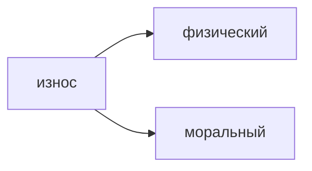
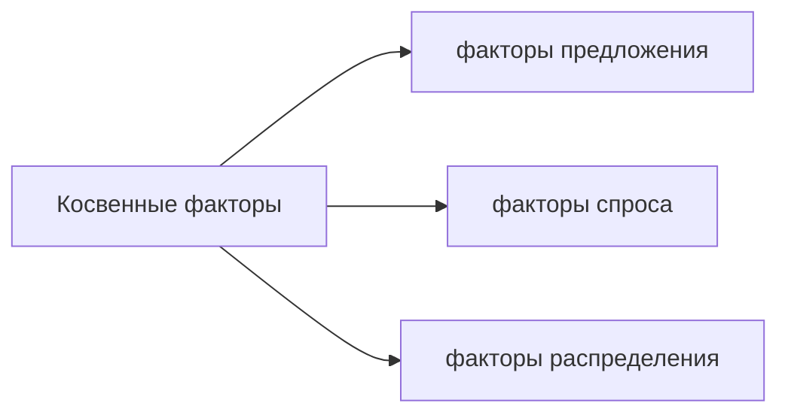

[[Экономика/23.03.31(Л)#Процесс и результаты деятельности предприятия|Процесс и результаты деятельности предприятия]]
## Показатели эффективности и использования основных и оборотных фондов
**Основные производственные фонды** (ОПФ) характеризуются тем, что действуют в течение многих производственных циклов и переносят свою стоимость на стоимость готовой продукции по частям по мере износа (станки, транспортные системы).


**Физический износ основных фондов** - это потеря потребительской стоимости фондов в ходе их эксплуатации, а также под воздействием сил природы.

**Моральный износ** - это потеря потребительской стоимости основных фондов по двум причинам:
1. из-за создания аналогичных, но более дешевых средств труда
2. из-за создания более современных средств труда

**Амортизация** - это процесс перенесение стоимости основных фондов на производимую с их помощью продукцию и одновременное аккумулирование ее в амортизационном фонде.

**Норма амортизации** - это отношение годовой суммы амортизационных отчислений к стоимости ОПФ, выраженное в процентах.

**Оборотные фонды** характеризуются тем, что полностью потребляются в течение одного производственного цикла и полностью переносят свою стоимость на стоимость готовой продукции.

**Формула расчета фондоотдачи и фондоемкости**
- **Фондоотдача:**
$$ФО=\frac{Q}{Ф_{осн}}$$
$Ф_{осн}$ - среднегодовая стоимость основных производственных фондов
$Q$ - объем реализованной продукции в стоимостном выражении
- **Фондоемкость:**
$$ФЕ=\frac{Ф_{осн}}{Q}$$

Показатели эффективности использования оборотных средств
````col
```
Материалоотдача
показатель выпуска продукции в денежной форме, приходящийся на 1 рубль стоимости оборотных средств, т.е. эффективность вложения средств в оборотные средства.
```
```
Материалоемкость
показатель, обратный материалоотдаче, показывающий долю стоимости оборотных средств, приходящуюся на каждый рубль выпускаемой продукции.
```
````

# Экономический рост. Цикличность как форма экономического развития
План:
1. Понятие экономического роста и его показатели
2. Факторы и типы экономического роста
3. Цикличность как форма экономического развития. Типы циклов
4. Причины экономических кризисов

## Понятие экономического роста и его показатели
**Экономический рост** - это долгосрочная тенденция увеличения реального ВВП.

**Валовой внутренний продукт** (ВВП) - это рыночная стоимость всех конечный товаров и услуг (т.е. предназначенных для непосредственного употребления), произведенных за год во всех отраслях экономики на территории государства вне зависимости от национальной принадлежности использованных факторов производства.

**Валовой национальный продукт** (ВНП) - рыночная стоимость всех конечных товаров и услуг, созданных производителями данной страны в течение года как внутри страны, так и за рубежом.

### Номинальный и реальный ВВП
**Номинальный ВВП** (НВВП) - рассчитывается в ценах текущего года.
Номинальный ВВП зависит от роста цен (инфляции), поэтому может искажать реальную картину экономического роста.

Для определения уровня развития экономики страны используют реальный ВВП.
**Реальный ВВП** (РВВП) - рассчитывается в сопоставимых ценах базового года.


## Факторы и типы экономического роста
![[IMG20230407110638.jpg]]
**Темп экономического роста**
$$g=\frac{a_t-a_{t-1}}{a_{t-1}}\times100\%$$
$a$ - Реальный ВВП в году


**Прямые** - это факторы, которые обеспечивают физическую способность экономики к росту.
**Косвенные** - это факторы, которые влияют на возможность превращения способности к росту в действительность.

**Прямые** факторы экономического роста:
- увеличение численности и качества трудовых ресурсов
- увеличение объема и качества основного капитала
- совершенствование технологии и организации производства
- увеличение количества и качества используемых природных ресурсов
- рост предпринимательских способностей в обществе


**Факторы предложения:**
- снижение степени монополизации рынков
- снижение цен на ресурсы
- снижение налога на прибыль
- повышение доступности кредитов

**Факторы спроса** - это рост потребительских, инвестиционных и государственных расходов, расширение экспорта вследствие освоения новых рынков сбыта или повышение конкурентоспособности продукции страны на мировом рынке.

**Факторы распределения** - структура распределения производственных ресурсов по отраслям, регионам и предприятиям, а также существующий порядок распределения доходов в обществе между субъектами хозяйственной деятельности.

