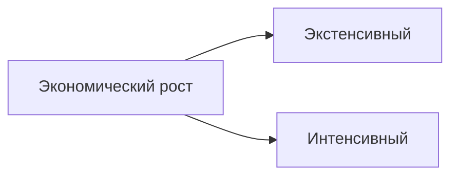
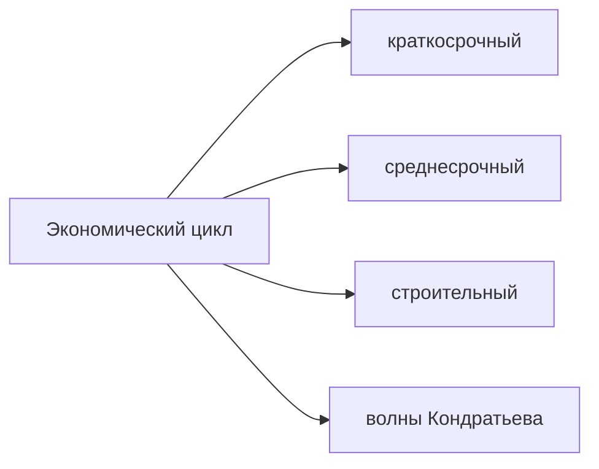

[[Экономика/23.04.07(Л)#Экономический рост. Цикличность как форма экономического развития]]

**Экстенсивный** экономический рост осуществляется за счет увеличения **количества** применяемых факторов роста.
**Интенсивный** экономический рост осуществляется за счет **качественного** совершенствования прямых факторов роста.

Если доля прироста ВВП за счет интенсивных факторов роста больше 50% -> преимущественно интенсивный экономический рост.

# Цикличность как форма экономического развития. Типы циклов
**Цикличность** - это периодичность повторяющихся нарушений равновесия в экономической системе, которые ведут к экономическому спаду, кризису, свертыванию хозяйственной деятельности.


## Циклы Китчина
\- краткосрочные экономические циклы с характерным периодом 3-4 года, открытые в 1920-е годы английским экономистом Джозефом Китчином.

## Циклы Жюгляра (промышленные)
\- среднесрочные экономические циклы с периодом в 7-12 лет. Названы по имени французского экономиста Клемана Жюгляра, одним из первых описавшего эти циклы.
```chartsview
#-----------------#
#- chart type    -#
#-----------------#
type: Area

#-----------------#
#- chart data    -#
#-----------------#
data:
  - Время: "1"
    ВНП: 20
    цикл: "2"
  - Время: "2"
    ВНП: 25
    цикл: цикл
  - Время: "3"
    ВНП: 15
    цикл: цикл
  - Время: "4"
    ВНП: 16
    цикл: цикл
  - Время: "5"
    ВНП: 25
    цикл: цикл
  - Время: "6"
    ВНП: 40
    цикл: цикл
  - Время: "7"
    ВНП: 35
    цикл: "1"

#-----------------#
#- chart options -#
#-----------------#
options:
  seriesField: цикл
  xField: Время
  yField: ВНП
```
Фазы промышленного цикла по К.Марксу:
- кризис (2-3)
- депрессия (3-4)
- оживление (4-5)
- подъем (5-6)

Классический кризис - кризис перепроизводства

### Фаза кризиса
Сокращается **спрос** на основные **факторы производства**, а также на потребительские товары и услуги, возрастает объем нереализованной продукции. В результате уменьшения сбыта снижаются **цены**, **прибыли** предприятий, **доходы домашних хозяйств** и доходы **государственного бюджета**.

При увеличении неплатежей нарушаются кредитные связи, стремительно падают курсы **акций** и других **ценных бумаг**, что сопровождается паникой на **фондовых биржах**, происходят массовые **банкротства** фирм и резко растет **безработица**.

### Фаза депрессии
- Данная фаза характеризуется приостановлением спада производства, уменьшением запасов товаров на складах, невысокой деловой активностью, увеличением массы свободного денежного капитала.
- Уровень производства на этой стадии цикла остается стабильным, но в сравнении с предкризисным остается весьма низким - роста нет, падение цен приостанавливается, безработица продолжает оставаться высокой.
- Фаза депрессии может иметь весьма продолжительный период.
  Может длиться от нескольких месяцев до нескольких лет. Например, начавшаяся в 1939 г. после Великого кризиса депрессия длилась до 1938 г., практически до самой войны.
- Появляются "Точки роста"

### Фаза оживления
Оживление - постепенный рост производства, сокращение безработицы, рост доходов населения, прибыли предпринимателей и курса акций предприятий, спроса на кредиты и процентных ставок по ним.

### Фаза подъема
Растут: производство, доходы населения, потребительский спрос, товарные объемы, капитальные вложения. Это продолжается, пока предложение (объем производства) не начинает опережать рост платежеспособного спроса (совокупные расходы). Наступает перепроизводство товаров, вновь нарушаются пропорции между производством и потреблением, кризис повторяется.

## Цикл Кузнеца (строительный цикл)
\- имеет продолжительность примерно 15-20 лет. Получил название по имени американского экономиста Саймона Кузнеца. Был открыт им в 1930 году.

## Длинные волны Кондратьева
1. Продолжительность 40-60 лет.
2. Длинные волны связаны с техническими изобретениями и открытиями.

# Причины экономических кризисов

## Экзогенные теории
- Английский экономист Уильям Джевонс (1835-1882) связал экономический цикл с 11-летним циклом **солнечной активности**.
- Джевонс исследовал влияние солнечных пятен на урожайность, на цены на зерно, и торговый цикл.
- Он связывал цикличность солнечной активности в основном с сельским хозяйством и торговлей. Его последователи распространили влияние солнечного цикла на всю экономику.

Лев Троцкий(1879-1940) в работе "О кривой капиталистического развития" утверждал, что периоды упадка и подъема капиталистического хозяйства в долгосрочной перспективе обусловлены большей или меньшей напряженностью классовой борьбы.

## Эндогенные теории
### Теория перенакопления капитала
Основы теории заложены экономистами М.И.Туган Барановским и К.Г.Касселем. Они считали, что возникновение экономических циклов связано с особенностями накопления основного капитала. Вывели специфическую особенность: отрасли, создающие товары производственного назначения, развиваются под воздействием экономического цикла более высокими темпами, чем отрасли, производящие потребительские товары.

### Теория недодопотребления
Родоначальник - швейцарский экономист Жан Сисмонди (1773-1842 гг.).

Кризисы вызываются тем обстоятельством, что слишком большая часть текущего дохода сберегается и слишком незначительная его часть расходуется на потребительские товары.

### Психологическая теория экономических циклов
Артур Пигу (1877-1959)
Смена пессимизма и оптимизма

## Основная причина
\- несоответствие между совокупным спросом и совокупным предложением, между совокупными расходами и совокупным объемом производства.

Типы экономических параметров по направлению изменения показателей
- проциклические - растут при подъеме и снижаются при спаде
- противоциклические (контрциклические) - растут при спаде и снижаются при подъеме
- ациклические - у этих показателей нет связи с экономическим циклом