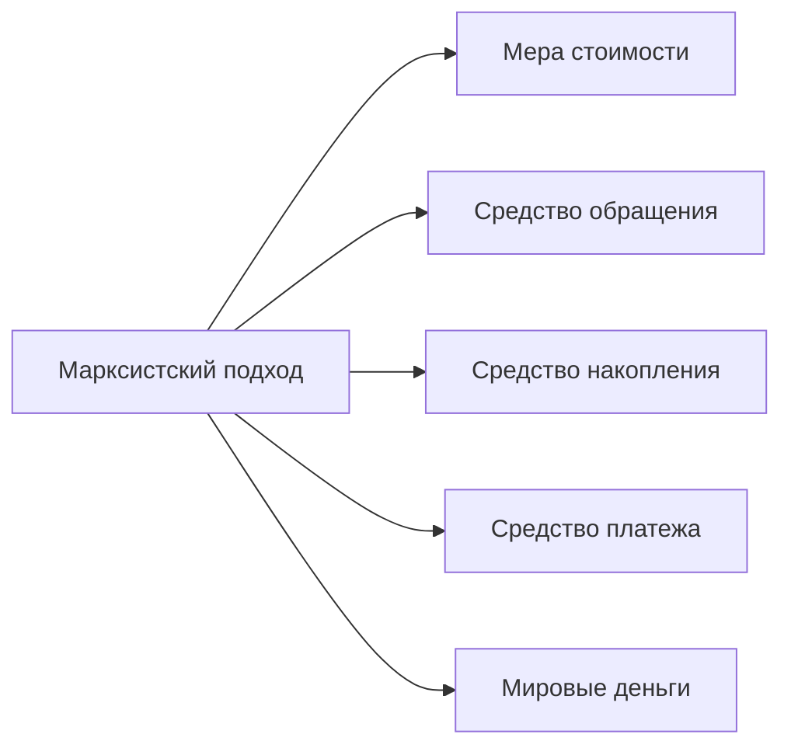
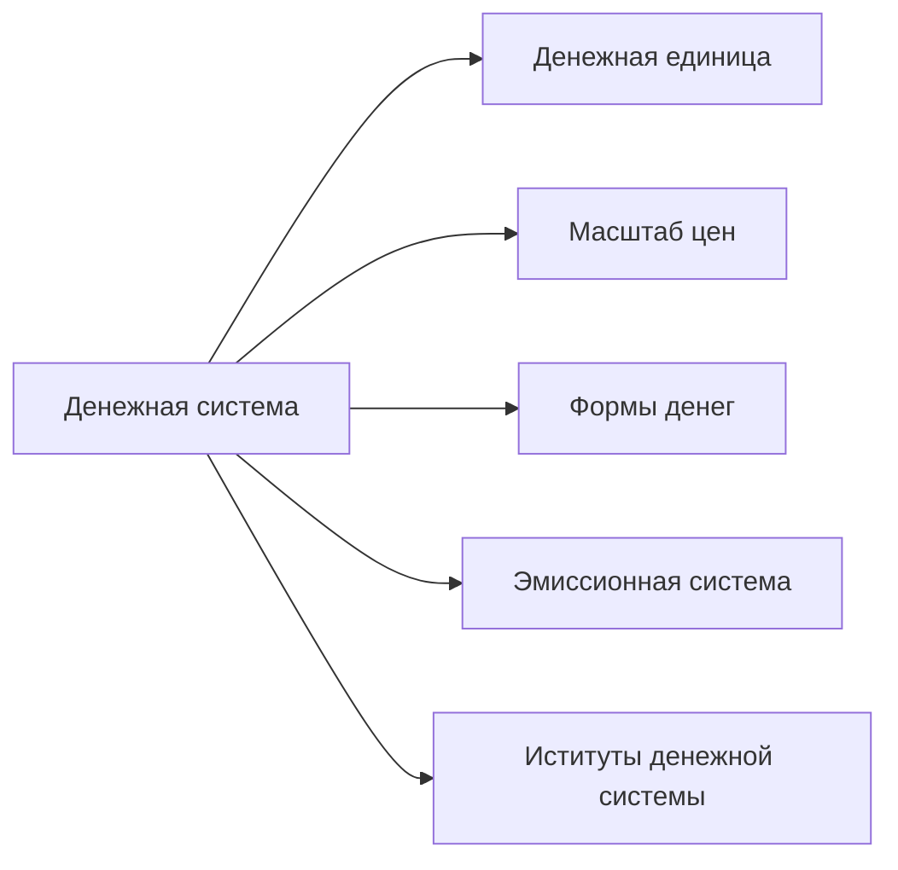
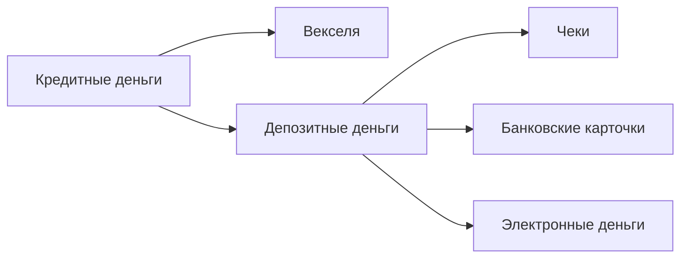

# Денежная система
План:
1. Сущность денег
2. Денежная система и ее структура
3. Понятие денежной массы и ее показатели (агрегаты)

## Сущность денег
Раскрывается через их функции.

Классический и современный подход.
По классическому подходу:

### Мера стоимости
**Деньги выражают стоимость всех других товаров.**
Через деньги можно выразить стоимость любого товара, сравнивая любые товары по ценности между собой.
При этом не обязательно иметь деньги.

### Средство обращения
Деньги выступают в качестве посредника при обмене товаров.
Товар - Деньги - Товар

### Средство накопления
Деньги - это особого рода актив, который сохраняется после продажи товаров и услуг и обеспечивает их владельцу покупательную способность в будущем.

### Средство платежа
**Ликвидность** - способность актива превращаться в средство платежа.

Деньги выступают в качестве средства платежа везде, где они переходят из рук в руки и не опосредуют движения товаров (при уплате налогов, коммунальных платежей, арендной платы, покупке в кредит и прочее).

### Мировые деньги
Деньги функционируют на мировом рынке и обслуживают международные расчеты.

По современному подходу:
1. Мера стоимости
2. Средство обращения
3. Средство накопления

## Денежная система и ее структура
**Денежная система** - это исторически сложившаяся в каждой стране и законодательно установленная государством форма организации денежного обращения.

**Денежное обращение** - это непрерывное движение денег, которые выполняют функции средства обращения и платежа, обслуживая кругооборот товаров и услуг.

**Масштаб цен** - отношение денежной единицы к постоянной мере стоимости.

Формы денег:
- Товарные доденежные эквиваленты
- Золотые и серебряные монеты
- Бумажные деньги
- Кредитные деньги
- Электронные деньги (пункт от себя)

Свойства металлов:
- Износостойкость
- Портативность
- Однородность
- Делимость

По этим пунктам золото превосходит товарные эквиваленты.

**Билонные монеты** - неполноценные монеты, номинальная стоимость которых превышает их реальную стоимость или наоборот.

**Бумажные деньги** - это условные денежные знаки, которые снабжены принудительной покупательной способностью.

**Золотой стандарт** - международная валютная система, основанная на официальном закреплении странами золотого содержания в единице национальной валюты с обязательством центральных банков покупать и продавать национальную валюту в обмен на золото.

**Вексель** - ценная бумага, дающая право лицу, которому вексель передан (векселедержателю), на получение от должника оговоренной в векселе суммы.

В основе **депозитных денег** лежит **депозит** - временно свободный денежный капитал, помещенные на текущий счет в банке для расчетов.

**Чек** - это приказ собственника счета о выдаче определенной суммы наличных денег, который выписывает владелец текущего счета в банке.

Отличие дебетовой карты от кредитной
- Дебетовая карта позволяет вам распоряжаться только своими средствами.
- Кредитная карта позволяет пользоваться средствами, ограниченными банком.

**Электронные деньги** - это платежное средство, существующее исключительно в электронном виде, то есть в виде записей в специализированных электронных системах. Как правило, платежи происходят с использованием Интернета, мобильного телефона и другого.

Денежное обращение
- наличное
- безналичное

## Понятие денежной массы и ее показатели (агрегаты)
**Денежная масса** - это совокупность всех денежных средств, находящихся в экономике в наличной и безналичной формах и выполняющих функции средства обращения, платежа и накопления.

### Денежные агрегаты ($M_{0},M_{1},M_{2},M_{3}$)
измерители денежной массы, располагаемые
- по степени убывания **ликвидности**
- по степени возрастания **доходности**

$M_{0}$ - наличные деньги
Самые высоколиквидные (возможно использовать моментально) и самые низкодоходные (не приносят прибыль).

$M_{1}=M_{0}+$деньги на текущих счетах населения и расчетных счетах предприятий
Могут быть быстро использованы. Почти не приносят прибыли.

$M_{2}=M_{1}+$срочные вклады (до 4 лет), сберегательные вклады.
Не могут быть быстро использованы. Приносят небольшую прибыль.

$M_{3}=M_{2}+$депозитные и сберегательные сертификаты банков, облигации государственного займа и долгосрочные вклады в коммерческих банках.
Не могут быть использованы. Приносят прибыль.

Задача.
Рассчитать величины $M_1,M_{2},M_3$
Чековые вклады - 895 млрд. руб.
Крупные срочные вклады - 1290 млрд. руб.
Небольшие срочные вклады - 3260 млрд. руб.
Наличность - 340 млрд. руб.
Безчековые сберегательные клады - 600 млрд. руб.