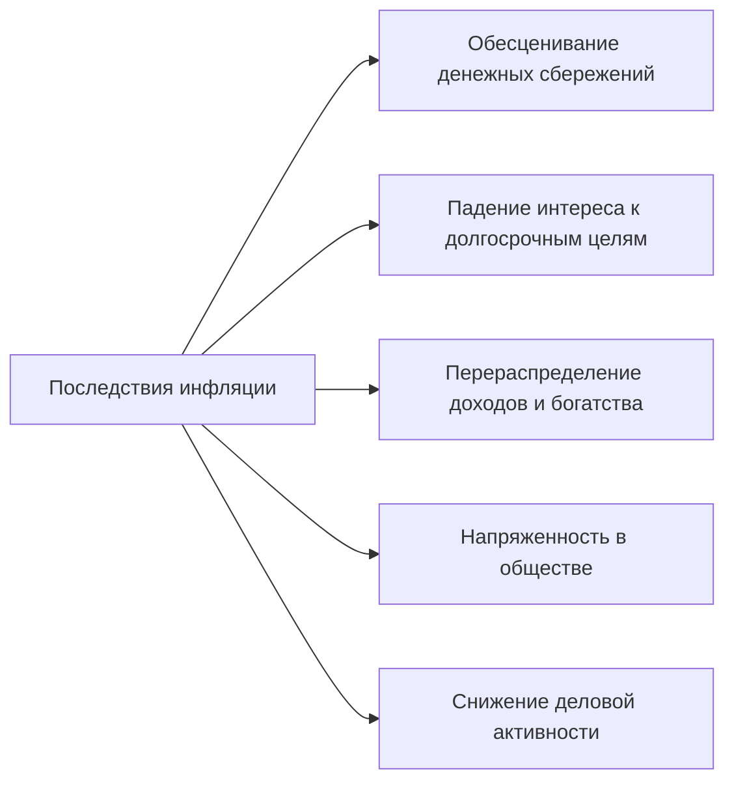

[[Экономика/23.04.28(Л)#Инфляция и антиинфляционная политика]]
**Главные последствия инфляции** - снижение покупательной способности и снижение реальных доходов.

**Покупательная способность денег** - это то количество товаров и услуг, которое можно купить на одну денежную единицу.

**Номинальный доход** - это денежная сумма, которую получает человек за продажу экономического ресурса, собственником которого он является.

**Реальный доход** - это то количество товаров и услуг, которое человек может купить на свой номинальный доход (на полученную сумму денег).

## Антиинфляционная политика государства
**Антиинфляционная политика** - это государственная экономическая политика, направленная на борьбу с инфляцией.

### Методы борьбы с инфляцией:
- прямые
- косвенные

#### Прямые методы (политика доходов)
- установление ориентиров для роста зарплаты и цен
- прямой контроль за ростом зарплаты и цен

#### Косвенные методы
- монетарная политика
- фискальная политика

##### Монетарная политика
**Монетарная политика** - контроль на *денежной массой* в экономике для воздействия н совокупный спрос.
- Изменение учетной ставки (удешевление-удорожание кредитов)
- Установление нормы обязательных резервов коммерческих банков (увеличение/уменьшение количества выдаваемых кредитов)
- Продажа/покупка государственных ценных бумаг

Под **учетной ставкой** понимается процентная ставка, по которой Центральный банк страны предоставляет кредиты коммерческим банкам.

**Обязательные резервы** коммерческих банков - средства кредитных организаций, которые они должны хранить в качестве обязательного резерва на счете в центральном банке.

**Операции на открытом рынке** - деятельность центрального банка по купле и продаже ценных бумаг (обычно государственных облигаций) на открытом рынке.

Виды монетарной политики
1. **Сдерживающая** (или жесткая) которая проводится для борьбы с инфляцией.
	В этом случае ЦБ *уменьшает предложение денег*
	- повышая норму обязательных резервов
	- повышая учетную ставку процента
	- продавая государственные облигации на открытом рынке
2. **Стимулирующая** (или мягкая) которая используется для преодолевания спадов и борьбы с безработицей.
	В этом случае ЦБ *увеличивает предложение денег*
	- снижая норму обязательных резервов
	- снижая учетную ставку процента
	- покупая государственные облигации на открытом рынке

С 1 марта 2023 года Банк России установил норму обязательных резервов:
- 4% для всех категорий резервов в рублях для банков с универсальной лицензией и небанковских кредитных организаций
- 7% для всех резервов в иностранной валюте для всех кредитных организаций

##### Фискальная политика
**Антиинфляционная политика**
- политика градуирования
- шоковая терапия

**Шоковая терапия**
- Либерализация цен
- Денежная реформа конфискационного типа

Шоковая терапия применяется в двух случаях:
- При гиперинфляции
- Для перевода инфляции из скрытого типа в открытый

**Либерализация цен** или **отпуск цен** - элемент экономической политики, заключающийся в ослаблении государственного регулирования в области ценообразования.

Денежные реформы России
- Конфискационная денежная реформа (Павловская реформа), была проведена в России в 1991 году. В течение трех суток января граждане могли обменять 50- и 100- рублевые купюры на новые. Обменять можно было только наличными сумму до 1000 рублей.
  Условия реформы:
  1. Изъятие из обращения в обмене 50- и 100-рублевых купюр образца 1961 года.
  2. Сжатые сроки обмена - три дня с 23 по 25 февраля
  3. Не более 1000 рублей на человека - возможность обмена остальных купюр рассматривалась в специальных комиссиях до конца марта 1991 года.
- Из-за возросшей инфляции в 1993 году Российское правительство проводит новую конфискационную денежную реформу.
  Обмен банкнот советских купюр на российские был проведен 26 июля - 7 августа 1993 года. Граждане России (согласно прописке в паспорте) могли обменять суммы до 100000 рублей, о чем в паспорте ставился штамп.

