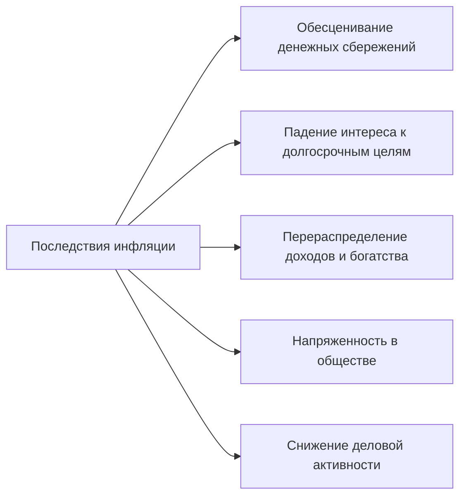

%%23.04.28(Л)%%
План:
1. Сущность инфляции и ее виды
2. Измерение инфляции
3. Причины и следствия инфляции
4. Антиинфляционная политика государства

## Сущность инфляции и ее виды
Инфляция (inflation - от итальянского слова inflatio - вздутие) - это устойчивая тенденция роста **общего уровня цен** в экономике.

### Виды инфляции
В зависимости от степени вмешательства в экономику:
- открытая (явная)
- скрытая (подавленная)

В зависимости от темпов роста цен:
- умеренная (ползучая) - до 10% в год
- галопирующая - 10-200% в год
- высокая - 200-300% в год
- гиперинфляция - 40-50% в месяц или более 1000% в год

В зависимости от того, насколько успешно экономика адаптируется к росту цен:
- сбалансированная
  \- это умеренный и одновременный рост цен на большинство товаров и услуг
- не сбалансированная
  \- это неравномерный, скачкообразный рост цен на отдельные товары и услуги

В зависимости от возможности прогнозировать инфляцию:
- ожидаемая (прогнозируемая)
  \- это инфляция, которая учитывается в ожиданиях и поведении экономических субъектов
- неожиданная (непрогнозируемая)
  \- становится для населения неожиданностью, так как фактический темп роста уровня цен превышает ожидаемый.

#### Явная инфляция
Механизмы раскручивания инфляционной спирали
- Адаптивные инфляционные ожидания
- Инфляция издержек

##### Адаптивные инфляционные ожидания
Инфляцию питают не только экономические причины, но и психологические. Ожидания роста цен заставляют потребителей закупать товары впрок  с целью освободиться от обесценивающихся денег. Крайней формой такого поведения является ажиотажный спрос. Подавление инфляционных ожиданий - важное направление борьбы с инфляцией, зависящее от последовательности государства в проведении антиинфляционной политики.

	Доход = Потребление + Сбережения
	При сокращении сбережений падают инвестиции -> предложение падает (или не изменяется)
	Рост спрос -> Рост потребления

##### Инфляция издержек
	Рост цен -> Рост цен на ресурсы -> Рост затрат на производство -> Рост затрат на производство -> Рост цен
	Рост цен -> Повышение зарплат -> Рост издержек производства -> Рост цен

#### Подавленная инфляция
характеризуется внешней стабильностью цен (при активном вмешательстве государства), но приводит к росту дефицита товаров, что так же снижает реальную стоимость денег.

Признак подавленной инфляции - отсутствие ценовых стимулов для расширения производства.

	Прибыль = Цена*Количество товара - издержки.

## Измерение инфляции
#### Индекс Пааше
$$I_{p}=\frac{\sum p_{1}^{i}q_{1}^{i}}{\sum p_{O}^{i}q_{1}^{i}}$$
$\sum p_{1}^{i}q_{1}^{i}$ - фактическая стоимость продукции отчетного периода
$\sum p_{O}^{i}q_{1}^{i}$ - стоимость товаров реализованных в отчетном периоде по ценам базисного периода

#### Дефлятор ВВП
\- ценовой индекс, отражающий динамику уровня цен в текущем периоде в сравнении с базовым периодом.

Данный индекс характеризует отклонение номинального ВВП от реального ВВП:
$$\text{Дефлятор ВВП}=\frac{\text{Номинальный ВВП}}{\text{Реальный ВВП}}\times 100\%$$

#### Индекс потребительских цен (ИПЦ)
измеряет затраты на приобретение фиксированного набора товаров и услуг (потребительской корзины):
- ИПЦ = (цена потребительской корзины в данном году/цена потребительской корзины в базовом году)$\times 100\%$
- ИПЦ>100% -> инфляция
- ИПЦ<100% -> дефляция

#### Темпы инфляции
$$\text{Темпы инфляции}=\frac{\text{ИПЦ}_\text{текущий}-\text{ИПЦ}_\text{базовый}}{\text{ИПЦ}_\text{базовый}}$$
Темпы инфляции показывают, на сколько % выросли цены в текущем году по сравнению с базовым.
$$\text{ИПЦ}=\frac{\text{Стоимость потребительской корзины текущего года}}{\text{Стоимость потребительской корзины базового года}}$$

#### Годовой темп инфляции ($\pi$)
рассчитывается по формуле:
$$\pi=\frac{P_{t}-P_{t-1}}{P_{t-1}}\times100\%$$
$P_{t}$ - уровень цен в данном году
$P_{t-1}$ - уровень цен в прошлом году

#### Уравнение Фишера
$$M\times V=P\times Y$$
$M$ - денежная масса
$V$ - скорость обращения денег в экономике
$P$ - уровень цен в стране
$Y$ - объем производства товаров и услуг
Левая часть описывает предложение денег, правая - спрос на деньги.

Рост **денежной массы** может быть обусловлен различными причинами:
- Покрытие дефицита государственного бюджета с помощью "печатного станка"
- Резкое расширение предоставляемых банками кредитов ("дешевые деньги")
- И другое

**Скорость обращения денег** - это среднее количество оборотов, которые делают деньги, находящиеся в обращении и используемые для оплаты услуг и покупки товаров.
На скорость обращения влияют:
- банковская инфраструктура страны
- техническое оснащение учреждений, участвующих в денежных схемах
- экономическая активность

Чем совершеннее спутниковые, компьютерные связи, техническое оснащение банковских структур, тем интенсивнее оборачиваются деньги и меньше их требуется для стабильного функционирования хозяйства.

%%23.05.05(Л)%%
**Главные последствия инфляции** - снижение покупательной способности и снижение реальных доходов.

**Покупательная способность денег** - это то количество товаров и услуг, которое можно купить на одну денежную единицу.

**Номинальный доход** - это денежная сумма, которую получает человек за продажу экономического ресурса, собственником которого он является.

**Реальный доход** - это то количество товаров и услуг, которое человек может купить на свой номинальный доход (на полученную сумму денег).

## Антиинфляционная политика государства
**Антиинфляционная политика** - это государственная экономическая политика, направленная на борьбу с инфляцией.

### Методы борьбы с инфляцией:
- прямые
- косвенные

#### Прямые методы (политика доходов)
- установление ориентиров для роста зарплаты и цен
- прямой контроль за ростом зарплаты и цен

#### Косвенные методы
- монетарная политика
- фискальная политика

##### Монетарная политика
**Монетарная политика** - контроль на *денежной массой* в экономике для воздействия н совокупный спрос.
- Изменение учетной ставки (удешевление-удорожание кредитов)
- Установление нормы обязательных резервов коммерческих банков (увеличение/уменьшение количества выдаваемых кредитов)
- Продажа/покупка государственных ценных бумаг

Под **учетной ставкой** понимается процентная ставка, по которой Центральный банк страны предоставляет кредиты коммерческим банкам.

**Обязательные резервы** коммерческих банков - средства кредитных организаций, которые они должны хранить в качестве обязательного резерва на счете в центральном банке.

**Операции на открытом рынке** - деятельность центрального банка по купле и продаже ценных бумаг (обычно государственных облигаций) на открытом рынке.

Виды монетарной политики
1. **Сдерживающая** (или жесткая) которая проводится для борьбы с инфляцией.
	В этом случае ЦБ *уменьшает предложение денег*
	- повышая норму обязательных резервов
	- повышая учетную ставку процента
	- продавая государственные облигации на открытом рынке
2. **Стимулирующая** (или мягкая) которая используется для преодолевания спадов и борьбы с безработицей.
	В этом случае ЦБ *увеличивает предложение денег*
	- снижая норму обязательных резервов
	- снижая учетную ставку процента
	- покупая государственные облигации на открытом рынке

С 1 марта 2023 года Банк России установил норму обязательных резервов:
- 4% для всех категорий резервов в рублях для банков с универсальной лицензией и небанковских кредитных организаций
- 7% для всех резервов в иностранной валюте для всех кредитных организаций

##### Фискальная политика
**Антиинфляционная политика**
- политика градуирования
- шоковая терапия

**Шоковая терапия**
- Либерализация цен
- Денежная реформа конфискационного типа

Шоковая терапия применяется в двух случаях:
- При гиперинфляции
- Для перевода инфляции из скрытого типа в открытый

**Либерализация цен** или **отпуск цен** - элемент экономической политики, заключающийся в ослаблении государственного регулирования в области ценообразования.

Денежные реформы России
- Конфискационная денежная реформа (Павловская реформа), была проведена в России в 1991 году. В течение трех суток января граждане могли обменять 50- и 100- рублевые купюры на новые. Обменять можно было только наличными сумму до 1000 рублей.
  Условия реформы:
  1. Изъятие из обращения в обмене 50- и 100-рублевых купюр образца 1961 года.
  2. Сжатые сроки обмена - три дня с 23 по 25 февраля
  3. Не более 1000 рублей на человека - возможность обмена остальных купюр рассматривалась в специальных комиссиях до конца марта 1991 года.
- Из-за возросшей инфляции в 1993 году Российское правительство проводит новую конфискационную денежную реформу.
  Обмен банкнот советских купюр на российские был проведен 26 июля - 7 августа 1993 года. Граждане России (согласно прописке в паспорте) могли обменять суммы до 100000 рублей, о чем в паспорте ставился штамп.

---
#theory #economics 