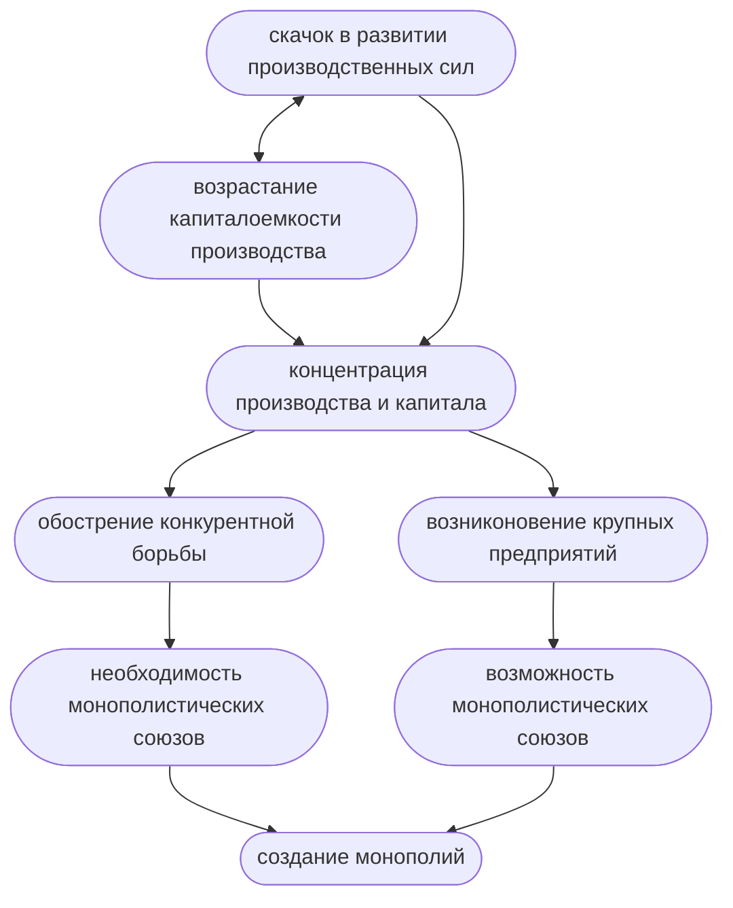
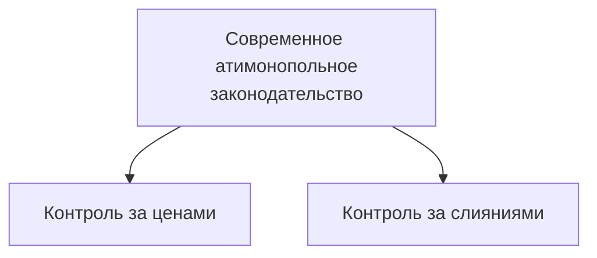

%%23.03.24(Л)%%
План:
- Сущность конкуренции
- Совершенная и несовершенная конкуренция. Типы рыночных структур
- Природа, специфика и типы монополистических предприятий
- Антимонопольная политика государства

## Сущность конкуренции
Конкуренция ((лат.) concura - сталкиваться) - это соперничество между отдельными субъектами (агентами) рыночного хозяйства за наиболее выгодные условия производства и реализации товаров.

- Обеспечивает нацеленность производителей на всестороннее удовлетворение запросов потребителей
- Стимулирует увеличение эффективности производства
- Способствует распределению ресурсов между отраслями в соответствии со спросом  и нормой прибыли
- Стимулирует снижение цен и повышение качества товаров
- Приводит к дифференциации производителей

Методы конкуренции:
- ценовые
	Цена = Издержки+Прибыль
- неценовые

**Ценовая конкуренция** - это борьба между товаропроизводителями путем снижения издержек производства товаров/услуг и, соответственно, снижения цен на них без изменения ассортимента и качества товаров/услуг.

**Неценовая конкуренция** проводится посредством совершенствования качества продукции (**конкуренция по продукту**) и условий ее продажи (**конкуренция по условиям продаж**).

## Совершенная и несовершенная конкуренция. Типы рыночных структур
Виды конкуренции
- внутриотраслевая и межотраслевая
- совершенная и несовершенная

**Совершенная конкуренция** - это такое состояние экономической системы, когда влияние каждого участника экономического процесса на общую ситуацию настолько мало, что им можно пренебречь.

- На рынке действует очень большое количество независимых продавцов
- Фирмы производят однородную продукцию
- Каждая фирма производит настолько небольшую часть от общего объема производства, что она не в состоянии оказывать влияния на цену данного товара
- Существует свободный вход и выход из данной отрасли производства
- Участники рынка имеют равный доступ к информации

Под **несовершенной конкуренцией** понимают рынок, на котором не выполняется хотя бы одно из условий совершенной конкуренции.

Модели несовершенной конкуренции:
- Чистая монополия
- Олигополия
- Монополистическая конкуренция

Чистая монополия:
- единственный продавец
- уникальный товар
- фирма-монополист полностью контролирует объем предложения, а следовательно и цену, что позволяет ей получать максимальную прибыль
- существуют барьеры на вход в отрасль (собственность на сырье, патенты, лицензии, размер капитала)

Ситуация, обратная монополии, называется монопсония (единственный покупатель).

Олигополия:
- на рынке доминирует несколько крупных фирм
- продукция может быть как однородной, так и дифференцированной
- существуют барьеры на вход в отрасль

Монополистическая конкуренция
- достаточно много предприятий
- только дифференцированная продукция
- вход в отрасль возможен

Трактовки понятия "монополия":
- монополия - это модель рынка несовершенной конкуренции
- монополия - это крупнейшее предприятие или объединение предприятий, которые доминируют в определенной сфере народного хозяйства.

Типы монополистических предприятий:
- картель
- синдикат
- трест

**Картель** - это объединение предприятий одной отрасли, при котором сохраняется их производственная и коммерческая самостоятельность.
Предприятия договариваются о ценах, делят рынки сбыта, определяют квоты.

%%23.03.31(Л)%%
**Синдикат** - это объединение предприятий одной отрасли, при котором сохраняется их производственная, но утрачивается коммерческая самостоятельность.

**Трест** - это объединение предприятий одной отрасли, при котором входящие в него предприятия утрачивают как коммерческую, так и производственную самостоятельность.

**Горизонтальная интеграция** - это объединение двух и более предприятий, занятых в одной отрасли производства.

С 1920-х гг. на смену горизонтальной приходит вертикальная интеграция.
**Вертикальная интеграция** - это объединение предприятий разных отраслей, связанных между собой единой технологической цепочкой.
-> **Комбинаты**

Вертикальная интеграция - это часть более общего процесса - диверсификации.
**Диверсификация** - это процесс объединения предприятий разных отраслей, не связанных между собой технологически.

**Концерн** - это крупное многоотраслевое предприятие, объединяющее предприятия смежных, близких по технологии отраслей, и имеющее единый финансовый центр.

**Конгломерат** - это монополистическое объединение, образованное обычно путем поглощения крупной корпорацией мелких и средних фирм, не имеющих производственной или технологической связи с традиционными сферами деятельности головной фирмы.

## Антимонопольная политика
**Закон Шермана** (1890 год)
"Всякий договор или объединение в форме треста или любой иной форме является незаконным"

**Закон Клейтона**
Принят Конгрессом США в 1914 году
1. Уточняет основные понятия антитрестовского законодательства, внедряет новые понятия.
2. Объявляет вне закона ценовую дискриминацию, тайный сговор.
3. Запрещалось приобретать акции конкурирующих корпораций, если это ослабляло конкурентов.

**Акт Селлера-Кефовера** (1950 год)
Ограничивал не только горизонтальные, но и вертикальные слияния.

**Демпинг** - продажа товаров и услуг по искусственно заниженным ценам.

В России существуют механизмы в законодательстве для противодействия *демпингу*.
Статья 7 ФЗ "О защите конкуренции" -> понятие "монопольно низкая цена".
**Монопольно низкая цена** - это та, которая ниже суммы затрат и прибыли; ниже цены на конкурентном сопоставимом товарном рынке.

---
#theory #economics 