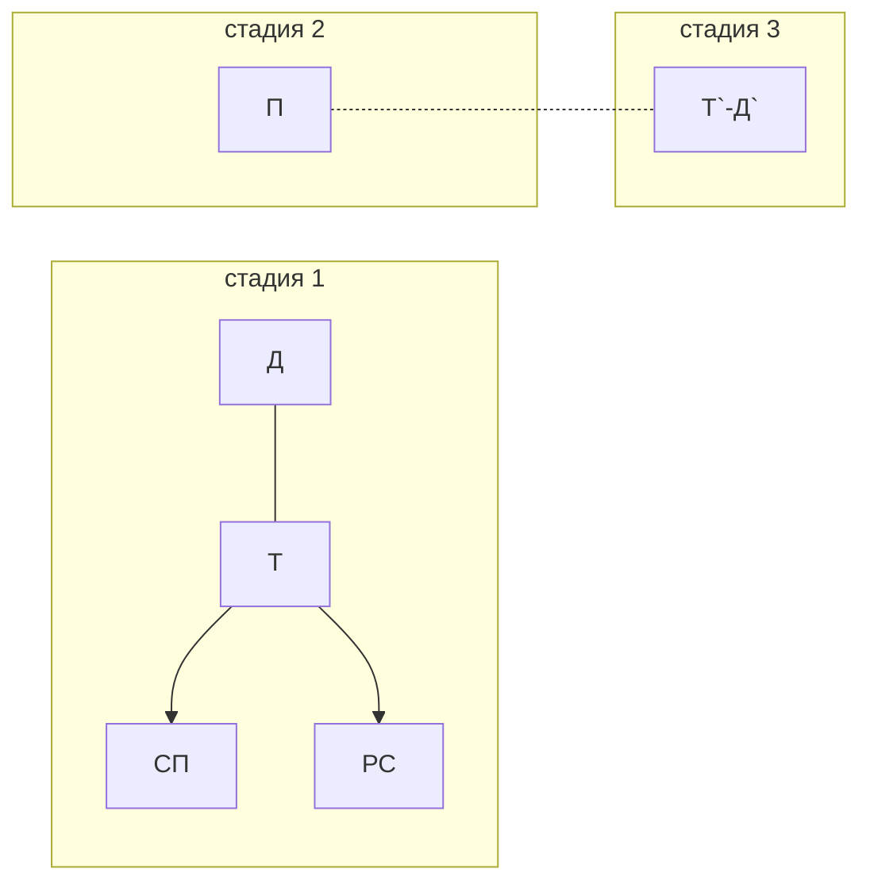
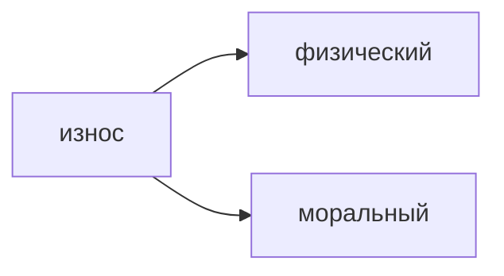
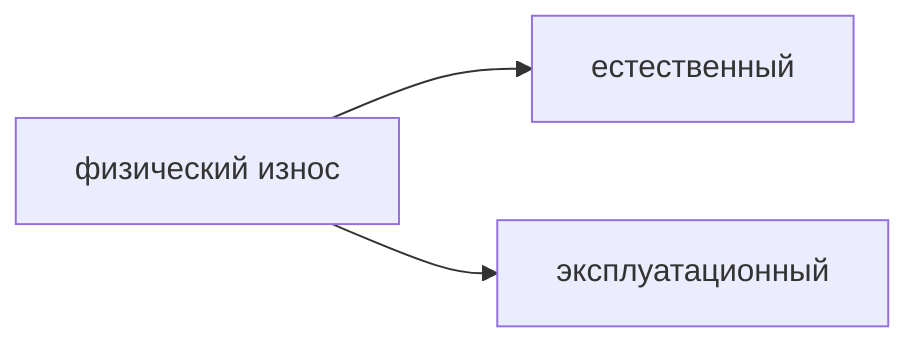

%%23.03.31(Л)%%
План:
1. Понятие индивидуального воспроизводства предприятия
2. Основные и оборотные фонды предприятия
3. Показатели эффективности и использования основных и оборотных фондов

## Понятие индивидуального воспроизводства предприятия
**Индивидуальное воспроизводство предприятия** - это постоянно повторяющийся процесс соединения факторов производства с целью создания товаров (услуг) и получения дохода в рамках предприятия.

## Основные и оборотные фонды предприятия
**Кругооборот фондов** - это движение стоимости факторов производства через сферы производства и обращения, в результате чего она проходит три стадии и последовательно принимает денежную, товарную и производительную форму.

схема кругооборота фондов

Д - деньги
Т - товары производственного назначения
СП - средства производства
РС - рабочая сила
П - производство
Д` = Д+$\Delta$Д

На **первой стадии** создаются условия для производства Т и У.
На **второй стадии** осуществляется непосредственный процесс производства Т и У.
На **третьей стадии** происходит реализация Т или У и получение прибыли.

**Оборот фондов** - это их кругооборот, рассматриваемый как непрерывно возобновляемый процесс.

Факторы производства в своем движении проходят стадию производства и две стадии обращения.
Период времени, в течении которого ресурсы, пройдя через сферы производства и обращения возвращаются к своей исходной (денежной) форме - **время оборота**.

Скорость оборота измеряется числом оборотов ресурсов, совершаемых в течение года.
Число оборотов определяется по формуле:
$n=\frac{O}{t}$
где $n$ - число оборотов в год, $O$ - принятая единица времени (1 год), $t$ - время оборота.

%%23.04.07(Л)%%
## Показатели эффективности и использования основных и оборотных фондов
**Основные производственные фонды** (ОПФ) характеризуются тем, что действуют в течение многих производственных циклов и переносят свою стоимость на стоимость готовой продукции по частям по мере износа (станки, транспортные системы).


**Физический износ основных фондов** - это потеря потребительской стоимости фондов в ходе их эксплуатации, а также под воздействием сил природы.

**Моральный износ** - это потеря потребительской стоимости основных фондов по двум причинам:
1. из-за создания аналогичных, но более дешевых средств труда
2. из-за создания более современных средств труда

**Амортизация** - это процесс перенесение стоимости основных фондов на производимую с их помощью продукцию и одновременное аккумулирование ее в амортизационном фонде.

**Норма амортизации** - это отношение годовой суммы амортизационных отчислений к стоимости ОПФ, выраженное в процентах.

**Оборотные фонды** характеризуются тем, что полностью потребляются в течение одного производственного цикла и полностью переносят свою стоимость на стоимость готовой продукции.

**Формула расчета фондоотдачи и фондоемкости**
- **Фондоотдача:**
$$ФО=\frac{Q}{Ф_{осн}}$$
$Ф_{осн}$ - среднегодовая стоимость основных производственных фондов
$Q$ - объем реализованной продукции в стоимостном выражении
- **Фондоемкость:**
$$ФЕ=\frac{Ф_{осн}}{Q}$$

Показатели эффективности использования оборотных средств
````col

Материалоотдача
показатель выпуска продукции в денежной форме, приходящийся на 1 рубль стоимости оборотных средств, т.е. эффективность вложения средств в оборотные средства.


Материалоемкость
показатель, обратный материалоотдаче, показывающий долю стоимости оборотных средств, приходящуюся на каждый рубль выпускаемой продукции.

````

---
#theory #economics 