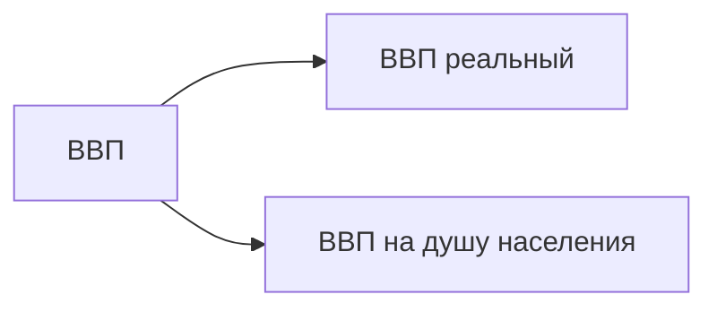
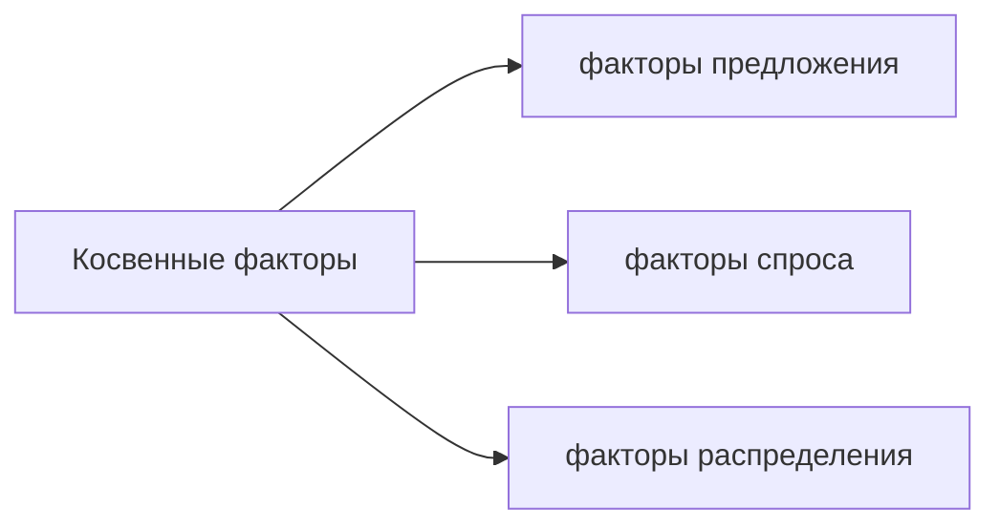
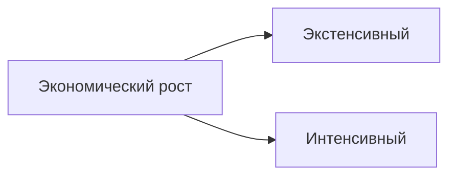

%%23.04.07(Л)%%
План:
1. Понятие экономического роста и его показатели
2. Факторы и типы экономического роста
3. Цикличность как форма экономического развития. Типы циклов
4. Причины экономических кризисов

## Понятие экономического роста и его показатели
**Экономический рост** - это долгосрочная тенденция увеличения реального ВВП.

**Валовой внутренний продукт** (ВВП) - это рыночная стоимость всех конечный товаров и услуг (т.е. предназначенных для непосредственного употребления), произведенных за год во всех отраслях экономики на территории государства вне зависимости от национальной принадлежности использованных факторов производства.

**Валовой национальный продукт** (ВНП) - рыночная стоимость всех конечных товаров и услуг, созданных производителями данной страны в течение года как внутри страны, так и за рубежом.

### Номинальный и реальный ВВП
**Номинальный ВВП** (НВВП) - рассчитывается в ценах текущего года.
Номинальный ВВП зависит от роста цен (инфляции), поэтому может искажать реальную картину экономического роста.

Для определения уровня развития экономики страны используют реальный ВВП.
**Реальный ВВП** (РВВП) - рассчитывается в сопоставимых ценах базового года.

## Факторы и типы экономического роста
![[IMG20230407110638.jpg]]
**Темп экономического роста**
$$g=\frac{a_t-a_{t-1}}{a_{t-1}}\times100\%$$
$a$ - Реальный ВВП в году

**Прямые** - это факторы, которые обеспечивают физическую способность экономики к росту.
**Косвенные** - это факторы, которые влияют на возможность превращения способности к росту в действительность.

**Прямые** факторы экономического роста:
- увеличение численности и качества трудовых ресурсов
- увеличение объема и качества основного капитала
- совершенствование технологии и организации производства
- увеличение количества и качества используемых природных ресурсов
- рост предпринимательских способностей в обществе

**Факторы предложения:**
- снижение степени монополизации рынков
- снижение цен на ресурсы
- снижение налога на прибыль
- повышение доступности кредитов

**Факторы спроса** - это рост потребительских, инвестиционных и государственных расходов, расширение экспорта вследствие освоения новых рынков сбыта или повышение конкурентоспособности продукции страны на мировом рынке.

**Факторы распределения** - структура распределения производственных ресурсов по отраслям, регионам и предприятиям, а также существующий порядок распределения доходов в обществе между субъектами хозяйственной деятельности.

%%23.04014(Л)%%

**Экстенсивный** экономический рост осуществляется за счет увеличения **количества** применяемых факторов роста.
**Интенсивный** экономический рост осуществляется за счет **качественного** совершенствования прямых факторов роста.

Если доля прироста ВВП за счет интенсивных факторов роста больше 50% -> преимущественно интенсивный экономический рост.

---
#theory #economics 